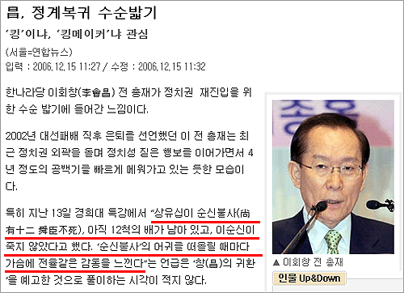
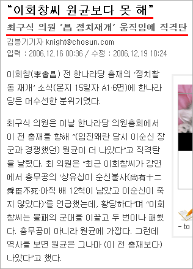
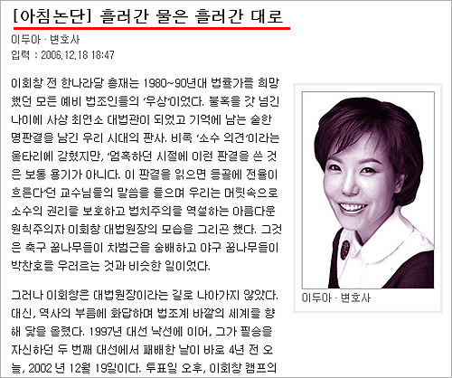
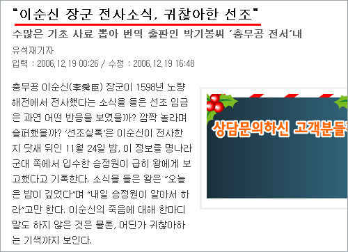
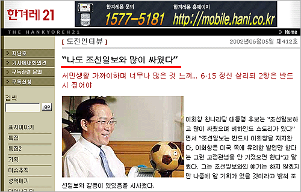

딱정벌레님의 [**조선일보는 이회창이 귀찮아**](http://www.mediamob.co.kr/aidi/blog.aspx?id=124405) 라는 글을 읽고 재밌어서 원문을 한번 찾아봤습니다.  

<!-- truncate -->

  
다른 매체에서지만 이순신 어쩌고 했던 기사 본 기억 납니다. 아, 이제 슬슬 시즌이 시작되니 다들 한명씩 시작하는구나 싶었죠.  
  
  
대충 보니 처음엔 이런 식으로 다른 사람의 말을 빌어다가 공격을 했었더군요. 하지만, 이렇게 한나라당 집안싸움으로만 비치면 결국 좋을 게 없다고 생각한 걸까요?  
  
  
그래서인지 외부 필자를 끌어다가 의견보충을 하더군요. 객관화 작업인가요? 하지만 이것도 약하다고 생각했는지도 모르겠어요.  
  
  
직접 눈으로 보니 너무 웃기네요. 제목부터가 히트예요. **조선일보는 이회창이 돌아오는 걸 반대한다**고 직접적으로 하지, 이렇게 어설프게 돌려서 말하다니. 이회창 쪽을 더 열받게 만드는 일석이조의 효과를 노린 걸까요? 싫어했다도 아니고 귀찮아했다니… 정말 맥빠지게 만드는 거니까요. 뭐, 정치가 원래 직접적인 말을 하지 않긴 하지만. (그런데, 신문사는 정치집단이 아니지 않나? -\_-)  
  
이제 회창옹께서 "우리나라가 발전하지 못한 이유는 신문 때문"이라면서 조선일보와의 전쟁을 선포할까요? 2라운드가 기대됩니다.  
  
.  
.  
.  
.  
.  
  
그러고 보니, 4년 전에도 조선일보와는 많이 싸우는 사이라고도 밝혔었군요. 물론 그 때는 아무도 안 믿었지만. (그리고 지금은 이제 조선일보가 다른 사람을 밀고 있어서 팽 당한 거기도 하고) 싸우면서 친해지는 건 애들 뿐만이 아닌 듯 합니다.
