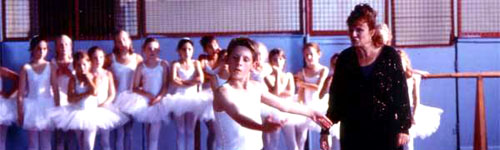
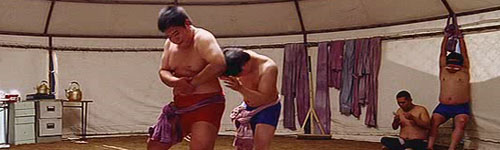

  
이 영화는 크게 두 가지에 대해 이야기하고 있다. 그건 바로 다름과 단절. 주인공인 동구 (류덕환 분)는 성전환수술을 받고 싶어하는 남자 고등학생이다. 그는 다르기 때문에 집 안팎에서 고생을 한다. 전직 권투선수였던 그러나 지금은 맨날 술만 먹고 사고만 치는 그의 아버지 (김윤석 분)마저(?) 그에게 정신적, 육체적으로 린치를 가한다. 그래서, 동구는 아버지를 포함한 자신을 인정하지 않는 모든 것들과 단절을 시도한다.  

<!-- truncate -->

  
이 영화는 여러모로 착한 영화이다. 어쨌거나 해피엔딩이고, 등장인물들도 몇 명을 제외하고는 모두 착하다. 주인공의 진심을 받아주는 인물들도 많다. 하지만, 이 영화가 이야기하는 내용은 '착함'과 어울릴 법한 '예쁘장한' 내용만을 담고 있는 건 아니다. 권투 선수가 되길 바랬던 아버지의 꿈을 뒤로 하고 발레리노가 된 소년의 이야기인 <빌리 엘리어트>와 비교해 보자면 곱상한(?) 코미디의 형태를 띄고 있는 이 영화는 위의 두 가지 면에서 모두 더 나아간다.  
  
  
그냥 발레가 하고 싶은 소년과 자신의 성정체성을 되찾아 '그저 평범하게' 살고 싶은 소년의 이야기는 다른 수준이니까. 결국은 가족의 기대를 한 몸에 안고 (어찌되었든 아버지를 설득시킨 후) 더 높은 곳으로 비상하는 소년의 이야기와 끝까지 아버지와 화해하지 않고 서로 이해하지 못한 채 얽혀있는 관계를 끊어버리는 소년의 이야기는 다른 수준이니까.  
  
또한 영화는 그저 힘든 상황에서 이루기 어려운 것을 바라는 소년이 성인이 되어가는 성장영화의 형태를 띄고 있다. 영화는 무슨 수를 써서라도 오랫동안 버텨내라고 한다. 버텨내야 기회가 오는 거니까. 한두 번 실패했다고 포기하면 술만 먹는 아버지나 만족할 줄 모른 채 분노로 가득찬 주장처럼 되어버리니까. (후에 주장에게는 변화가 생긴다.) 씨름 한두 판 졌다고 포기해버리기엔 '뒤집기 한판'을 위한 장학금이 너무 아깝지 않은가!  
  
'다름'에 대한 다른 표현일까? 영화는 '변칙'을 이야기하기도 한다.  (이 부분은 스포일러일 수도 있어서 가립니다. 보려면 클릭) 

그건 바로 동구는 아버지에게 두드려 맞다가 뒤집기로 아버지를 이기고, 라이벌에게 여러모로 눌렸던 주장은 마지막에 변칙 공격으로 승리를 하는 장면들을 통해 나타난다. 사실 삶에 대한 동구의 태도도 보통 사람들과는 다르지 않은가. 보통 사람들과는 다르게 수술 (변칙)을 통해서 정체성을 찾아야 하는데도 동구는 긍정적인 생각을 가지고 살아간다.

  
  
음악은 전체적으로 매우 좋았다. 전체적으로 전자음악이 주된 분위기를 형성하는데 만약 흔히 예상하는 현악기 위주의 편곡으로 이루어진 곡들이 주된 분위기를 잡았다면 다소 상투적인 분위기가 될 수 있었을 장면들을 재치있게 살짝 살짝 띄워주었다. 일본어 선생님 (초난강 분) 장면들에서 나오는 음악도 매우 적절했고. :) 또 한가지 좋았던 점은 씨름 장면에서의 음악들인데, 씨름 -> 소싸움 -> 소 -> 투우 -> 스페인 -> 라틴, 뭐 이런 식의 생각이 순식간에 들어서 '기발하다!'는 생각까지는 들지 않았지만 긴장감을 고조시키면서 무언가 격돌한다는 느낌이 드는 등 '매우 잘 어울렸다'.  
  
다만 어색했던 부분을 한군데만 잡는다면 동구가 아버지를 잡아서 날리는 장면에서 나오던 음악이었다. 나오는 타이밍이 조금 애매하기도 했고, 조금 밍숭밍숭하게 처리된 느낌이었다.  
  
  
사운드 중에서 개인적으로 제일 재밌었던 건 중반부를 지나서 덩치1 (문세윤 분)과 동구가 씨름 연습을 하다가 갑자기 어색한 분위기 (일종의 러브라인?)가 되서 덩치1이 헤드락을 걸고 동구가 빠져나오는 장면이 있는데 거기 사용된 효과음이었다. 과장되지 않은 크기의 뿅-소리. 코믹하면서도 오버하지 않으며 진행되는 영화의 전체적인 성격을 대변하는 장면과 소리라고나 할까?  
  
배우들의 코멘터리를 들으면서 오히려 재밌었던 영화가 다소 재미없어진 면이 있었다. 동구의 친구인 종만 역을 했던 배우 (박영서)의 실제 말투와 이야기하는 태도가 좀 거슬렸다는 것 말고도 재미없었던 건 이 영화의 중요한 소재 중의 하나인 "다름"에 대한 배우들의 생각이 드러나는 대화들이었다. 배우들은 영화를 찍으면서 영화에 대해 많이 생각을 했으리라 생각하는 관객의 생각이 사라졌는데 다들 "만약 내 자식이라면 어휴~"라는 말을 하며 공감하는 분위기를 만들어내는가 하면 "얼마나 감독들이 소외되며 살았는지…"라는 농담 아닌 농담에 다들 재밌어(만) 하며 웃는 반응 등 때문이었다. 영화는 영화고, 현실은 현실이라는 씁쓸함이 오히려 코멘터리를 통해 완성되는 순간이랄까.  
  
영화를 보기 전에 '착한 영화'라는 표현을 많이 봤는데, 보고 난 후의 느낌은 이 영화가 '마냥 착하지만은 않은 영화'라서 더욱 좋았다.  
  
 /  /   
  

**그리고**  
  
- 예전에 분명히 <으랏차차 스모부>를 본 것 같은데 기억이 하나도 안난다. 씨름과 스모라서 비슷하지 않을까 하며 생각했던 기억도 나는데 말이지.  
  
- 꽤 많은 씬에서, 류덕환의 얼굴에서 조승우를 보았다. 조승우랑 닮지 않았나? (둘은 7살 차이)  
  
- 그리고, 백윤식 역에 대한 설명은 [카이만님](http://kaiman.8con.net/blog/)의 [**환상의 커플, 그리고 고아의식**](http://kaiman.8con.net/blog/index.php?pl=134)을 읽으면 될 듯 하다. 앞부분도 재밌지만 뒷부분과 첫번째 리플이 이 글과 관계가 있다. 고아 의식, 아버지 찾기,이상적인 멘토 그리고 백윤식.

  

**관련 링크**  
  
[씨네21 - 동아시아판 <빌리 엘리어트>, <천하장사 마돈나>](http://www.cine21.com/Article/article_view.php?mm=002001001&article_id=41073)  
[씨네21 - 영화 속 여자가 되고 싶은 남자 캐릭터들 [1]](http://www.cine21.com/Article/article_view.php?mm=005001001&article_id=41273) [[2]](http://www.cine21.com/Article/article_view.php?mm=005001001&article_id=41274)  
[씨네21 - 발견! <천하장사 마돈나> [1]](http://www.cine21.com/Article/article_view.php?mm=005001001&article_id=40969) [[2]](http://www.cine21.com/Article/article_view.php?mm=005001001&article_id=40970)[[3]](http://www.cine21.com/Article/article_view.php?mm=005001001&article_id=40971)   
[<천하장사 마돈나> 류덕환과 씨름부 3인방 [1]](http://www.cine21.com/Article/article_view.php?mm=005001001&article_id=41143) [[2]](http://www.cine21.com/Article/article_view.php?mm=005001001&article_id=41144) [[3]](http://www.cine21.com/Article/article_view.php?mm=005001001&article_id=41145)  
  
[필름2.0 - 유쾌한 성장담](http://film2.co.kr/review/review_final.asp?mkey=2221)  
[필름2.0 - 자, 지금부터! 놀라지 마십시오 2006년의 아이들, 배우 류덕환](http://film2.co.kr/feature/feature_final.asp?mkey=3460)
