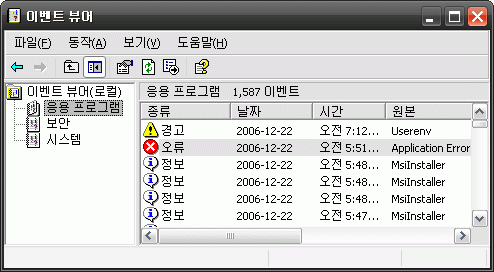
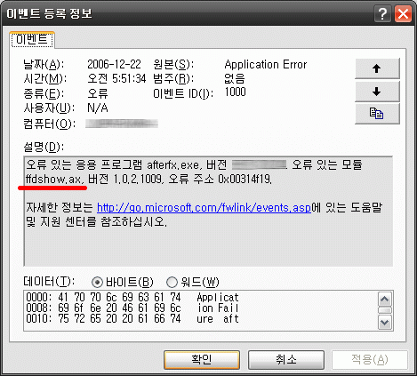
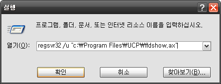

만약 [어도비사](http://www.adobe.com)의 [**애프터 이펙트** (After Effects)](http://www.adobe.com/products/aftereffects/)를 설치한 후 아래와 같은 메시지를 내며 실행이 되지 않는다면, (혹은 잘 사용하다가 어느날 갑자기 실행이 되지 않는다면)  

<!-- truncate -->

After Effects can't continue : sorry, After Effects has crashed. see http://www.adobe.com/support/products/aftereffects.html for known issues. If you still can;t resolve the issue, please contact Adobe Technical support (2)  
  
(0 :: 42)

  
**컴퓨터에 ffdshow.ax 코덱을 설치한 적이 있는지 확인**하고 만약 그랬다면 관련 코덱을 삭제하면 문제가 해결될 수 있습니다.  
  
  

보다 확실하게 확인할 수 있는 건 위와 같은 에러 메시지를 냈을 때 **시작 > 제어판 > 관리도구 > 이벤트 뷰어**를 실행시킨 다음 애프터 이펙트가 오류가 난 부분을 잘 찾아서 더블클릭을 한 후 살펴보면 ffdshow.ax 와 충돌이 생겼음을 알 수 있죠.  
  
  

제 경우는 **통합코덱 팩 (Unified Codec Pack)**을 깔아서 생긴 문제였던 것 같은데, 통합코덱 팩은 보통 **c:\Program Files\Unified Codec Pack** 에 깔리니 거기에서 언인스톨을 하든지 다른 방법으로 언인스톨을 하면 됩니다.  
  
하긴 그렇지만 그것 말고도 ffdshow를 무단으로 사용하는 프로그램들이 많긴 하죠. 예전에 논란이 되었던 네이버의 터보 플레이어를 비롯해 이것저것 많죠.  
  
  
  

만약 ffdshow.ax만 삭제하고 싶으면 **시작 > 실행**에 가서 **regsvr32 /u "c:\설치된 경로명\ffdshow.ax"** 를 해도 됩니다.
