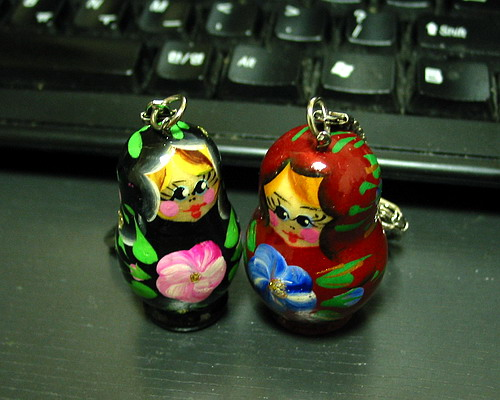

  

감사합니다. [**끄르또이님**](http://russiainfo.co.kr). :)  
(조카 준다고 하나 더 받아왔습니다.)  

<!-- truncate -->

  
  
뭔지 알긴 아는데, 정확한 명칭을 몰라서 찾아봤습니다. 볼링핀 비슷한 형태의 목각인형을 돌려서 열면 그 안에 또 목각인형이 있고, 그걸 열면 그 안에 또 있고, 또 있고… 이런 인형을 마트로시카 (Matryoshka, 마트로슈카, 마트로쉬카)라고 하더군요. 다산과 풍요를 상징한다고 합니다.  
  
(마트로시카, 마트로시카… 외우기 쉬운 것 같으면서도 입에 잘 붙지 않는군요;; )  
  

**관련 링크**  
  
[스카이 뉴스 - 러시아 목각인형 마트로시카(Matryoshka)](http://www.skynews.co.kr/skynews_main/travel/place/place_048.htm)  
[호기심박스 - 행운을 부르는 러시아 목각 인형, 마트로시카(Matryoshka)](http://www.hokisimbox.co.kr/tech1/read.cgi?board=h-sample&y_number=10)  
[Wikipedia - Matryoshka doll](http://en.wikipedia.org/wiki/Matryoshka_doll)  
[마트로시카 전문 쇼핑몰 마트로시카](http://www.matryoshka.co.kr/)  
[김지희님의 블로그 - 러시아 인형 마트로쉬까(1)](http://blog.segye.com/document/BEAA39802)
