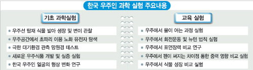
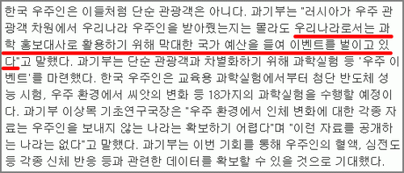
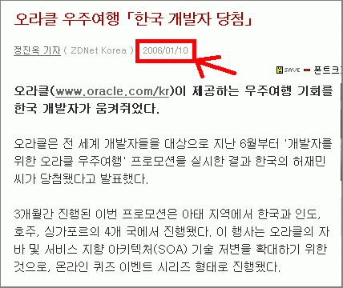
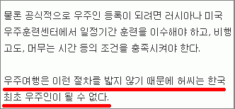

[자바월드](http://club.shinbiro.com/sbrClub_Go.jsp?sClubUrl=kaiser)에서 보고 한번 찾아봤습니다.  

<!-- truncate -->

TV를 잘 안봐서 몰랐는데, 요즘 SBS를 통해 대한민국 최초의 우주인을 뽑는 [거창한 이벤트](http://tv.sbs.co.kr/2008space/index.html)가 있었더군요. 10인의 도전자 어쩌고 하면서 재밌는(?) 테스트도 하면서 최초로 우주로 나갈 우주인을 뽑았더라고요.  
  
재밌는 건 최종 우주인이 선발되기 전부터 여러 사람들이 처음부터 **"과기부 + SBS + 삼성 + 카이스트"**의 짜고치는 고스톱이 아니냐는 이야기를 본 적이 있었다는 겁니다. 선발 과정에서 한 테스트들도 다분히 이벤트적이었다고들 하고요.  
  
  
표 출처 : [쿠키뉴스](http://www.kukinews.com/news/article/view.asp?page=1&gCode=kmi&arcid=0920399903&cp=nv)  
그러고 보면 참 묘하게 상징적이예요. 과기부가 [우주인 프로젝트라는 쇼](http://www.woojuro.or.kr/)를 하는데, 그 쇼를 가장 상업적인 공중파 방송사인 [SBS가 주관 방송사](http://tv.sbs.co.kr/2008space/index.html)로 참여하고, 그 쇼를 통해 선발된 우주인은 삼성맨과 카이스트 출신이라니! 역시 [삼성](http://www.samsung.co.kr/news/biz_view.jsp?contentid=114337)과 [카이스트](http://www.kaist.ac.kr/ks_intro/ks_nt_prmtn/ks_pr_sym/1178506_1571.html)는 저런 일을 할 수 있는 인력까지 가지고 있는 대단한 인력풀입니다.  
  
  
출처 : [중앙일보](http://news.joins.com/article/aid/2006/12/26/2862904.html)  
우주여행에 개인당 비용이 260억이 든다고 하던데, 위의 실험이 그런 비싼 돈을 주고 할 만한 가치가 있는 건지 하는 생각도 해봅니다만, 아이들에게 우주에 대한 꿈과 희망을 심어 줄 수도 있는 거고 (-\_-), 그쪽은 제가 관련 분야 사람이 아니라 모르는 것일 수도 있는 거니까 패스.  
  
  
출처 : [ZDNet Korea](http://www.zdnet.co.kr/news/enterprise/dbms/0,39031095,39143365,00.htm)  
하지만, 제가 제일 재밌었던 부분은 바로 **과연 최초의 우주인이 저 쇼를 통해 뽑힌 사람들이 되는 걸까** 하는 점이죠. 이미 오래 전부터 알려진, 유명한 오라클 우주여행을 가기로 되어있는 한국인이 있었으니까요. 기사는 올해 초에 났죠.  
  
그럼 이 분이 먼저 나가면 이 분이 최초의 우주인이 되는 것 아닌가요? 1년 가까이 먼저 우주여행이 결정되었지만, 1년 가까이 이런 저런 조사로 대기하는 중이라고 하던데, 쇼를 통해 결정된 사람들도 막상 나가는데는 시간이 오래 걸리지 않겠냐는 것이죠. 그럼 누가 우리나라 최초의 우주인이 되는 걸까요? 궁금하던 차에 재밌는 기사가 이 논란을 정리시켜 줍니다.  
  
  
출처 : [경향신문](http://news.khan.co.kr/kh_news/khan_art_view.html?artid=200612270835351&code=930401)  
**처음 우주에 나가도 절차를 밟아야 최초의 우주인으로 인정해준다**고 하는군요. 아아… 그렇군요. 대단한 사실입니다. 몰랐어요. 제가 글을 본 커뮤니티에서는 이런 내용의 반응들이 올라왔습니다.  
  
> 등산동호회 가입하고 교육받고 산악인 자격증까지 따고나서  
> 산에 최초로 등정 성공해야 '최초' 인정해주는거냐??  
>   
> 그냥 능력되서 먼저 오르는게 1빠지.

  
더 이상 설명이 필요없군요. -\_-;  
  
  

사족.  
  
개인적으로는 저 쇼에 들어가는 돈을 조금 아껴서 (분야가 다르긴 하지만) 황우석 논문조작 [**제보자들을 돕는데**](http://www.pressian.com/scripts/section/article.asp?article_num=30061206164808) 사용해도 좋겠다는 생각을 해봅니다. 제보자, 내부고발자들은 옳은 일 하고도 실직자가 되어버린 현실이 씁쓸합니다.  
  
참고로 제보자들이 활동했던 BRIC에서는 성금 모금 운동을 했었는데, 모금운동으로 모아진 금액을 전달하는 방식에 있어 [**상/포상 형식**](http://gene.postech.ac.kr/bbs/zboard.php?id=job&no=10573)으로 전달하려고 했었죠. 참 멋진 아이디어인 것 같아요. 맞아요, 상을 줘야 하는 거죠. 도와주는 게 아니라.
