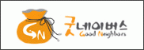
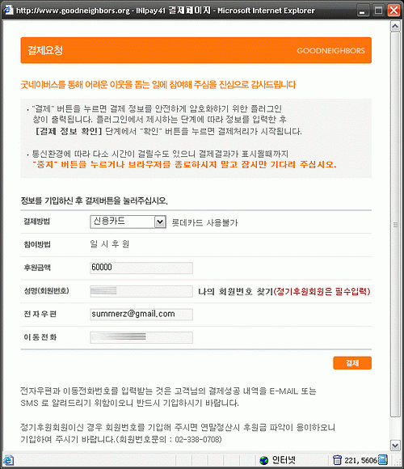

  
**0** 2006년의 마지막 날,  [**굿네이버스**](http://www.goodneighbors.org)에 기부를 했습니다. 제 이름으로는 아니고, 가족 중 다른 사람들의 이름으로 했어요. (하고 나서 생각하니 그냥 누구누구 가족- 이렇게 해도 되는 게 아니었나 하는 생각이 드는군요.)  

<!-- truncate -->

  

사실은 여러번 나눠서 했어요. 즉, 이 화면은 그냥 예. ^^  
**1** 잠깐 예전 이야기를 하면, 예전에 호주에 있을 때만 해도 담배를 폈었죠. 호주의 담배값은 한국에 비하면 엄청 비쌌는데, 흡연자가 무슨 뾰족한 수가 있나요. 그냥 언젠간 끊어야지, 끊어야지 하면서도 계속해서 비싼 담배를 사서 폈는데, 당시 매주 AUD$20~30 (약 16,000 ~ 24,000원) 정도가 담배값으로 나갔죠. 물론 아르바이트도 하고 해서 생활비를 어느 정도 충당하긴 했지만 그래도 낭비되는 돈이죠.  
  
어느날 TV를 켜다가 기부 관련 광고를 보게 됐어요. 호주는 각종 기부 프로그램들에 대한 광고가 자주 나오는 편이었는데, 보통 한달에 AUD$30 정도 정기 기부하는 게 많았죠. 즉, 하루에 AUD$1 (800원)씩 아껴서 내자는 그런 취지였겠죠? 광고를 볼 때마다 "담배를 끊으면 그 돈으로 내겠다"고 다짐을 했는데 결국 한번도 못냈어요. 담배는 끊었지만. 여기까지가 예전 이야기이고,  
  
  
**2** 올해 블로깅을 하면서 수입이 조금 있었는데, 그 중에 하나는 [**블로그플러스**](http://blogplus.joins.com)를 통한 것이었습니다. 블로그플러스에 회원가입을 하고, 글을 쓰다보면 이슈가 되고 인기가 있는 글들에 한해 일간스포츠 지면에 글이 실리고 일정 금액의 고료를 받게 되는데, 제 글도 몇 번 실렸더라고요.  
  
처음에 이와 같은 방식으로 제 글이 사용되는 걸 허락할 때 "나야 전문으로 글을 쓰는 사람도 아닌데 (엄밀히 따지면 이 블로그의 글들을 처음부터 댓가를 바라고 쓴 건 아닌데), 이게 돈이 된다면야 괜찮은 거네" 라는 생각 이상도 이하도 아니었지요. 물론 전문적으로 하시는 분들도 많고, 돈을 많이 버시는 분들도 많지만 말이죠. 어쨌든 그래서 저는 돈을 받으면 그 중의 일부를 어딘가에 좋은 일에 쓰자고 속으로 생각했는데, 2006년 마지막 날에 약속을 지키게 되었군요.  
  
  
**3** 블로그에 [**애드센스**](http://www.google.com/adsense/?hl=ko)도 달았지요. 이제까지 달았다가 뗀 적도 있고, 저는 다른 분들처럼 클릭이 많이 이루어지지 않더라고요. 하지만 이제 거의 1년이 넘어가는 시점에서 드디어 $100 가 채워졌어요. :) 아직 돈을 받기 전이라 중간에 무슨 일이 있을지 모르겠지만, 이것도 받게 되면 쓸 곳에 대해 생각을 하고 있습니다.  
  
어쨌든 약속을 하나씩 지키게 되서 저도 뿌듯하군요. 내년에도 애드센스든 블로그플러스든 또 다른 경로든 블로깅을 통해 번 돈이 있으면 일부를 좋은 일에 사용할 생각입니다. 그리고, 뭔가 재밌는 꺼리를 만들어서 하면 더 재밌을 거란 생각도 들고요. :)  
  
  
p.s. 블로그플러스를 소개해 주고 알려 주신 홍기자님과 조기자님에게 감사를 드립니다. :)
