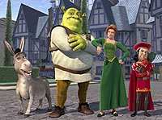
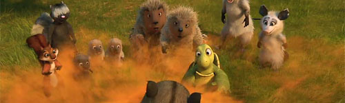
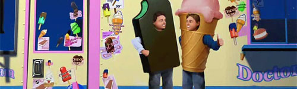
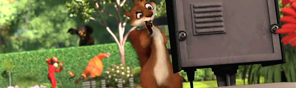

<슈렉>이 경쟁 치열한 극장용 애니메이션 시장에서 대박을 칠 때 많은 사람들이 드림웍스에서 새로운 대형 애니메이션 스튜디오로서의 가능성을 발견했을 것이다. 포스트 디즈니로 맹위를 떨치다가 지금은 디즈니에 합병된 픽사와는 또다른 형태의 3D 애니메이션이란 바로 **성인 취향**으로 새로운 시장을 공략하는 애니메이션이 아니었을까? 정확하게 따지면 어린이들이 볼 수 있는 기본 이야기 구조에 어른들이 웃을 수 있는 코드를 심어서 시장을 확장시킨 드림웍스의 첫 성공 사례가 바로 <슈렉>이었던 것 같다.  

<!-- truncate -->

난 처음엔 그런 분석들을 별로 염두해두지 않고 애니메이션 그 자체로 드림웍스의 작품들을 즐겼었는데, 그 중의 하나가 바로 <마다가스카>이다. 여느 평범한 디즈니풍 애니메이션으로 충분히 재밌는 작품이라고 생각했지만, 많은 평론가들은 드림웍스만의 색깔이 없다는 걸 지적했었다.  
  
  
이른바 맛폭탄. 기발하다.  
하지만, 나 역시 <헷지>를 한참 낄낄거리며 보면서 예전부터 사람들이 이야기하는 **드림웍스만의 무기**가 무엇인지 다시 한번 느끼게 되었다. 우선 그들은 굉장히 현실적인 이야기를 소재로 삼는다. (심지어 동화의 트위스트 버전인 <슈렉>에서의 왕국마저 스타벅스가 있다.) 주로 동화나 상상의 세계를 이야기하는 디즈니와의 차별점이라 할 수 있다. 또한 그들은 그러면서도 세상의 이치를 그리 미화시키지 않는다. 역시 이 점은 열정과 순수함에 대한 이야기를 만드는 픽사와의 차별점이다. 물론 전체적인 모양새와 결말이야 어린이 관객들을 위해 해피앤딩으로 끝내긴 하지만, 이야기를 하는 동안에는 현실을 직접적으로 패러디하고 조롱하기도 하며 기존의 생각들을 비꼬면서 웃음을 만들어 낸다.  
  
  
먹기 위해 사는 인간들  
그런 면에서 보자면 <슈렉> 시리즈의 직접적인 현실 풍자만큼은 아니지만 <헷지>는 어느 정도 그들의 색깔을 되찾은 느낌이다. 적대적인 관계로 변해버린 인간과 동물들 간의 관계를 바탕으로 현대 도시인들의 생활 패턴을 적절히 패러디하며 재밌는 이야기를 만들어 냈다. (이러한 풍자에 대한 감각은 <은하수를 여행하는 히치하이커를 위한 안내서>의 각본가였던 공동 감독 캐리 커크패트릭의 공이라는 중평이다.) 전혀 기대하지 않고 봤는데 상당히 재밌는 영화. :)  
  
  
수퍼두퍼 넛, 해미의 활약  
여기까지 적고 나니 헷지 잡담이 아니라 드림웍스 잡담인 듯한 느낌. -\_-;  
  
 /  /   
  

**그 밖에 몇 가지 직접적인 이야기**  
  
- 성우들이 너무 잘 어울렸다. 브루스 윌리스 (RJ 역)의 톤을 높인 목소리는 여러 영화에서 보여준 그의 능글맞은 이미지와 딱 어울렸으며, 게리 샌들링 (번 역)의 또다른 형태의 능글맞음 (그리고 느릿느릿함)은 거북이라는 캐릭터와 잘 어울렸다. 그 밖에 윌리엄 섀트너 (아지 역)와 에이브릴 라빈 (헤더 역)의 부녀 캐릭터 연기도 상당히 잘 어울렸고.  
  
- 반면 더빙판은 정말 영화의 재미를 상당히 반감시켰는데, 솔직히 애니메이션 성우로 유명인을 쓰는 건 흥행을 위해 애니메이션 캐릭터에 그들의 이미지를 적극 반영하기 위한 것 아닌가? (나만 해도 이 영화를 보기 망설였던 이유는 내가 가는 대부분의 극장에서 더빙판을 하고 있었기 때문이다) (영어를 모르는 아니 자막을 읽기 힘든) 아이들을 위해 더빙을 하는 건지 어떤 건지 모르겠지만, 원작의 분위기와 재미를 유지하는 더빙은 정말 힘든 작업이라 생각한다. <빨간 모자의 진실> 같은 경우는 국내 흥행에 있어 더빙 덕을 봤다고 하지만 더빙은 정말 신중해야 할 듯 싶다. (물론 원작의 재미와 내용을 살린 제대로 된 번역이 우선이겠지만)  
  
- 성우들과 캐릭터들이 잘 어울렸다고 생각했기 때문인지 캐릭터들의 표정과 연기도 너무 좋았다. 큰 동작과 표정도 기존의 드림웍스 작품들보다 많이 좋았지만, 이야기의 진행과 잘 어울리는 세세한 표정들은 영화의 재미를 강화시켜주었다.  
  
- 오프닝 타이틀을 비롯해 몇몇 표현은 정말 재밌었는데 (기존 영화에서 쓰였든 쓰이지 않았든 간에), 예를 들자면 RJ가 숲 속의 동면 동물들에게 치즈맛 나초칩 봉지를 열 때의 그 시각효과라든지 스컹크 스텔라의 방귀에 대한 표현은 기발했으며 특히 후반부에 해미가 카페인이 든 마하6를 마신 후의 장면은 압권이었다. :)  
  
- 그 밖에도 인간과 음식에 대한 이야기라든지 RJ와 넝마주이의 비교, 제네바 협정 운운하는 인도주의적인 동물들의 대우, 두더지 꼬마들의 운전 관련 이야기도 재미있었다.  
  
- 왜 국내 개봉 제목을 왜 <헷지>라고 했는지 모르겠다. "Over The"를 빼려면 아예 번역을 하는 게 더 낫지 않았을까? "울타리" 라든지 "울타리 너머" 같은 식으로. 솔직히 "헷지 hedge"라는 단어가 우리나라에서 흔히 쓰이는 단어는 아니잖아.  
  
- 그리고, 벤 폴드 (Ben Folds)가 참여한 사운드트랙은 영화의 백미. "Family of Me", "Still", "Heist" 등의 곡을 불렀는데 <호기심 많은 조지> (Curious George, 2006)의 잭 존슨 (Jack Johnson)의 음악 만큼이나 좋다.  
  
  
Ben Folds - Family of Me
