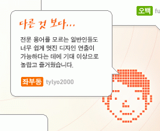

네이버 블로그 시즌2의 에피소드1이 [**오픈**](http://section.blog.naver.com/NoticeList.nhn?mode=r&nid=905)을 했다.  

<!-- truncate -->

**1** 우선 네이밍이 참 대단하다. IT적인 냄새를 풍기지도 않으면서도, 적당히 매니아적인 분위기 (미국 TV드라마 시리즈 정도는 아는 센스)를 풍기는 네이밍이 아닐까 싶다.  
  
그런 면에서 다음과 티스토리의 [**2세대 블로그 캠페인**](http://2.tistory.com/)은 여러 모로 아쉽다. 일단 이름부터 따라지은 듯한 느낌이 들 뿐더러 세대라는 표현은 애매하다. (아이팟 사용자라면 익숙할 수도 있겠다.) 적어도 나에겐 [싸이월드의 **C2**](http://c2.cyworld.com)는 느낌이 좀 다르지만, 시즌2와 2세대는 비슷하게 느껴진다.  
  
**2** 예전에 시즌2 서비스의 예고편 격이라 할 수 있는 [**플래시 동영상**](http://blogimgs.naver.com/imgs/event/0612/blogrenewal.html)이 돌아다닐 때부터 우려를 하긴 했다. 이 영상의 핵심은 **블로그의 템플릿을 설치형 블로그 정도로 자유롭게 변경할 수 있다**인데, 많은 사람들이 실제로 저렇게 실시간으로 위젯이나 구성요소를 이동할 수 있거나 삐뚤삐뚤 위젯을 걸어놓거나 하는 게 가능하다고 받아들이는 것 같았기 때문이었다.  
  
굳이 이야기하자면 **과장광고** 정도 되는 셈인데, 정말 네이버의 수완이 대단하다고 느껴지는 지점이다. 무료서비스이기 때문에 특별히 배상해야 할 금액이 있는 것도 아니니까.  
  
**3** 아직 **에피소드1**이기 때문에 더 많은 변화들이 생길텐데, 적지 않은 사람들이 지금의 업데이트를 **시즌2** 전체의 변화라고 생각하는 듯 하다. 어쨌든 네이버는 시간을 벌었다. 많은 사람들의 이목을 집중시키는데 성공했고, 이슈를 만들어 냈다.  
  
또한, 시간을 너무 오래 끌지만 않는다면 사용자들로부터 에피소드 2, 3 등 차후 기획들을 눈여겨 지켜볼 여지를 남겼다는 점에서 성공적이라 할 수 있겠다.  
  
  
이번 업데이트의 의의는 바로 이것.  
**4** 개인적으로 우려되는 지점은 바로 차후 업데이트 (에피소드 2, 3 혹은 그 이후의 업그레이드) 이다. 만약 네이버가 블로그에 독립 도메인 지원을 하게 된다면, 수많은 독립형(처럼 보이는 네이버의) 블로그들이 네이버의 닫힌 정책 안에서 컨텐츠를 생산해내며 혹은 펌질을 하며 세가 커질 것이라 생각하니 오싹하다.  
  
이 닫힌 정책은 네이버가 대표로 네티즌들의 몰매를 맞고 있지만, 사실 싸이월드도 똑같다. 그동안 미니홈피는 개인의 공간이라는 개념 하에 검색이 안되는 게 당연할 수도 있었지만, C2를 통해 그 사용성이 확대되는 서비스를 기획하는 싸이월드도 닫힌 정책을 유지한 채 그 세를 확장시킬까 두렵다.  
  
**5** [보도자료에 따르면](http://www.newswire.co.kr/read_sub.php?id=216745&no=0&ca=&ca1=&ca2=&sf=&st=&of=&nwof=&conttype=&tm=1&type=&hotissue=&sdate=&eflag=&emonth=&spno=&exid=&rg1=&rg2=&rg3=&tt=) 향후 연말까지 포스트 주제별 템플릿 지원, 외부 메타 블로그와의 연동, 포스트 저작권 보호 기능 강화 등의 기능을 추가 할 것이라고 한다. 반면 현재 네이버가 욕을 먹는 가장 큰 이유는 **닫힌 정책**과 **무분별한 펌글의 방치 및 조장** 정도라 할 수 있는데, 그에 대한 변화는 그리 없는 듯 하다.  
  
자신의 소중한 컨텐츠가 다른 회사의 검색에 걸리지 않게 하고 생성된 컨텐츠의 저작권을 보호하는 것이 정책이라면, 다른 회사의 서비스를 통해 생성된 컨텐츠를 무단으로 들고 오는 사용자들의 행위도 잘 처리하고 막아야 당연한 것 아닐까 싶은데, 네이버의 생각은 그렇지 않은가 보다. 그나저나 앞 뒤 가리지 않고 닥치는 대로 모두 먹어대기에는 네트가 너무 광대하지 않나?  
  
  
배고파… 배고파…
