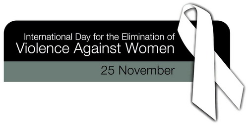
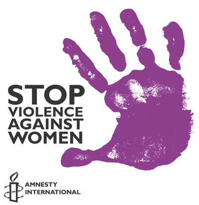
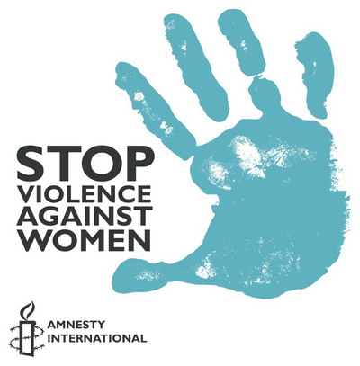

SVAW aka Stop Violence Against Women  

<!-- truncate -->

**Up To 69**  
  
  
어떤 나라에서는 69%에 이르는 여성들이 그들의 배우자에 의해 신체적인 폭행을 당해오고 있습니다. 당신은 이에 대해 무언가 할 수 있습니다.  
  

  

**One Man Fight**  
  
  
여성에 대한 폭력을 추방하자.  
살해당한 여성의 두 명 중 한 명은 그들의 남성 파트너에 의해 죽음을 당한 것입니다. 또한 이는 지속적으로 학대받는 관계 속에서 이루어 질 때가 많습니다.  
  

  

**The Audition**  
  
  
가정 폭력에 대해 이야기를 하는 자리에서 많은 패널들은 아예 비협조적인 자세로 나오는데, 한 남자가 이야기를 합니다. "경찰이 오기 전에 부인을 35번이나 때렸다"는 사실을 자랑스럽게 이야기하죠. 여성 사회자가 추가로 무언가를 이야기하려 하자 이야기를 끊으며 자신에게 "뭘 하라고 지시하지 말라"며 급격하게 흥분하기 시작합니다.  
  
대부분의 가정 폭력은 이렇게 이루어지는 게 아닌가 싶습니다. 상대방을 자기보다 미천하다고 생각하며, 그런 상대방이 감히 자기에게 이래라 저래라 하는 게 싫고, 그럴 때마다 흥분하여 폭력을 행사한 후, 다시 깔끔하게 사과를 청하는 과정이 반복된단다는 건 여러 기사를 통해서도 잘 알려진 사실이죠.

  
  

참고로 매년 11월 25일은 **세계여성폭력추방의 날**입니다. 도미니카공화국의 세 자매가 독재에 항거하다 살해당한 것을 기리기 위해 1981년 11월 25일 제정되었습니다. 이후 1991년 미국 여성국제지도력센터에 모인 세계 여성운동가들이 세계인권의 날인 12월 10일까지 16일간을 **세계여성폭력추방주간**으로 정했다고 합니다.  
  

