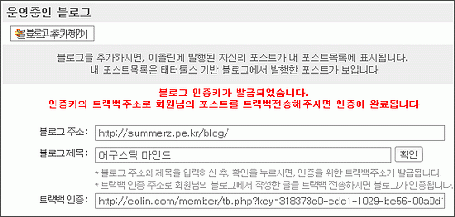

얼마 전부터 새로운 url이 보이기 시작하던 [**이올린**](http://eolin.com)이 드디어 개편되었습니다. 회원제를 기반으로 한 서비스로군요.  

<!-- truncate -->

그런데, 등록한 계정에 자신이 운영 중인 블로그를 추가하기 위해서는 그 블로그에서 글을 쓰고 트랙백을 보내야 한다고 되어있습니다. 보기에 따라서 조금 불편할 수도 있지만, 매우 재밌는 아이디어라고 생각합니다. 반강제 바이럴 마케팅? :p  
  
  

재밌는 방식이긴 한데, 어리둥절 할 사용자가 많을 것 같아요.  
(파이어폭스에서 좌측 상단 버튼이 좀 깨지는군요.)  
[태터툴즈](http://tattertools.com) 쪽 ([티스토리](http://tistory.com), [태터툴즈 포럼](http://forum.tattertools.com) 포함)은 전체적으로 좀 어려워요. 컴퓨터나 인터넷, 블로그에 대해 잘 모르는 사람들은 아직 접근하기 좀 어려운 면이 있다고나 할까요? 앞으로 점점 일반인들(^^)과도 친숙해졌으면 좋겠습니다.  
  
어쨌든 축.  
  
  
p.s. 잠깐 서비스를 둘러보고 있는데, 구석구석 재밌는 부분이 많군요. 태터툴즈 및 이올린 관계자분들 모두 수고하셨습니다. :)
