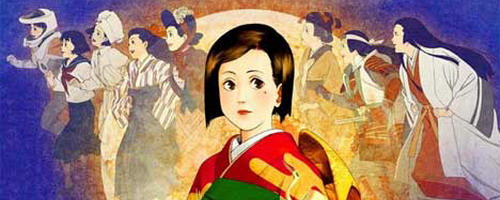
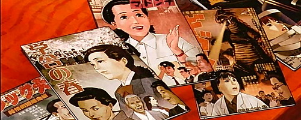
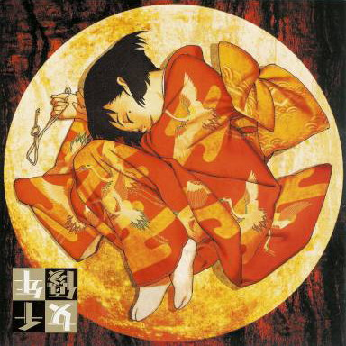

aka 千年女優, Chiyoko - Millennium Actress  

<!-- truncate -->

> 창립 70주년을 맞아 개축을 위해 촬영장을 철거하는 은영 영화사는 이를 기념하기 위해 전설적인 여배우 후지와라 치요코의 다큐멘터리 영화 제작을 타치바나 원야에게 맡긴다. 평소 그녀의 작품을 수십 번이나 봤을 정도로 열혈 팬이었던 그는 그녀를 찾아 나선다. 그녀는 전성기를 누리던 30년 전 갑자기 은막 뒤로 사라진 뒤, 신비에 둘러싸여 온 인물. 타찌바나는 어렵게 찾아낸 그녀에게 그녀가 잃어버린 추억의 열쇠를 내 놓으며 인터뷰를 시작한다. 그 열쇠는 소녀 시절 그녀가 한 남자에게 받았던 것이자 그녀의 평생을 이끌어온 운명이었다. 그리고, 그녀는 차근차근 입을 열기 시작하는데…

  
  
곤 사토시 감독이 여러 인터뷰에서 밝혔듯이 이 영화 (애니메이션)는 **<퍼펙트 블루>의 형제 버전**이라 할 수도 있다. 또한, **거짓으로 엮어 이은 진실, 그게 내 애니메이션이다**는 그의 말이 잘 어울리는 작품이기도 하다.  
  
형식적으로 무엇보다 특이한 점은 인터뷰를 하면서 치요코의 이야기 속에 인터뷰어인 원야와 그의 조수가 등장해 그녀를 쫒아다닐 뿐만 아니라 원야는 그녀의 이야기에 직접적으로 관여를 한다. 원야가 그럴 수 있었던 이유는 실제로 그녀와 같은 촬영장에서 근무를 한 경험이 있을 뿐만 아니라 그녀를 배우로서 너무나 좋아하는 팬이기에 (그녀가 출연한 모든 영화를 여러 차례 감상했기 때문에) 가능한 것이다.  
  
그녀의 모든 연기는 언제나 '열쇠 하나 남겨놓고 떠나가버린' 그녀의 첫사랑을 떠올리는 그녀의 현실과 닮아있고, 그 첫사랑을 찾으려는 마음이 그녀가 연기를 하는 동력이 된다. 그녀는 첫사랑을 만난 현실과 영화배우로서의 연기를 하는 영화 속 주인공을 넘나들며 첫사랑에 대한 그녀의 애절한 마음을 표현한다.  
  
 **지금부터는 스포일러를 포함하고 있습니다. (보시려면 클릭)** 

  
흥미롭게도 영화가 막바지에 이르러 죽음을 앞둔 치요코는 말한다. "그 사람을 쫒아가는 자기 자신이 좋다"고. 즉, 열쇠로 대변되는 첫사랑에 대한 설레임과 애절함은 모두 거짓일 수도 있다는 놀라운 반전이다. 첫사랑을 위해 노력하고 열정을 다하는 모습으로 살기 위해 첫사랑이라는 존재를 상정하고, 자기 자신을 그 안에 던졌을 뿐만 아니라 본인을 저주하는 늙은 할멈의 존재까지 만들어냈다고 볼 수도 있다는 뜻이다. (우리는 흔히 이럴 때 "천상 배우"라는 표현을 사용한다.) 하지만, 그렇다고 첫사랑에 대한 감정을 키워가며 그를 만나기 위해 평생 연기를 해온 그녀의 행동이 거짓으로 이루어졌다고만 할 수 있을까? 그렇다. 뫼비우스의 띠와 같은 **거짓으로 엮어 이은 진실**이 탄생하는 순간이다.  
  
  
또한 앞에서 이야기한 것처럼 치요코의 이야기는 그녀가 출연했던 영화의 일부분이기도 하고, 실제 그녀가 첫사랑을 찾기 위해 노력했던 현실이기도 하다. 그러나, 이 두 가지 서로 다른 세계는 인터뷰어 원야와 첫사랑과 이루어질만 하면 항상 둘 사이를 가로막는 얼굴에 상처난 남자의 개입으로 인해 서로의 영역을 침범하며 경계가 흐려진다. 어느 것이 현실이고 어느 것이 환상인지 모르는 이러한 설정은 가히 **<퍼펙트 블루>의 형제 버전**이라 할 수 있다. 다만, <퍼펙트 블루>와는 달리 <천년여우>에는 긍정의 기운이 강하다. 사실 이 영화에서 치요코의 삶이 거짓이었는지 진실이었는지를 가리는 건 그리 중요한 게 아니다. 중요한 건 그녀가 끊임없이 무언가 (첫사랑 혹은 첫사랑을 사모하는 자기 자신)를 믿고, 그 믿음을 바탕으로 뜨겁게 나아간다는 사실이다.  
  
사실 이 점은 일본 만화/애니메이션/영화와 한국 만화/애니메이션/영화의 가장 큰 차이점이다. 핫과 쿨. 뜨거운 열정과 멋진 자세. 눈물을 곱씹으며 작은 것이라도 이뤄내는 결말과 정말로 아쉬운 실패에도 불구하고 자의 혹은 타의로 잊고 살아가야만 하는 현실. 아이러니 하게도 우리나라의 신파는 바로 이 후자들이 속한 지점, 즉 쿨함에서 탄생하고, 일본 영화와 애니메이션이 보여주는 후회없는 깔끔함은 이 뜨거운 열정에서 탄생한다.

  
곤 사토시 감독은 원래 영화감독이 되려고 했었다는 글을 읽은 기억이 나는데, 애니메이션팬의 입장에서 보면 애니메이션 감독이 된 게 정말 다행이라고 생각한다. 그는 언제나 다음 작품이 기대되는 감독이다.  
  
  
 /  /   
  
관련 글 : **Perfect Blue - 우리 모두가 피해자고 가해자야.**  
  

**관련 링크**  
  
[tojapan.co.kr - 천년여우(千年女優, 2001) 소개](http://www.tojapan.co.kr/culture/ani/pds_content.asp?service=worklib&number=385)  
[tojapan.co.kr - <천년여우>의 곤 사토시 감독](http://www.tojapan.co.kr/culture/movie/interview_content.asp?number=3388)  
  
[PIFF 2001 by FILM2.0 - 초대석 - <천년여우>의 곤 사토시 감독](http://www.film2.co.kr/festival/200111_piff/piff2001_daily_final.asp?mkey=791)  
[PIFF 2001 by FILM2.0 - 선택! 이 영화 <천년여우>](http://www.film2.co.kr/festival/200111_piff/piff2001_daily_final.asp?mkey=777)  
  
[씨네21 - 현실과 환상의 실험은 계속된다, 곤 사토시](http://www.cine21.com/Article/article_view.php?article_id=25795&page=2&mm=005004002)
