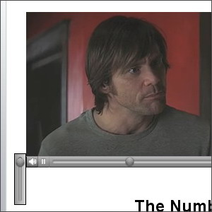
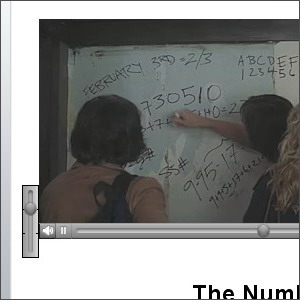

웹상에서 보는 퀵타임으로 된 동영상들은 여느 포맷의 동영상 보다 그 화질이 월등히 좋습니다. 하지만, 퀵타임 동영상을 자주 보시는 분들은 느꼈겠지만, 볼륨을 최대로 해도 여타 동영상이나 음악에 비해 비교적 소리가 살짝 작다는 걸 알 수 있습니다.  

<!-- truncate -->

  
이렇게 좌측 하단에 있는 볼륨을 최대로 해도 소리가 그리 크지 않다는 거죠.  
그럴 때는 **쉬프트 (Shift) 키를 누른 상태로 볼륨 조절을 해보세요.** 그러면 모양이 살짝 다른 인터페이스가 나타나면서 소리를 더 키울 수 있습니다. **상당히 많이 커집니다.** 앞으로는 좋은 화질 만큼이나 소리도 빵빵하게 들으세요.  
  
  
쉬프트키를 누른 상태에서 볼륨을 조정하면 **더 크게** 들을 수 있습니다 !  
  
※ 위의 스크린샷은 영화 조엘 슈마허 감독, 짐 캐리 주연의 [**The Number 23**](http://www.apple.com/trailers/newline/thenumber23/trailer/) 입니다. (공식 홈페이지는 [**http://www.number23movie.com**](http://www.number23movie.com) )  
  
  
관련 글 : **인터넷 익스플로러에서 퀵타임 무비가 안보일 때**  
관련 링크 : [**애플의 영화 예고편 (movie trailers) 사이트**](http://www.apple.com/trailers/)
