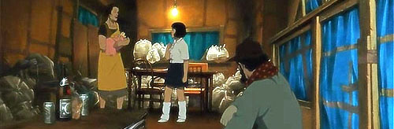
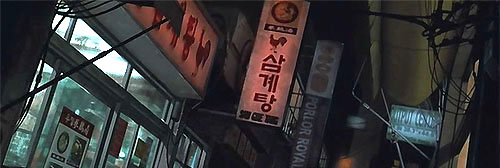

aka 도쿄 갓파더스, 東京ゴッドファ-ザ-ズ, Tokyo Godfathers  

<!-- truncate -->

  
  

홈리스 트리오가 아기를 위해 열심히 뛰어다닙니다.  
간단하게 내용을 말하자면 - 전직 경륜선수였던 긴짱, 여장한 게이로 이름을 날렸던 하나짱, 가출한 소녀인 미유키는 신주쿠의 외진 곳에서 사는 홈리스들입니다. 어느 날 밤 그들은 쓰레기장에 버려진 아기를 발견하죠. 평소에 아기를 가지고 싶어하던 하나짱은 그 아기에게 키요코라는 이름을 붙여주고, 이들은 아기의 부모를 찾아 모험을 떠납니다.  
  
이 작품은 곤 사토시 감독하면 떠오르는 '환상', '현실', '스릴러'와 같은 단어와는 정반대에 있다고 할 수 있습니다. 주인공인 위의 삼인조 홈리스들은 시종일관 한 템포 엇갈리는 유머를 보여주며, 크리스마스와 연말하면 떠오르는 '기적'을 빙자한 '우연'이 극을 이끌어 나가죠.  
  
  

사실 이들은 가족과 다름없죠.  
  
  

빨간 도깨비와 파란 도깨비 이야기도 나옵니다.  
이 유사가족의 좌충우돌 로드무비는 하루라도 더 빨리 화해를 하라고 말하고 있습니다. 하지만, 오랫동안 감정의 교류 없이 지내오던 사람들 사이에 화해란 물론 힘든 일이지요. 그러나, 적어도 이 작품 안에서는 가능합니다. 크리스마스니까. 눈이 내리는 연말이니까. 마치 <러브 액추얼리>의 이야기들처럼 말이죠.  
  
코믹한 면이 강조된 이 작품 속에서도 곤 사토시 감독의 색깔은 빛을 발합니다. 인물과 배경에는 감독 특유의 촘촘한 묘사가 스며있고, 영화는 <천년여우>에 이어 진심과 희망에 대해 이야기하고 있죠. 게다가 코미디 또한 전혀 어정쩡하지 않습니다. 억지로 웃기려고 하는 스타일이라기 보다는 상황을 이용해 툭툭 던지는 대사 위주로 이루어진 코미디에 대한 감각은 장진 감독의 그것과 비슷하기도 합니다. (도대체 이 감독, 못하는 게 뭘까요?)  
  
p.s. 곤 사토시 감독 작품에서 음악을 담당하는 사람들이 누군지 찾아봐야겠다는 생각이 들었습니다. 전형적이지 않으면서도 극에 착 달라붙는 음악은 곤 사토시 감독 작품의 매력 중 하나입니다.  
  
 /  /   
  
  

이들이 열심히 뛰어다니는 뒷골목 풍경 중에 삼계탕 집도 있더군요. :)  

**관련 링크**  
  
[tojapan.co.kr - 동경대부(東京ゴッドファ-ザ-ズ, 2003)](http://www.tojapan.co.kr/culture/ani/pds_content.asp?number=607)  
[tojapan.co.kr - 리뷰 - 실사영화같은 판타지 애니메이션](http://www.tojapan.co.kr/culture/ani/review_content.asp?number=6631)  
  
[씨네21 - <도쿄 갓파더스>로 시카프 찾은 곤 사토시 감독](http://www.cine21.com/Article/article_view.php?mm=001001001&article_id=25560)
