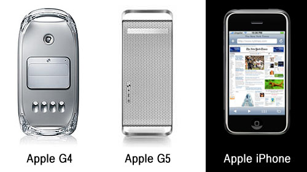
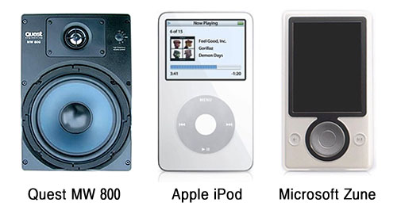

  

스티브 잡스의 발표를 보면서 처음에는 그저 디자인이 (당연히) 애플스럽다고 생각했는데, 보면 볼수록 애플의 데스크탑 디자인들이 머리에 떠올랐다.  

<!-- truncate -->

막상 붙여놓고 보니 좀 달라 보이긴 하지만, 아이폰 아래에 있는 Home 버튼을 파워 버튼으로 고치고 데스크탑으로 내놓아도 전혀 이상없는 디자인이라 할 수 있겠다. 그만큼 심플하다는 뜻이기도 하고.  
  
  

하긴 아이팟이 처음 나왔을 때도 휠이 꼭 스피커의 유닛 같아 보였었다. 마이크로소프트의 준은 그 느낌이 더 강했고.  
  
디자인 그 자체로도 중요하지만, 본래 사용했던 것과 비슷한 느낌을 가지게 하는, 본래의 목적을 상기시키는 디자인이라는 점에서 재미있는 것 같다. 아이팟이나 준은 소리를 내는 스피커를 떠올리게 만들고, 아이폰의 경우에는 이것저것 다 하는 포켓 속의 데스크탑을 떠올리게 만든다.  
  
(그렇다면 아이폰은 핸드폰이 주가 아니라 각종 PDA 기능이 주라는 건가? ^^ 하긴, 스티브 잡스의 발표에서 가장 흥미로웠던 부분도 바로 OS X, 사파리, 구글맵, 리치 HTML을 지원하는 야후 IMAP 같은 거였으니까.)  
  

**추가**  
  
그런데, LG에서 KE850 이라고 아이폰과 비슷한 폰을 먼저 [**발표**](http://www.engadget.com/2007/01/11/iphone-and-lg-ke850-separated-at-birth/)했었군요. 날짜상으로는 분명히 애플보다 먼저인데, LG의 이 휴대폰은 여느 수많은 신제품들처럼 주목도 못받고 사라지는 중이고, (International Forum Design Product Design Award에서는 수상을 했다고 합니다) 애플은 아주 화려하게 난리법석을 떨어버리는군요.  
  
[**▶ 비교 사진 보러가기**](http://www.engadget.com/2007/01/11/iphone-and-lg-ke850-separated-at-birth/)
