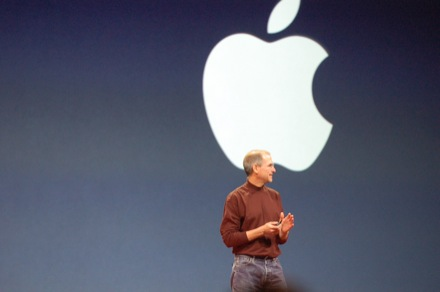  
작정한 듯한 잡스  
사실 Apple TV는 지난번의 재탕 수준이었지만,  

<!-- truncate -->

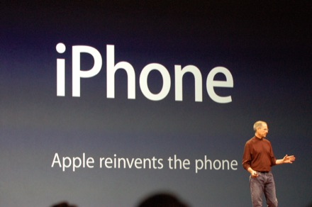  
이번에 새로 소개하는 아이폰은  
  
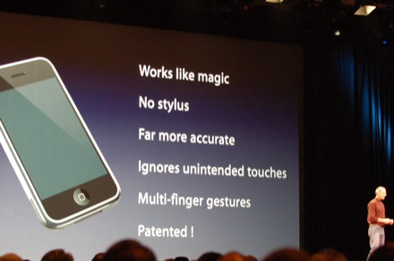  
혁신은 기본에다가  
  
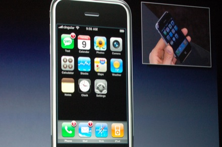  
별의별 ~~gadget (개짓-\_-)~~위젯도 되고,  
  
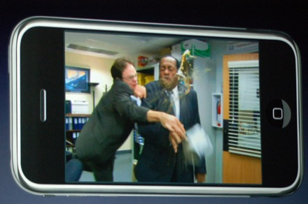  
광활한 와이드 스크린에  
  
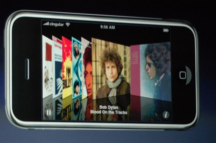  
아이튠즈의 멋진 커버 뷰는 아이폰을 위해 만들었단 생각까지 드는군요.  
  
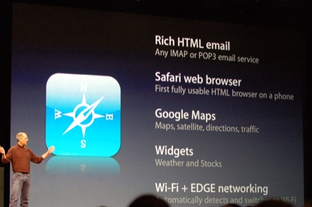  
OS X을 탑재시키는 것도 모자라 사파리와 구글맵을 지원한다고 하더니  
  
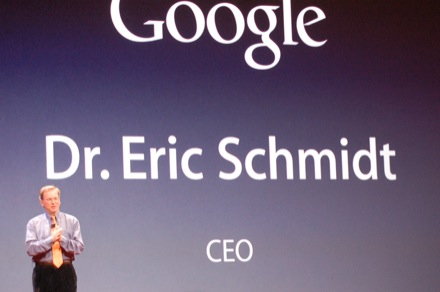  
구글의 에릭 슈미트도 불러내고  
  
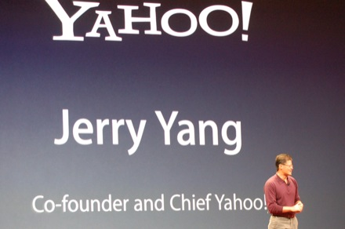  
야후!의 제리 양까지 불러냅니다.  
  
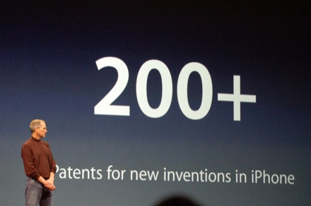  
전화기를 재발명했다고 하는 게 허풍만은 아닌 듯 하군요.  
  
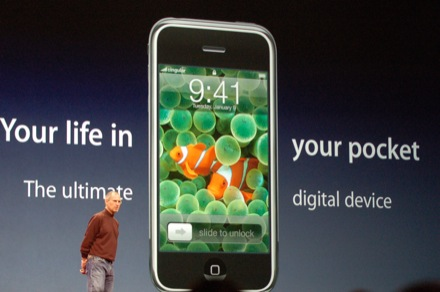  
4기가 $499, 8기가 $599. 아시아는 2008년 예정이라는데, 우리나라는 뭐 택도 없겠죠.  
SKT와 KTF, LGT까지 한꺼번에 미치지 않는 한.  
  
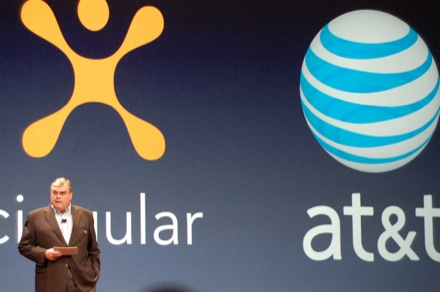  
5천 8백만 가입자를 가진 싱귤러 CEO까지 세웁니다.  
  
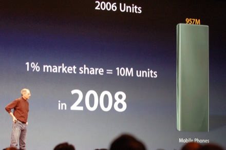  
전세계 9억 5천 7백만개 팔린 핸드폰 시장, 2008년까지 1%를 차지하는 게 목표래요.  
  
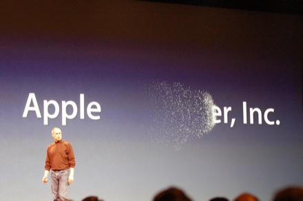  
그러면서, 회사명까지 바꾼답니다.  
이제 Apple Computer Inc.가 아니라 **Apple Inc.**래요.  
  
... 마무리는 아카데미상을 휩쓴 존 메이어 (John Mayer)의 노래로. (확실히 해버리는군요.)  
  
  
사진 출처 : [Engadget - Live from Macworld 2007: Steve Jobs keynote](http://www.engadget.com/2007/01/09/live-from-macworld-2007-steve-jobs-keynote/) (트래픽에 누가 될까 옮겨왔습니다;; )  
  
관련 링크 : [**Apple - iPhone**](http://www.apple.com/iphone/) (공식 홈페이지)  
관련 링크 : [Apple - Apple TV](http://www.apple.com/appletv/) (공식 홈페이지)  
관련 링크 : [Apple Store (한국) - Apple TV](http://store.apple.com/080-3404-622/WebObjects/koreastore.woa/wa/RSLID?mco=100F2F41&nclm=AppleTV)  
  
관련 기사 : [삼성, '구글-야후'와 손잡다](http://news.moneytoday.co.kr/view/mtview.php?no=2007010910452948078&type=2)  
관련 기사 : [삼성, 구글폰ㆍ야후폰 공개…美선 인터넷TV 인기](http://news.mk.co.kr/newsRead.php?no=12351&year=2007)  
관련 기사 : [삼성전자, CES 2007에서 '야후폰', '구글폰' 선보여](http://aving.net/kr/news/default.asp?mode=read&c_num=32401&C_Code=01&SP_Num=53)  
(관련기사라기 보다는 비교되는 기사 -\_-)
