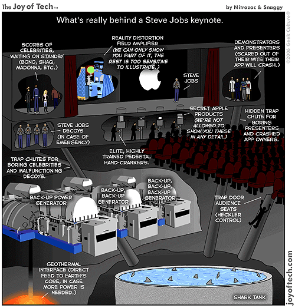

  
보시다시피 출처는 [**joyoftech.com**](http://joyoftech.com/joyoftech/joyarchives/772.html)입니다.  

<!-- truncate -->

잠깐 설명을 붙이자면,  
  
일단 스티브 잡스가 서 있는 무대 뒤에는 "현실왜곡파"를 증폭시키는 장치가 있습니다. 그렇지 않고서야 스티브 잡스의 연설과 애플의 기기들이 매번 매력적으로 보일 수가 없겠지요!  
  
무대 아레에는 애플의 비밀스러운 신개발 제품들이 있습니다. 물론 일반인에게 공개되어 있지 않죠. 이 신개발 제품들은 매우 잘 훈련된 엘리트들에 의해 무대 위로 올라갑니다.  
  
무대 오른쪽에는 시연자들과 발표자들이 대기하고 있습니다. 그들은 유머감각이 형편없어서 청중을 휘어잡지 못할까봐, 그들이 시연할 어플리케이션들이 에러를 일으킬까 두려워하고 있군요.  
  
무대 왼쪽으로는 U2의 리더 보노라든지 샤킬 오닐, 마돈나 같은 세계적인 유명인사들이 대기하고 있고, 그 아래에는 비상시를 대비해서 스티브 잡스와 똑같이 생긴 로봇들이 있습니다.  
  
청중을 지루하게 만든 유명인사들이나 고장난 스티브 잡스 로봇들, 어플리케이션에 에러가 생긴 발표자들을 위한 함정도 있습니다. 상어들이 득실거리는 수조로 직행하는군요. 키노트 동안 야유하는 청중도 이 상어 수조로 직행입니다. (아하! 그래서 그렇게 열심히 박수를 치는구나!)  
  
그리고, 이 행사장 지하에는 파워에 이상이 생겼을 때를 대비한 백업 발전시설이 있습니다. 백업 발전시설을 백업하는 시설도 있고요. 뿐만 아니라 백업 발전시설을 백업하는 시설을 백업하는 시설도 되어 있습니다! 그래도 전력이 더 필요하면 지구의 핵으로부터 전력을 공급받습니다.  
  
자, 이제 스티브 잡스의 키노트에 대한 비밀이 풀리셨습니…까? :p
