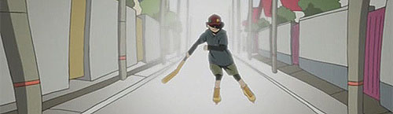
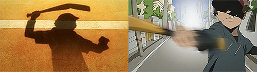
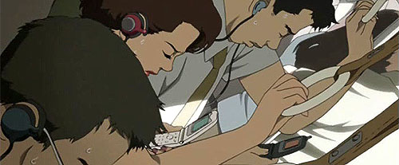
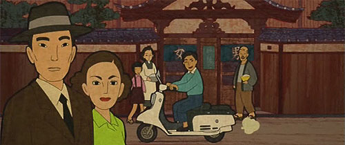
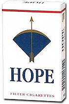
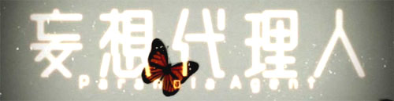

aka 妄想代理人, Paranoia Agent  

<!-- truncate -->

  
모든 것은 인기 캐릭터 마로미를 만들어낸 캐릭터 디자이너 사기 츠키코로부터 시작한다. 그녀는 다음 캐릭터도 히트하길 기대하는 사람들 때문에 스트레스를 받다가 그만 금색 롤러블레이드를 신고 구부려진 야구방망이를 든 소년에게 습격을 당하고, 이 소년은 "소년 배트"라고 불리우게 된다.  
  
이카리와 바바 형사는 이 사건을 조사하게 되는데, 이 단순한 듯 보이는 사건은 소년 배트에게 가격 당하는 사람들이 많아짐에 따라 점점 미궁 속에 빠져든다.  
  
  
이카리와 바바 형사는 여기서 흥미로운 사실을 알아내는데, 그것은 바로 소년 배트에게 당한 사람들에게 공통점이 있다는 것이다. 그것은 바로 "궁지에 몰렸다"는 점. 즉, 그들은 궁지에 몰린 사람을 알아내서 그 사람 주위에 있으면 소년 배트를 잡아낼 수 있다는 결론에 도달한다.  
  
 **스포일러가 될 수 있는 부분은 감춰두었습니다. (보시려면 클릭)** 

  
현대에는 갖가지 것들에 중독된 사람들이 있다. 중독이란 그것이 사라졌을 때 금단현상이 생기는 것이다. 애니메이션, 판타지, 전자오락, 육체적인 쾌락 심지어는 고통이나 자살에 중독된 사람들도 있으며 무리에서 이탈하지 않으려고 최선의 노력을 다하는 사람들도 있다. 이들의 공통점은 무엇일까? 자기 자신과 직접적으로 관련이 없는 것들, 자기 자신 이외의 것들에 중독되었다는 점이다.  
  
소년 배트는 이렇게 무엇인가에 중독되어 불안해진 사람들의 마음 속 틈새를 노려 거짓 구원을 하는 것이다. "어쩔 수 없었어.", "나도 당했으니, 이젠 내 책임이 아니야."와 같은 생각을 갖게 만들어 준다. 재밌는 것은 이 소년 배트라는 인물 자체도 사람들 각자가 만들어낸 거짓의 인물이라는 점이다. 후회를 막아주는 백만 스물 두 가지 핑계 중의 하나. 실제로 이 소년 배트는 캐릭터 디자이너 사기 츠키코의 10년 전 거짓이 만들어 낸 망상 속의 인물이다.  
  
  
하지만 결국 곤 사토시 감독은 이카리 형사 부부의 입을 빌려 말한다. 비록 세상이 잘못됐다 해도 옳바름이란 반드시 있으며 그러기 때문에 우리는 살아갈 수 있는 거라고 말이다. 결국 순간적인 도피는 가짜에 지나지 않으니 아무리 힘들어도 극복하자는 해결책을 시리즈 내에서 매우 직접적으로 말한다.  
  
동시에 이카리 형사의 파트너인 바바 형사는 이 환상과 망상을 통해 이루어진 사건을 해결하는 역할을 한다. 소년 배트와 관련된 사건은 점점 그 규모가 커지고 모든 도시를 파멸로 몰아넣을 뻔 하지만, 바바 형사는 판타지 오락에 빠져 "소년 배트"인 척 모방범죄를 일으킨 소년의 말까지 귀를 기울이는 세심함과 집중력을 발휘해 결국 이 모든 미스테리를 풀어낸다.  
  
후반부에 이카리 형사가 거짓으로 이루어진 세상에서 안주하다가 그 세계를 때려부수는 장면은 마치 <매트릭스> 시리즈의 세계관과 <파이트 클럽>의 마지막 장면을 떠올리게 한다. 소년 배트라는 존재가 정신없이 폭주하는 것과 사이코 드라마라는 극의 성격은 <신세기 에반게리온>을 떠올리게 하기도 하고.

  
이 작품은 매우 천연덕스럽게 여러가지 형식을 보여주고 있는데, 마지막 잎새 같은 고전을 패러디하는가 하면, 판타지 혹은 전자오락과 같은 세계를 표현하기도 하고, 컷 아웃 애니메이션을 보여주는가 하면 심지어는 애니메이션 제작에 관한 이야기를 상세한 설명을 붙여 보여주기도 한다.  
  
  
그리하여, 이 작품은 정말 더도 덜도 아닌, 정확히 "곤 사토시 감독이 만든 TV시리즈"라 할 수 있겠다 (2004년작). 시리즈의 중반부에 핵심 줄거리와는 조금 벗어나는 에피소드들이 있어서 극의 전체적인 밀도가 살짝 떨어지는 감도 있지만, 자유로운 형식과 다양한 주제의 이야기를 오밀조밀하게 엮어놓는 솜씨는 대단하다고 할 수 밖에 없다. 극의 분위기를 정확하게 잡아주는 음악 역시 말할 것도 없고. :)  
  
  
<망상대리인> 인트로 및 주제곡 - 夢の島思念公園  

**이것 저것**  
  
[妄想代理人 공식 홈페이지](http://www.mousou.tv/) (일본어)  
[Paranoia Agent 공식 홈페이지](http://www.paranoiaagent.com/) (영문)  
  
[tojapan.co.kr - 망상대리인(妄想代理人, 2004)](http://www.tojapan.co.kr/culture/ani/pds_content.asp?number=717)  
[Ray's 月 - 망상대리인.](http://raypiel.egloos.com/1413614) (바바 형사의 활약상 등 몇몇 이미지 첨부)  
  
히라사와 스스무 (Susumu Hirasawa)가 <천년여우>에 이어 사운드트랙을 맡았다.  
  
[chaosunion.com - Susumu Hirasawa](http://www.chaosunion.com/hirasawa/e/) (영문)  
[Wikipedia - Susumu Hirasawa](http://en.wikipedia.org/wiki/Susumu_Hirasawa) (영문)  
  
[D-S in the Wonderland - Rotation (LOTUS-2) - 히라사와 스스무](http://dseraph.egloos.com/2636192) (<천년여우> 앤딩곡)  
  
[만화인 잡학사전 - 호프](http://www.manhwain.com/ez2000/ezboard.cgi?db=manhwain_dic_01&action=read&dbf=1&page=0&depth=1) (담배)  
[HOPE 지포 라이터들](http://www.geocities.jp/zippo77tetsu/hope.html)
