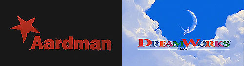
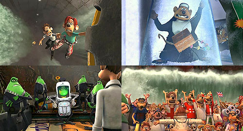
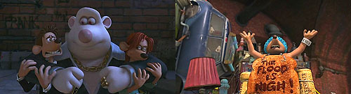
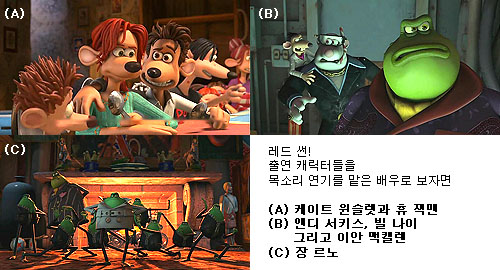
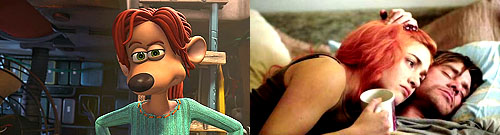
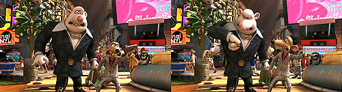

aka 플러쉬 어웨이, Flushed Away  

<!-- truncate -->

 아드만 + 드림웍스  
클레이 애니메이션의 대가 아드만 스튜디오의 작품이다. <치킨 런> 때부터 아드만 스튜디오와 함께 일했던 드림웍스가 공동 제작을 했다. 이 작품은 3D 애니메이션이다. 그리고. 이 작품은 우리가 "아드만, 클레이, 드림웍스, 3D…" 하면 떠오르는 그 여러 생각들에 거의 들어맞는 작품이다.  
  
  
많은 영화의 패러디와 아드만 특유의 영국식(?) 유머들  
드림웍스 제작답게(!) 수많은 패러디가 등장한다. 극 초반부터 007 시리즈, <니모를 찾아서>를 슬쩍 흘리더니 수퍼맨 시리즈, <타이타닉>, <터미네이터> 등 꾸준히 패러디해내는가 하면 주인공 로디 (목소리 연기: 휴 잭맨)가 처음 하수구 마을로 떨어졌을 때의 느낌은 조금 과장을 섞자면 &;t;A.I.>에서 처음 로봇들의 도시에 들어온 장면을 비출 때를 떠올리게 했고, 루비와 관련된 초기 에피소드에서는 <반지의 제왕>을 떠올리게도 한다. (그렇다. 이 작품엔 간달프와 골룸이 목소리 연기에 참여하고 있다.) 또한, <꼬마 돼지 베이브>에서 화면 구석에서 노래를 부르던 쥐들과 같은 역할을 하는 아카펠라 민달팽이 중창단도 있다.  
  
  
화이티는 <월리스와 그로밋> 시리즈의 캐릭터를 많이 닮았다.  
오른쪽은 종말을 부르짓는 하수구 마을의 한 시민 (THE FLOOD IS NIGH!)  
더군다나 <월리스와 그로밋: 거대 토끼의 저주>에 나왔던 토끼 인형과 <마다가스카>의 사자 알렉스 등 아드만 스튜디오와 드림웍스의 여러 작품에 등장했던 캐릭터들이 슬쩍슬쩍 소품으로 등장한다. 하긴, 이런 건 아드만 스튜디오의 특징이기도 하다.  
  
  
화려한 이름들에 걸맞게 연기들이 아주 좋다. 특히 케이트 윈슬렛의 씩씩함이 좋다.  
사실 이 작품의 가장 큰 미덕은 배우들의 목소리 연기이다. 주인공 리타의 목소리를 맡은 케이트 윈슬렛의 연기는 정말 생생하다. 평소 여러 영화를 통해 보여주었던 그녀의 매력이 충분히 발산된다. 또한, 어리숙한 악당 스파이크와 화이티 콤비의 목소리를 맡은 (골룸으로 유명한) 앤디 서키스와 (<러브 액추얼리>의 퇴물 가수) 빌 나이의 연기도 매력만점이다. 특히 빌 나이의 능청스러움은 얼굴은 보이지 않지만 목소리만으로도 여전히 빛난다. 우리의 '간달프' 이안 맥켈런과 '레옹' 장 르노의 연기도 훌륭하다. (휴 잭맨은? 아쉽지만 몇몇 장면을 빼놓고는 그의 특징이 잘 드러나지는 않는다.) 또한 여기저기에서 빛나는 엉뚱한 유머는 분명 아드만 스튜디오와 목소리 연기를 한 영국 배우들의 공이다.  
  
  
리타가 대사하는 걸 보고 있으면 <이터널 선샤인>에서의 빨강 머리 그녀가 저절로 떠오른다.  
예고편으로 처음 봤을 때는 클레이와 3D의 묘한 특징이 잘 어우러져서 기대를 많이 했는데, 막상 보고 나니 클레이의 느낌이 생각보다 적어서 아쉬웠다. 입의 움직임이라든지 캐릭터들의 과장된 액션 등은 '이 애니메이션이 아드만표구나'하고 충분히 느낄만한 것이었지만, 사실적이고 부드러운 렌더링이라는 요즘 3D 애니메이션의 추세를 따르는 다른 애니메이션에 눈이 익숙해서인지 전체적으로 질감은 단순하고, 배경묘사가 부족했다는 느낌이다. 특히 배경이 많이 아쉬웠는데 만약 이 작품이 실제 소품을 이용해 만든 클레이 애니메이션이었다면 상당히 다른 느낌이었을 것이다. (그리고, 나는 더 좋아했을 것이고.)  
  
  
스파이크가 "적이 12시 방향에 있다!" 하고 소리치니 화이티는 시계를 본다. 크크.  
아드만 스튜디오와 드림웍스가 함께 작업할 때 더 많은 걸 얻는 쪽은 어디일까? 그건 말할 것도 없이 드림웍스라고 생각한다. (물론 아드만 스튜디오가 재정적으로 힘들어 오늘 내일 문을 닫아야 하는 정도가 아니라는 전제하에.) 3D라는 기술은 유행일 뿐이지만, 아드만 스튜디오가 가진 캐릭터의 묘사력, 미니어쳐 세트의 제작기술, 조명의 활용력 등의 기술은 애니메이션을 하는데 필요한 원천기술이라 생각하기 때문이다.  
  
아드만 스튜디오에서 다음 작품도 3D로 제작한다면 보다 아날로그의 느낌이 더 많이 나길 바란다. 클레이 애니메이션으로 제작한다면 더 좋고. :)
