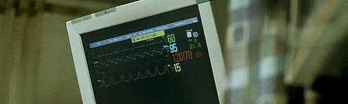

  
던컨 맥두걸(Duncan MacDougall, 1866~1920)이라는 박사가 1907년 과학저널(Scientific Journal)에 발표해 센세이션을 일으켰던 실험 때문에 유명해진 무게라고 한다. 이 실험은 "인간의 영혼 역시 하나의 물질"이란 가설에서 시작하는데, 초정밀 저울을 이용해 임종 환자 6인의 몸무게를 측정했더니 모두 사망과 동시에 몸무게가 줄었다고 한다. 그 무게가 바로 21그램.   

<!-- truncate -->

How many lives do we live?  
우리는 몇 개의 삶을 사는가?  
  
How many times do we die?  
우리는 몇 번이나 죽는가?  
  
They say we all lose 21 grams at the exact moment of our death.  
사람이 죽는 그 순간 21그램이 줄어든다고 한다  
  
Everyone.  
모두가 그렇다.  
  
And how much fits into 21 grams?  
21그램은 얼마큼일까?  
  
How much is lost?  
잃는 건 얼마큼일까?  
  
When do we lose grams?  
언제 21그램을 잃는 걸까?  
  
How much goes with them?  
얼마나 그것들과 함께 할까?  
  
How much is gained?  
얻는 건 얼마큼일까?  
  
How much is gained?  
얻는 건 얼마큼일까?  
  
Twenty-one grams.  
21그램.  
  
The weight of a stack of five nickels.  
5센트짜리 동전 5개의 무게.  
  
The weight of a hummingbird.  
벌새의 무게.  
  
A chocolate bar.  
초콜릿바 하나의 무게.  
  
How much did 21 grams weigh?  
21그램은 얼마나 나갈까?

  
  
이 영화를 가슴 가깝게 느끼게 만든 요인 중 하나를 꼽으라면 바로 편집이다. 평범하게 진행되었으면 뻔할 수 있는 이야기가 편집으로 인해 시종일관 긴장감을 유지하고, 보는 이를 괴롭게 만든다. 화면 속 배우들이 웃고 있어도 불안하고, 화면 속 배우들이 희망을 가지는 장면을 보면서 오히려 마음이 아프게 만드는 경험을 만들어 준다.  
  
  
이와 비슷한 영화들로는 뭐가 있을까? <숏컷>을 비롯한 로버트 알트만의 영화들과 폴 토마스 앤더슨의 <매그놀리아>, 스티븐 소더버그의 <시리아나> 같은 영화? 유쾌한 쪽으로 따지자면 <러브 액츄얼리> 같은 영화?  
  
  
구스타보 샌타올라라 (Gustavo Santaolalla)가 작업한 음악은 과장없이, 커다란 기교없이 그러면서도 조심스러운 리듬감과 함께 묘한 울림을 준다. 하지만(?), 이런 스타일의 음악은 후에 미국 TV시리즈 (범죄물)라든지 공익광고 등에 점점 더 많이 쓰이고 있다. 만약 다시 이 영화를 본다면 영화 중간 중간 딴 생각이 나는 걸 참느라 힘들지도 모르겠다. 음악이 나쁜 것도 아닌데 (오히려 좋은데), 이제는 몰입을 방해할만한 스타일이라니!  
  
  
 /  /   
  

**Dave Matthews - Some Devil**  
  
  
 **(가사보기 클릭)** 

One last kiss one only  
Then I'll let you go Hard for you  
I've fallen  
But you can't break my fall  
I'm broken don't break me  
When I hit the ground  
  
Some devil some angel  
Has got me to the bones  
You said always and forever  
Now I believe you baby  
You said always and forever  
Is such a long and lonely time  
  
Too drunk and still drinking  
It's just the way I feel  
It's alright  
Is what you told me  
Cause what we had was so beautiful  
Feel heavy like floating  
At the bottom of the sea  
  
You said always and forever  
Now I believe you baby  
You said always and forever  
Is such a long and lonely time  
  
Some devil is stuck inside of me  
I cannot set it free  
I wish, I wish I was dead and you were grieving  
Just so that you could know  
Some angel is stuck inside of me  
But I cannot set you free  
  
You said always and forever  
Now I believe you baby  
You said always and forever  
Such a long and lonely time  
  
Stuck inside of me

  

**관련 링크**  
  
[씨네21 - 죽음의 무게는 얼마인가? <21그램>](http://www.cine21.com/Article/article_view.php?mm=005004001&article_id=26927)  
[필름2.0 - 인간 딜레마의 최후 질량 <21그램>](http://film2.co.kr/feature/feature_final.asp?mkey=2537)  
[필름2.0 - 21그램보다 더 무거운 영혼의 무게](http://film2.co.kr/review/review_final.asp?mkey=1497)  
[에너지 데일리 - 김충태의 '영화 바로잡기' 21g(그램)](http://www.energydaily.co.kr/news/read.php?idxno=17815)  
  
[씨네21 - 거장 예감, 세계의 新星 감독 10인 [6] - 알레한드로 곤잘레스 이냐리투](http://www.cine21.com/Article/article_view.php?mm=005001001&article_id=26342)  
[씨네21 - 21세기 촬영감독 10인 [1] - 로드리고 프리에토](http://www.cine21.com/Article/article_view.php?mm=005001001&article_id=41357)  
[씨네21 - 야수같은 연기본능, <21그램>의 베니치오 델 토로 Benicio Del Toro](http://www.cine21.com/Article/article_view.php?mm=005002001&article_id=26941)
