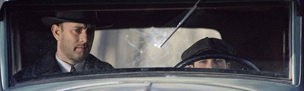
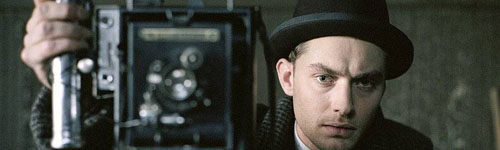

  
로드 투 퍼디션.  

<!-- truncate -->

자식은 아버지를 힘들게 하려고 태어난 사람이라는 말. 세상이 험해져서 아버지, 혹은 어머니들은 가족을 위해 힘들게 힘들게 하루를 사시는 거겠지. 자신은 힘들게, 진흙밭을 구르더라도 자식은 그러지 않기를 바라는 게 부모님의 마음이겠지.  
  
형제가 있으면 본의아니게 형제끼리 비교 당하는 경우가 있지. 내가 상대적으로 잘하면 다른 형제가 그만큼 평가절하 당하는 거고, 내가 못하면 내가 평가절하 당하게 되고. 실제로 부모님이 그렇게 평가의 잣대를 들이대지 않으셔도 자격지심 때문에 혼자 그렇게 생각하는 경우도 있고 말야. 왜 그런데 어릴 때는 부모님의 마음은 안중에도 들어오지 않고 형제들만 생각하게 되는 걸까.  
  
  
영화를 보면서 머리에 떠오르는 생각은 두가지. 하나는 참 연극적이라는 생각이 떠오르고, 이상하게도 샘 멘데스 (Sam Mendes) 감독과 이창동 감독이 함께 떠오르는 거야. 콘라드 L. 홀 (Connrad L. Hall) 촬영감독의 역량도 있겠지만, 샘 멘데스 (Sam Mendes) 감독의 상황을 짜는 능력이 느껴지는 거야. 뭐랄까, 가슴으로 감동을 느끼기 전에 참 화면 잘 짰다라는 생각이 드는 거야. 그런 느낌을 이창동 감독의 오아시스를 보면서 느꼈거든. 영화를 보며 소설이나 연극 등 다른 형태의 발상인 것 같다는 느낌 말이지.  
  
퍼디션 (Perdition)이란 단어가 영화 속에서는 마을 이름이기도 하지만, 지옥이라는 뜻도 가지고 있지. 그렇게 끝을 향해 가는 일종의 로드무비. 죽을 때까지 사람들은 성장하는 것 같아. 그게 후퇴하는 것이더라도 말이야.  
  
기억에 남는 장면들은 코너 루니 (다니엘 크레이그D 분)이 실수를 해서 존 루니 (폴 뉴먼 분)이 탓하는 회의 장면, 코너 루니가 마이클 설리번 (톰 행크스 분) 집에서 살인을 저지르고 나오는 장면, 마이클과 아들이 함께 도심을 걷는 장면, 마이클이 존 루니 일당을 빗속에서 살인하는 장면. 그리고, 맥과이어 (쥬드 로 분)와 마이클 부자와의 마지막 장면. 참 연극적이라는 느낌을 받았어.  
  
폴 뉴먼, 톰 행크스, 쥬드 로. 셋 다 참 좋은 배우.  
  
평점을 주자면 별 다섯개에 네개. Conrad L. Hall의 뛰어난 촬영술이 돋보이네.  
  
 /  /   
  
지금 보니 새천년의 제임스 본드 다니엘 크레이그가 '그 놈'이었구나.  
  
예전에 홈페이지에 적었던 것들을, 복구하는 차원에서 하나씩 올려봅니다. 지금 보니 재밌네요. ^^ 카테고리는 무비 레터.
