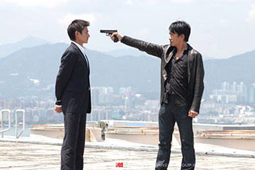
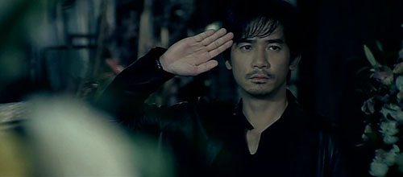

aka Infernal Affairs  

<!-- truncate -->

  

유건명 (유덕화 분)은 경찰에 침입한 범죄조직의 스파이, 진영인 (양조위 분)은 범죄조직에 침투한 경찰의 스파이. 참 단순하면서도 명쾌한 설정이라고 생각해. 오히려 처음 나왔을 때는 그런 설정이 뻔한 이야기를 뻔하게 보여주지 않을까 하는 생각에 - 게다가 몇년동안 홍콩 영화들에게 생긴 불신이 더해져서 잠깐 멈칫하는 사이에 극장에서 볼 기회를 놓쳤지 뭐야.  
  
사람들은, 아니 나는 나의 정체성에 대해 혼란를 느낄 때가 있어. 예전부터 아주 가끔씩 드는 느낌 중의 하나인데, 내 자신이 꼭 물 밖에 나온 고기 같다는 느낌. 주위 사람들은 행복해하고, 즐거워하는데 나는 몇가지 것들에 대해서 불편해 하고 만족스러워하지 않는다는 것. 하긴, 나중에 알고 보니 사람들도 그러한 불편함을 가지고 살아가더라구. 그것을 생각하지 않기 위해 다른 것들을 하면서 피해 살기도 하고, 아니면 정면으로 부딪혀서 조금씩 극복해나가기도 하면서.  
  
무간도는 여덟의 지옥 가운데 제일 마지막에 위치한 지옥으로 가장 큰 고통을 받게 되는 곳이래. 결정적인 건, 한번 무간지옥에 빠진 사람은 영원히 죽지 않고 영원히 그 극한 고통을 받게 된다고 하더라구. 지옥 중의 지옥이라고나 할까. 설명만 들어도 너무 끔찍했어.  
  
한번 실수를 하게 되고, 그걸 여러번 반복하게 되면 난 정말 왜 이럴까 하고 생각하게 되고, 다음 번에 비슷한 순간이 오면 더 긴장하고 그로 인해 다시 실수를 반복하고, 무감각해져서 실수를 하고 있는지 아닌지도 모르는 상태가 되기도 하고, 반대로 더 심해져서 자학을 하게 되기도 하고. 수많은 크고 작은 실수들에 대해. 이런 고리를 깨는 방법은 뭘까.  
  
양조위의 눈빛은 참 슬퍼. 가만히 있어도 참 많은 생각을 하게 만드는 눈빛. 영화를 보고 나서 느낀 건데, 양조위의 그런 눈빛도 많은 일들을 겪은 후에 만들어진 거라는 생각. 무언가 빠져나오고 싶은 일들 속에서 이런 저런 노력들을 하다가 인정하고 그걸 자기 것으로 만든 게 아닐까 하는 생각.  
  
촬영감독이 크리스토퍼 도일이었구나. 참 오랜만에 유덕화의 좋은 연기를 봤네. 멋진 장면도 많았고, 주연 4명의 연기도 모두 좋았어. 장르에 충실하면서도 호기심을 놓치지 않게 만드는 내용도.  
  
  

평점을 주자면 별 다섯개에 네개 반. 어떤 순직한 경찰을 운반하고 가던 운구차를 향해 진영인이 골목에서 경례하던 장면, 그 장면 하나로도 많은 느낌을 가지게 해.  
  

2003.07.06

  
 /  /   
  

**관련 글**  
  
무간도와 디파티드 이야기  
사운드 : Modern Times / 종극무간 / 쿵푸 허슬
