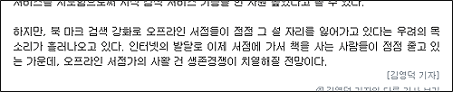

  
기사출처 : [데일리안 - 네이버, 온라인 북 시장 점령(?)](http://www.dailian.co.kr/news/n_view.html?id=54570)  
소제목 : 즐겨 찾기 기능이 강화 된 ‘네이버 북마크 2.0’ 선보여  

<!-- truncate -->

이 기사는 이런 문장으로 끝을 맺는다.  
  

하지만, 북 마크 검색 강화로 오프라인 서점들이 점점 그 설 자리를 잃어가고 있다는 우려의 목소리가 흘러나오고 있다. 인터넷의 발달로 이제 서점에 가서 책을 사는 사람들이 점점 줄고 있는 가운데, 오프라인 서점가의 사활 건 생존경쟁이 치열해질 전망이다.

  
  
이에 대한 ㄴ님의 댓글  
  

다음 카페의 기능 강화로 오프라인 커피숍들이 점점 그 설 자리를 잃어가고 있다는 우려의 목소리가 흘러나오고 있다. 인터넷의 발달로 이제 커피숍에 가서 커피를 사먹는 사람들이 점점 줄고 있는 가운데, 오프라인 커피숍끼리의 사활 건 생존경쟁이 치열해질 전망이다.

  
  
아아… 재밌다. 그래서, 나도 한번.  
  

안철수연구소 백신의 성능 강화로 오프라인 보건소들이 점점 그 설 자리를 잃어가고 있다는 우려의 목소리가 흘러나오고 있다. 인터넷의 발달로 이제 보건소에 가서 백신을 맞는 사람들이 점점 줄고 있는 가운데, 오프라인 의료계의 사활 건 생존경쟁이 치열해질 전망이다. (의료대란?)  
  
싸이월드 도토리의 거래 증가로 오프라인 다람쥐들이(-\_-) 점점 그 설 자리를 잃어가고 있다는 우려의 목소리가 흘러나오고 있다. 인터넷의 발달로 이제 거리에서 도토리를 구하는 다람쥐들이 점점 줄고 있는 가운데, 오프라인 도토리 시장의 사활 건 생존경쟁이 치열해질 전망이다. (사람은 자연보호, 자연은 사람보호)  
  
티스토리의 스킨 꾸미기 강화로 오프라인 화장품 업체들이 점점 그 설 자리를 잃어가고 있다는 우려의 목소리가 흘러나오고 있다. 인터넷의 발달로 이제 스킨 화장품을 사는 사람들이 점점 줄고 있는 가운데, 오프라인 화장품 업계의 사활 건 생존경쟁이 치열해질 전망이다. (웰빙 시대 도래)  
  
포토샵 브러쉬 기능의 강화로 오프라인 문방구들이 점점 그 설 자리를 잃어가고 있다는 우려의 목소리가 흘러나오고 있다. 인터넷의 발달로 이제 문방구에 가서 붓을 사는 사람들이 점점 줄고 있는 가운데, 오프라인 문방구들의 사활 건 생존경쟁이 치열해질 전망이다. (무너져가는 재래시장;; )  
  
네로 버닝 롬의 씨디 굽기 기능의 강화로 오프라인 주방용품 판매점들이 점점 그 설 자리를 잃어가고 있다는 우려의 목소리가 흘러나오고 있다. 인터넷의 발달로 이제 주방용품 판매점에 가서 프라이팬을 사는 사람들이 점점 줄고 있는 가운데, 오프라인 프라이팬 판매점들의 사활 건 생존경쟁이 치열해질 전망이다. (다기능 제품의 우수성. 씨디도 굽는 후라이팬!)

  
적다보니 이런 이유들로까지 경쟁이 심해지면 정말 세상살기 팍팍할 것 같다. -\_-;
