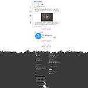

<!-- truncate -->

Drips & Dips 1.1

Mac Look 1.1

  
저는 태터툴즈 클래식 버전을 사용하고 있지만, 무슨 바람이 불어서인지(-\_-) 1.1에 대응하는 스킨을 한번 만들어 봤습니다. 그것도 두 개씩이나! -o-  
  
[**▶ Drips & Dips 1.1** 받으러 가기](http://www.tattertools.com/ko/bbs/view.php?id=skin&page=1&sn1=&divpage=1&sn=off&ss=on&sc=on&select_arrange=headnum&desc=asc&no=405)  
[**▶ Mac Look 1.1** 받으러 가기](http://www.tattertools.com/ko/bbs/view.php?id=skin&page=1&sn1=&divpage=1&sn=off&ss=on&sc=on&select_arrange=headnum&desc=asc&no=406)  
  
둘 다 태터툴즈 1.1과 현재의 티스토리에서 사용 가능하고, 윈도우XP에서 파이어폭스 2.0.0.1과 인터넷 익스플로러 6.0으로 테스트했습니다.  
  
웹표준에 준수하려고 노력했고, 특징이라면 Drips & Dips는 좀 자유로운 디자인에 **큰 글씨**라서 시원시원하고, Mac Look은 아쿠아 디자인을 사용했고 포멀한 느낌이 든다는 점입니다.  
  
레이아웃 맞추는 게 좀 까다롭긴 하지만 그럭저럭 재밌네요. ^^  
  
아, 스킨과 HTML, CSS 등에 대한 내용을 위해 티스토리에 하나 열었습니다. 이름은 [**Skins And Bones**](http://bones.tistory.com/). '페이지를 구성하는 뼈대부터, 꾸민 후의 스킨까지…'라는 뜻으로 즉, **살과 뼈**… 입니다. ;;; 스킨 블로그는 업데이트가 거의 안되지 않을까 합니다;;; (사실 Drips & Dips 는 여기에 사용하려고 만들기 시작했어요.;;; )
