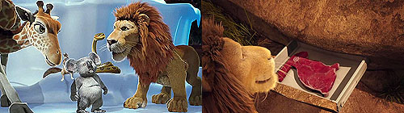
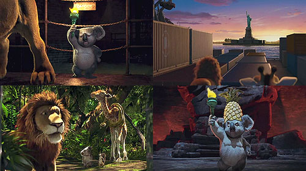
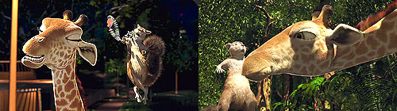
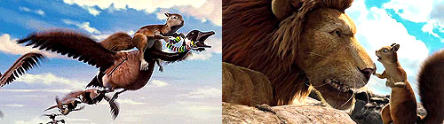
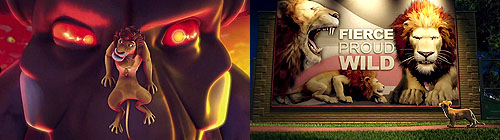
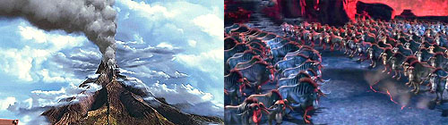
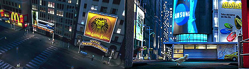

  
동물원 안에서 우리는 친구, 오른쪽은 동물원에서 제공하는 토끼맛 고기?  
이 영화는 주인공 동물 네 마리의 소동을 다루고 있다. 이들은 동물원에서 만난 친한 친구들인데 아빠 사자 샘슨 (키퍼 서덜랜드 분)의 아들 라이언이 실수로 아프리카행 배를 타는 바람에 그를 구하러 동물원을 탈출한다.  

<!-- truncate -->

  
  
  
(위에서부터 순서대로)  
자유의 여신상을 코스프레하는 코알라 나이젤 덕분에,  
그들은 아프리카까지 날아갈 수 있다.  
그들은 과연 크기 차이를 극복할 수 있을까?  
다람쥐 베니는 절대 포기하지 않는다!  
이들은 자유의 여신상을 찾아 아프리카까지 가게 되는데, 이 중에서 가장 독특한 캐릭터는 코알라 나이젤이다. 동물원 최고의 인기 장난감 모델인 그는 능글맞고 시니컬한 사고뭉치이다. 또한 기린과 다람쥐의 러브라인 역시 여느 애니메이션에서 보기 힘든 설정이다. 순발력과 리더쉽을 발휘해 사건을 해결해 내는 주인공 역시 다람쥐이다.  
  
  
아빠의 권위와 실력을 부러워하는 아들  
이 영화의 도입부는 잠시나마 <라이언 킹>을 떠올리게 한다. 사자라는 동물이 등장했다는 단순한 이유도 있겠지만 처음 아빠 사자 샘슨이 들려주는 이야기의 내용이나 그림체는 딱 <라이온 킹>의 비디오 시리즈답기 때문이다. 물론 후에 아버지의 권위가 아들에게 이어진다는 '햄릿'식의 해석은 전혀 없다.  
  
  
결국 이들의 독재자는 축출되는가?  
최근에 디즈니의 고전 애니메이션들을 다시 보면서 느끼는 디즈니 작품들의 특징 중 하나는 극의 전개에 불필요한 불필요한 폭력들이 나온다는 것이다. 머리를 쥐어박고 얻어 맞고 실수로 넘어지고 부딪히는 그런 설정들이 이야기 전개와는 동떨어진 슬랩스틱 코미디를 보는 듯 한데, 이 작품을 보면서도 몇 장면 그런 걸 느꼈다. 이 영화는 코어 디지털 픽쳐스 (C.O.R.E. Digital Pictures)의 기술로 태어났고, 디즈니의 손에 의해 제작되었을 뿐(?)인데 말이다.  
  
게다가 화산폭발로 이제 곧 모두 한 줌의 재가 될 상황임에도 불구하고 미친 우두머리 카자르를 받들며 육식동물이 되고 싶어하는 영양떼라는 설정은 정말 '신기하게도' 90년대식 발상으로 느껴졌다. 동시에, 저기 먼 나라 부시 식으로 이야기하자면 '멋도 모르고 세계 질서에 대항하며 핵폭탄을 만들려고 발버둥치는 북한'이 생각났다. 이런 설정은 정말 '디즈니답다'고 밖에 할 수 없다.  
  
  
드림워스의 애니메이션 마냥 실제 광고가 나온다  
내가 알고 있기로 이 영화는 드림웍스의 <마다가스카>보다 먼저 기획되었다. 작업기간이 오래 걸리는 틈을 타 드림웍스는 재빨리 동물들이 동물원을 탈출하는 컨셉을 빌려 그럭저럭 흥행했고 비평도 썩 나쁘지만은 않았다. (분명히 좋지는 않았다) 하지만, <와일드>는 먼저 기획되었음에도 <마다가스카>의 짝퉁이냐는 비아냥을 들으며 흥행과 비평 모두 죽을 쒔다.  
  
하지만 영화가 보여주는 3D 기술은 정말 대단하다! 비슷비슷한 3D 애니메이션이 우후죽순처럼 쏟아지는 요즘 이런 식의 시각적 차별성이라면 충분히 차별화할 수 있지 않을까 싶다. 물론 기획과 내용이 받쳐줘야 하지만. (자연 다큐멘터리 같은 작품을 만들면 정말 좋을 것 같다!) 어쨌든 정말 대단한 기술력이다.  
  
  
아, 한가지 더. 샘슨 목소리를 키퍼 서덜랜드가 맡았는데 목소리도 목소리거니와 고집 피우면서 단서 (lead)를 찾아서 추적하는 설정까지 더 해지니 보는 내내 드라마 24시가 생각나서 집중이 힘들었다.  
  
 /  / 
