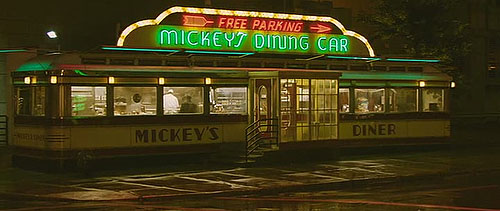
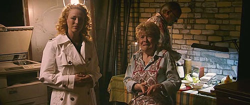
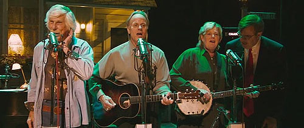
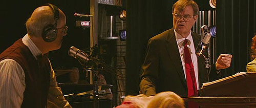
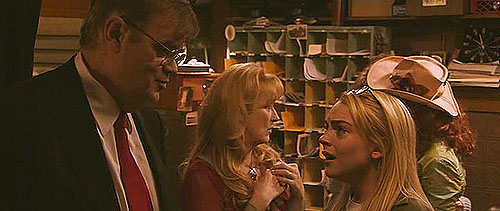
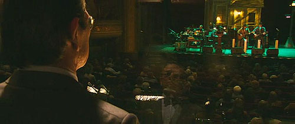
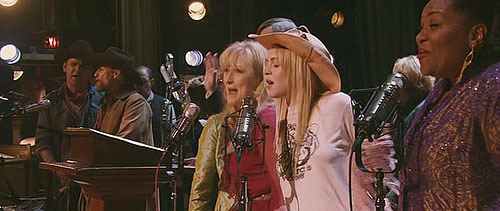

aka A Prairie Home Companion  

<!-- truncate -->

그는 이 영화가 자신의 마지막 작품이 되리란 걸 알고 있었을까요? 그의 영화는 보통 줄거리를 요약하기가 힘들었는데, 이 작품은 그 반대입니다. 영화는 어느 생방송 라디오 쇼의 마지막 무대 뒷모습을 그리고 있죠. 그리고, 그게 이 영화의 전부예요.  
  
이 영화의 무대가 되는 게리슨 케일러의 라디오 쇼 "프레리 홈 컴패니언"은 실제 존재하는 방송이라더군요. 영화 속 연주자들도 실제 인물들이예요. 1974년부터 시작된 이 쇼의 MC인 게리슨 케일러도 영화에 실명으로 등장하고요. 즉, 다큐멘터리인 셈이죠. 하지만, 이 영화는 허구입니다. 현실의 "프레리 홈 컴패니언"은 여전히 방송 중이라니까요.  
  
반대로, 영화라는 매체는 이렇게 개봉되어 영원히 남겠지만 허구의 세계인 이 영화를 만든 알트만 감독은 현실에서 유명을 달리했지요.  
  
이 영화를 보는 내내 대학 때 선배들과 동기들과 그리고 후배들과 기타를 치며 공연했던 기억들이 떠올랐습니다. 그리고, 전 알트만 감독의 명복을 빌었습니다. 안녕, 알트만.  
  
 /  /   
  
  

이 영화는 픽셔널 다큐멘터리입니다.  
  
  

샌드위치를 팔던 한 노부인이 쇼가 끝나는 것을 슬퍼하며 웁니다. 옆에서 천사가 말하죠.  
참새 한 마리까지도 모두 기억 될 거예요.  
Every sparrow is remembered.  
  
  

그들은 마지막 순간에도 노래를 부릅니다.  
만약 나에게 친구가 있었다고 한다면, 그 친구는 바로 너일 거야.  
If ever I have had a friend, you've been that friend to me.  
  
  

진행상의 실수에도 당황하지 않고 서로 호흡을 맞추며 광고를 하죠.  
뭔가 고칠게 생겼다면 덕테입 (다용도 은색 테입)을 찾으세요.  
When you need to fix something, just reach for a roll of duct tape.  
  
  

알트만이 하고 싶었던 말일까요?  
생방송 라디오 쇼는 절대 뒤를 돌아보지 않아. 그게 미덕이지.  
나이드는 사람도 없고, 죽는 사람도 없어.  
We don't look back in radio. That's the beauty of it.  
Nobdoy gets old, nobody dies.  
  
  

시대의 흐름을 이유로 라디오 쇼를 없애러 온 해결사는 말이 없습니다.  
하긴 무슨 할 말이 있겠어요. 자기도 알거예요. 시대의 하수인이라는 걸.  
  
  

영화는 그렇게 끝이 납니다. 공연장에 갔다고 생각하고 보세요. 아니 들으세요.  
편안한 컨트리 음악을 듣다 보면 마음도 편해집니다. 아련해질 정도로 말이죠.
