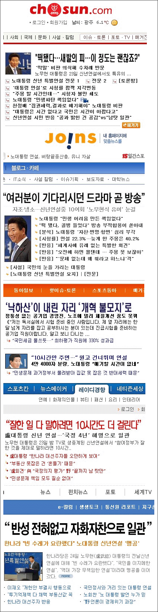

  

이미지 출처 : [자바월드](http://jawol.net)  

<!-- truncate -->

제목들이 정말 가관입니다.  
  
저 역시 노무현 대통령의 모든 행적을 무조건 잘했다고 보지는 않지만 이건 좀 심하군요. (권력을) 가진 자들이 벌이는 제일 저열한 방식의 한 행태라고 생각해요. 하긴 그 방식으로 이제껏 재미를 보고 있으니 포기할 이유가 없겠죠.  
  
그나저나 저 제목들이 우리나라 최대 판매부수를 자랑하는 신문들의 것이라고요?  
정말 창피하군요.  
  
저런 제목은 저도 쓸 수 있겠어요.  
  
"ㅈㅅ일보 기자, 신년 연설 들으면서 코를 세 번이나 파다."  
"ㅈㅇ일보 기자, 연설 도중 두 번 정도 피식거리고 세 번 헛기침"  
"ㄷㅇ일보 기자, 연설 끝나고 식사 메뉴에 대해 동료와 20분간 토론"  
(물론 이런 류의 제목에는 부제가 있죠. "기사야 쓰든 말든")  
  
쳇, 정말 저질이야. 그냥 싫으면 싫다고 하지.  
  

**관련 링크**  
  
[**노무현 대통령 신년 특별 연설 동영상**](http://www.president.go.kr/cwd/kr/tv/popup/tv_view.php?id=82ac7bf9c3d40205c002dba8&brd_id=president_tv)  
[**노무현 대통령 신년연설 - 연설문 보기**](http://www.president.go.kr/cwd/kr/archive/archive_view.php?meta_id=speech&category=236&id=31564cadb4577ed0a5911921)
