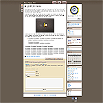
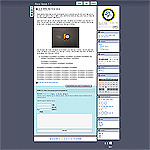
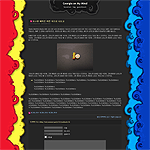
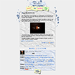

<!-- truncate -->

Docs Brown 1.1

Docs Green 1.1

Docs Blue 1.1

  

Colorful Waves 1.1

Mess Around 1.1

  
요즘 이런 저런 스킨들을 만들어 보고 있습니다. 스트레스 해소 겸 해서 만들고 있는데 만들 때 보다는 스킨에 이름을 붙일 때 제일 재미를 느끼는 진기한 경험을 하는 중입니다. -\_-;  
  
조금 모자란 부분도 있고 해서 앞으로 스킨마다 보완을 좀 할 예정입니다만 기본적으로 쓰시는데는 큰 무리가 없을 듯 합니다.  
  
[▶ **Docs Triple 1.1** 받으러 가기](http://www.tattertools.com/ko/bbs/view.php?id=skin&no=413)  
[▶ **Colorful Waves 1.1** 받으러 가기](http://www.tattertools.com/ko/bbs/view.php?id=skin&no=410)  
[▶ **Mess Around 1.1** 받으러 가기](http://www.tattertools.com/ko/bbs/view.php?id=skin&no=415)  
  
태터툴즈 1.1 과 티스토리에서 사용하실 수 있으며 테스트 환경은 윈도우 XP에 파이어폭스 2.0.0.1 + 인터넷 익스플로러 6.0 + 오페라 9.0 입니다.  
  
스킨에 대한 문의는 [**살과 뼈 (-\_-) 블로그**](http://bones.tistory.com)에 해주세요.
