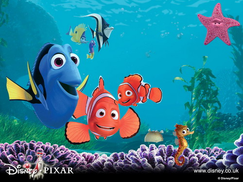

  
난 바다를 - 아니 물을 무서워해. 어렸을 때 강인지 호수인지, 어쨌든 빠져서 허우적거리다가 물을 엄청 먹은 이후로는 물을 무서워해 - 아마 사촌형님인가가 장난치셨던 걸로 기억해. 물에 들어가서 아무리 가만히 있어도 몸이 안떠. 아니, 가만히 있지를 못하지. 몸에 자꾸 힘이 들어가. 물은 크면 클수록, 깊으면 깊을수록 나에겐 공포야.   

<!-- truncate -->

말린 (알버트 브룩스 분)은 아들 니모 (알렉산더 굴드 분)를 너무 끔찍히 아끼다 못해 아무것도 못하게 해. 그건 보나마나 뻔한 결과를 낳지. 반발심 말야. 그게 정말로 아끼는 건 아닐거야, 그치? 자신은 아낀다고 생각하지만, 세상은 위험하다고 생각하지만, 자식은 언제나 어리다고만 생각할 수 있겠지만, 사실은 그렇지 않은 경우가 참 많지. 내가 후에 아버지가 되면 어떻게 할까.   
  
아들을 잃어버린 말린은 정말 말 그대로 망망대해에서 아들 니모를 찾기 위해 여행을 떠나. 그러다가 단기기억상실증(!)에 걸린 도리 (엘렌 드제너러스 분)를 만나서 본격적으로 아들을 찾아 나서지.   
  
이 말린과 도리는 그리 어렵지 않으면서도 참 재밌는 설정이야. 둘은 몸 색깔도 정반대이고, 성격도 정반대야. 말린은 강박적일 정도로 걱정이 앞서는데, 도리는 낙천적이지 - 그럴 수 밖에, 몇 분전의 상황들을 기억 못하니 언제나 해피 해피지. 도리는 말린 덕분에 조금씩 기억하려고 노력하게 되고, 말린은 도리를 통해 - 그리고 자기보다 덜 강박적인 성격의 물고기들을 통해 조금씩 나아지지. 돌이켜보면 나도 그랬던 것 같아.   
  
여행 도중에 - 확실치는 않지만 도리가 말린과 헤어지고 난 후 헤어진 걸 잊어버린 다음에 혼자 가다가 중얼거리는 거야. "뭔가 중요한 걸 잊은 것 같은데, 그게 뭔지를 모르겠어..." 참 절묘한 대사라고 생각했어. 너무나 쓸쓸한 독백들... 요즘 사람들의 입에서 자주 나오는 말이 아닐까 싶어.   
  
화면이 얼마나 진짜 같던지 물을 무서워하는 나는, 보면서 종종 속에서 공포심이 조금씩 일어나는 게 느껴졌어. 깊은 물을 표현하는 장면들에서 말야. 채식주의자가 되고 싶어하는 상어들 - "물고기는 친구다! 먹을거리가 아니다!", 떼거지로 몰려다니는 은색 물고기들, 먹이에 집착하는 갈메기들, 낙천적인 거북이 등 많은 캐릭터들이 나오는데 정말 그럴 듯하게 느껴졌어. 그런 거 있잖아, '곰은 말을 느리게 할 것 같아' 라던가, '다람쥐의 성격은 급할 거야' 라고 생각해왔던 것처럼 - 놀랍게도 자연스럽게. 특히 상어들은 진짜 웃겼어.   
  
난 픽사의 애니메이션을 참 좋아해. 픽사라면 메이저급 애니메이션 제작사로서 충분히 자격이 있다고 봐. 제일 마음에 드는 건 그들 스스로 꿈꾸고 있는 게 느껴진다는 거야. 희망을 가지고 있는 게 느껴져. 그들의 어두운 날들도 힘겨운 시간도 애니메이션에서 느껴지지만 그들의 유쾌한 웃음에 따라 길을 찾게 되지. 그러고 보니 <벅'스 라이프>는 봤는지 안봤는지 기억이 잘 나진 않지만 그것 말고 확실히 기억나는 픽사의 이제까지 모든 장편은 전부 버디 무비에 로드 무비네. 곳곳에서 힘든 일들은 생겨나지만 소중한 사람들과 의사 소통을 해나가고, 오해를 풀고, 자신이 가지고 있던 한계를 조금씩 넓혀가면서 문제를 해결해 나가는.   
  
그들의 인터뷰를 보면 성공한 자들의 여유인지도 모르겠지만 이쁜 말들을 하는데, 그들이 가장 중요하게 생각하는 건 이야기라는 거야. 첫 장편인 <토이 스토리>에서부터 지금까지 계속 3D 애니메이션의 기술적인 혁신을 이루어왔으면서도 그들이 제일 먼저 꺼내는 말은 '이야기가 중요하다'는 것. - 갑자기 <원더풀 데이즈>가 걱정되네.   
  
평점을 주자면 별 다섯개에 세개 반. <몬스터 주식회사> (Monsters, Inc.) 만큼의 기발함이 덜 느껴져서 아주 약간 서운하다.   
  

20030607

  
 /  /   
  
그나저나 이 때만 해도 기대만발의 애니메이션 스튜디오였던 픽사가 벌써 <카>로 주춤하고 디즈니로 들어가다니… 스티브 잡스가 아무리 아이팟을 밀고 있다고 해도 이건 아닌 듯 싶다;;;  
  
나중에 혼자서도 여러 차례 본 영화 중 하나이다. 어느 날은 보면서 어찌나 울음이 쏟아지던지…
