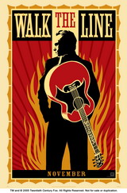

**Johnny Cash - Hurt**

<!-- truncate -->

  
컨트리 음악의 대부인 자니 캐쉬 (Johnny Cash)는 이 곡을 2002년에 발매된 "American IV: The Man Comes Around"에서 리메이크하고 죽기 전 마지막으로 뮤직비디오를 남겼습니다. 정말 인상적인 뮤직비디오죠. 음악이 가지고 있는 힘, 자니 캐쉬가 가지고 있던 이미지, 현재의 상황 등이 정말 적절하게 어우러져 있죠.  
  

**Nine Inch Nails - HURT (live)**

  
원래 이 곡은 인더스트리얼 밴드 나인 인치 네일즈 (Nine Inch Nails aka NIN)의 리더 트렌트 레즈너 (Trent Reznor)가 만들었습니다. 그리고는 1994년에 발매된 앨범 "The Downward Spiral"에 실었죠.  
  
맞습니다. 원래 좋은 음악은 보편성을 가지고 있지요. 위대한 뮤지션은 보편성을 만들어 내고요. 다음의 나이키 에어 광고를 보세요.  
  

**Nike Air commersial with " Johnny Cash - Hurt"**  
  
  
  
I hurt myself today  
오늘 난 내 자신을 아프게 했어  
to see if I still feel  
내가 여전히 느끼는지 보려고 말야  
I focus on the pain  
고통에 집중했어  
the only thing that's real  
고통은 유일한 진실이지  
  
what have I become?  
나는 뭐가 되었을까?  
my sweetest friend  
내 사랑하는 친구여  
  
and you could have it all  
너는 이 모든 걸 가질 수 있어  
my empire of dirt  
하잘 것 없는 내 왕국 모두를  
  
I will let you down  
난 너를 실망시킬 거야  
I will make you hurt  
난 널 아프게 하겠지  
  
(번역 : 써머즈)

  
NIN의 버전도 알고 있었고, 자니 캐쉬의 버전도 알고 있었고, 그의 뮤직비디오도 봐서 알고 있었는데도 위의 광고를 처음 볼 때 깊은 곳에서 뭔가가 느껴지더군요. 멋진 광고, 무서운 광고인들인 거죠.  
  
  
  
그리고, 아래는 이 노래의 각종 라이브 버전 등입니다.  
  

**Nine Inch Nails - Hurt (Live at Glastonbury)**

  

**Trent Reznor- Hurt (at ReAct Now benefit)**  
  
  
카트리나 재해 당시 성금 모금 방송 당시였지요.

  
  

**Sheryl Crow - Hurt (live at Johnny Cash Tribute on CMT)**  
  
  
CMT는 Country Music Television의 약자입니다.

  

**Nine Inch Nails Featuring David Bowie - Hurt (live)**

  

**Sevendust - Hurt (Nine Inch Nails Cover)**

  
p.s. 참고로 얼마 전(?)에 개봉된 호아퀸 피닉스, 리즈 위더스푼 주연의 <앙코르> (Walk The Line, 2005)가 바로 자니 캐쉬의 실제 이야기를 담은 영화입니다.  
  
그는 흔히 흥겹다고 여겨지는 컨트리와 락커빌리라는 장르의 대부였지만 그의 노래는 항상 어두운 가사를 담고 있었습니다. 그러면서도 동시에 인간에 대한 믿음, 희망 등을 표현하고 있었죠.  
  
누군가 이런 표현도 하더군요. "양지에 엘비스가 있었다면 음지엔 자니가 있었다." 그는 1932년 2월 26일에 태어나 2003년 9월 12일에 세상을 떠났습니다.  
  
공식 홈페이지 : [**http://www.johnnycash.com**](http://www.johnnycash.com)
