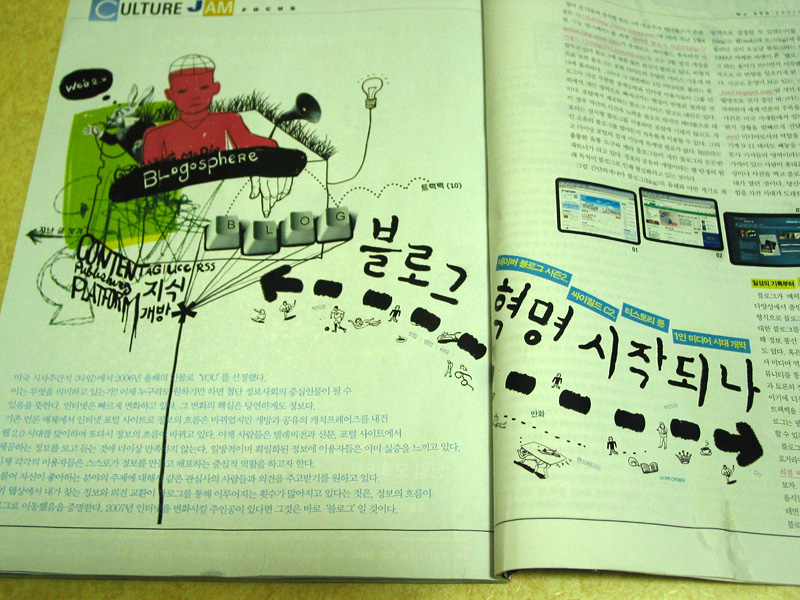
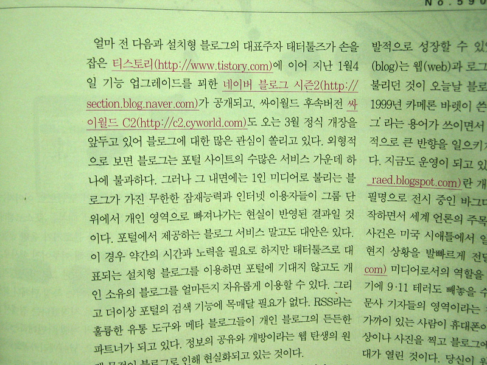
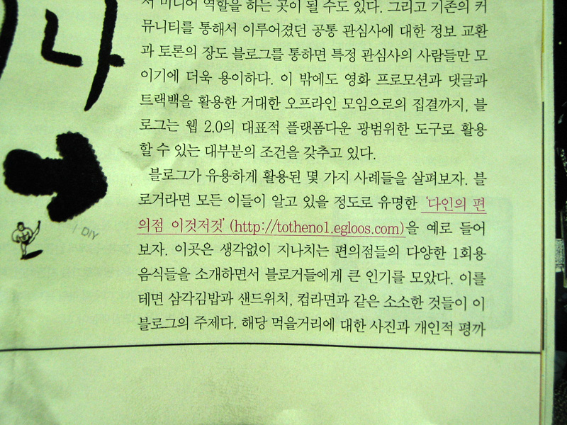
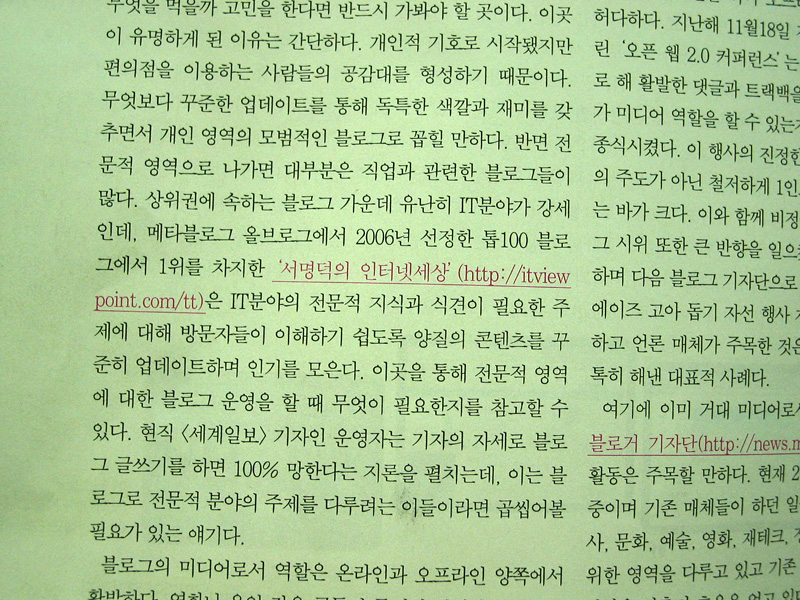
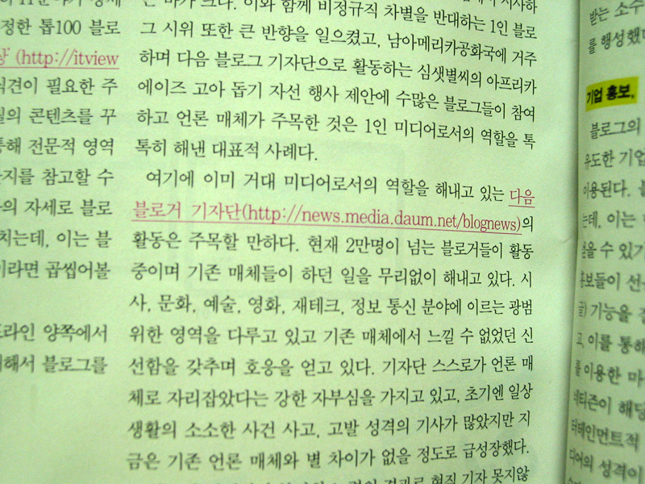
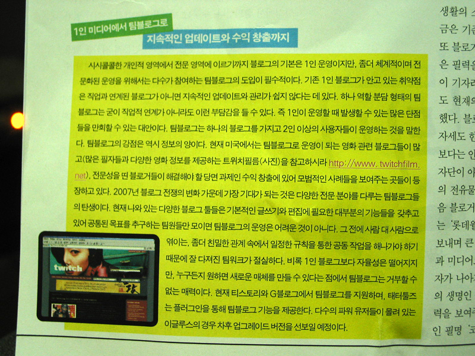
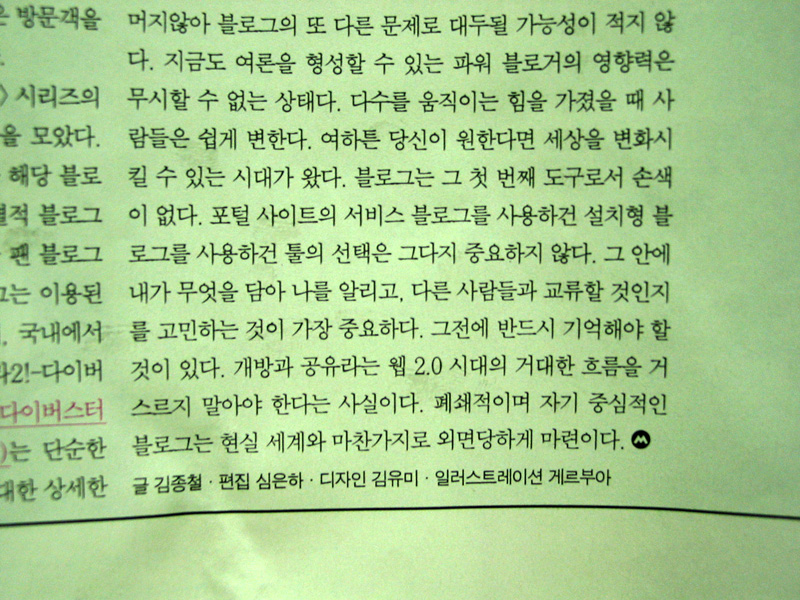

이번 주 시네21에 블로그 관련 기사가 떴습니다. 지난 번에는 필름2.0에 관련 기사가 나왔었지요. 태터툴즈, 티스토리를 비롯해 자주 가는 곳도 소개가 되어 카메라로 찰칵찰칵.  

<!-- truncate -->

기사 전체를 찍은 건 아니고 그냥 이름들 중심으로 찍었으니 기사를 보실려면 직접 사서 보셔야 할 듯 합니다. (온라인에는 기사가 안 뜬 것 같군요. 원래 이런 비영화 기사는 안 뜨던가 싶기도 하고.)  
  
클릭하면 크게 볼 수 있습니다.  
  
  
제목은 [블로그 혁명 시작되나]  
  
  
티스토리가 제일 처음으로 언급되었군요. 네이버 블로그 시즌 2와 싸이월드 C2도 함께 나오고요.  
  
  
다인님의 블로그도 소개됐습니다. 꽃등심 이것저것으로 안나왔네요? ^^  
  
  
서명덕님의 블로그도 소개되었죠. 그런데, 이런… 올블로그 이름에 오타가 났네요. 올브로그;;;  
  
  
다음의 블로거 기자단도 나왔습니다. 사실 주목을 좀 받을 것도 같은데 활동에 비해 크게 알려지지 않은 것 같아요.  
  
  
박스 기사입니다. 태터툴즈와 티스토리가 팀블로깅을 지원한다고 소개되었군요.  
  
  
웹2.0 시대의 개방과 공유라는 흐름을 거스르지 말자고 합니다.
