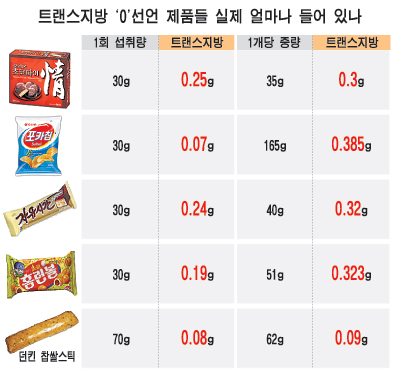

**2007.2.10.** **웹2.0은 사람이다.**  

<!-- truncate -->

  
[Web 2.0 ... The Machine is Us/ing Us](http://www.youtube.com/watch?v=6gmP4nk0EOE)  
기술 발달의 근본적인 이유는 무엇일까. 많은 이유들 중 분명한 한 가지는 바로 사람을 위한다는 것일테다. 이쯤해서 우리나라의 웹2.0은 어디로 향하고 있는지 궁금하다. 진정 사람을 위한 웹2.0일까 아니면 사람이 웹2.0에 적응하고 있는 중일까.

  

**2007.2.7.** **중국산 일부 포도주가 생수보다 "훨씬" 싼 이유**  
원액 포도주를 반이라도 섞은 것은 그나마 약과다. 이 공장의 다른 한 곳에서는 100% 맹물에 첨가제만 넣어 포도주의 색깔, 향기, 맛을 내는 100% 가짜 포도주를 만들고 있는 장면이 목격돼 취재진을 경악케 했다. / 이들 공장이 만든 제품들 가운데 대부분은 명칭에서부터 외부포장 도안에 이르기까지 거의 모든 부분을 창청(長城), 왕차오(王朝), 장위(張裕) 등 국내 유명 브랜드 포도주와 흡사하게 만들고 있으며, 병당 1-5위안에 주로 전국의 슈퍼마켓이나 호텔에 팔고 있는 것으로 밝혀졌다. [가짜 계란](http://summerz.pe.kr/blog/index.php?pl=919)에 이어 가짜 포도주. '대한민국에 안되는 게 어딨어'라는 유머는 진짜 유머 수준이다. '중국에서 안되는 게 어딨어!'  
  
[▶ 기사보기](http://www.yonhapnews.co.kr/international/2007/02/05/0603000000AKR20070205119700083.HTML)  
[▶ 관련보도 (SBS)](http://news.sbs.co.kr/section_news/news_read.jsp?news_id=N1000215593)

  

**2007.2.5.** **트랜스지방 "0" 표기 헷갈리네**  
  
출처 : 매일경제  
박혜경 식약청 영양평가팀장은 "지난달 23일 공청회에서 의견수렴한 결과 소비자에게 보다 정확한 정보를 주기 위해 100ｇ 대신 1회 분량을 기준으로 하고 0.5ｇ 이하를 트랜스지방 `0`로, 0.2ｇ 이하를 무(無)트랜스지방으로 표기하는 내용이 이달에 입안 예고될 것"이라고 말했다. 그러니까 트랜스지방 0이라고 선전한다고 마음껏 먹으면 안된다는 뜻. 그런데, 앞으로 1회 섭취량 (1회 분량)을 기준으로 표기한다는데 그게 무슨 뜻이지?  
  
[▶ 기사보기](http://news.mk.co.kr/newsRead.php?year=2007&no=61758)  
  
▶ 관련 기획 기사 (오마이뉴스)  
[① '트랜스 지방 제로', 믿어도 되나](http://www.ohmynews.com/articleview/article_view.asp?at_code=389128)  
[② 왜 가난한 사람이 더 살찌나](http://www.ohmynews.com/articleview/article_view.asp?at_code=389003)  
[③ 몸과 마음이 시드는데 '뒷북'만 칠 건가](http://www.ohmynews.com/articleview/article_view.asp?at_code=389269)  
[④ "팝콘· 감자튀김· 횟집 옥수수 먹지 마라"](http://www.ohmynews.com/articleview/article_view.asp?at_code=388845)  
[⑤ 기름에 튀기지 않은 '오븐 돈가스'](http://life.ohmynews.com/articleview/article_view.asp?at_code=388811) (이건 살짝 핀트가 나간 것도 같지만 이 역시 오마이뉴스다운 발상이고 특징이라 생각한다. ^^)
