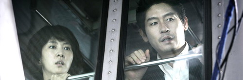

  
**0** 이 영화는 여러가지 면에서 봉준호 감독의 <살인의 추억>을 떠올리게야 만드는 작품이다. (실제로 영화를 보면서 여러 번 생각이 났다.) 그러나, 안타깝게도 <살인의 추억>에 비해 여러가지 면에서 아쉬운 면이 많은 작품이 되었다.  

<!-- truncate -->

**1** 우선 음악이 그러하다. 이 영화의 음악을 맡은 이병우는 봉준호 감독의 <괴물>의 음악도 맡았는데, 난 그 때도 <살인의 추억>의 음악에 비해 아쉽다고 생각했었다. 반복하자면 이와시로 타로가 <살인의 추억>에서 들려준 타악 (리듬) 중심의 스코어들은 영화 속에 잘 녹아들면서도 분위기를 정확하게 잡아줬던 반면 이병우의 <괴물> 음악은 작곡가 특유의 색깔이 이질적으로 섞여 있으며 감성적인 느낌의 멜로디가 영화와는 불균형적으로 느껴졌었다.  
  
이 작품에서도 그 느낌은 비슷하다. 이병우의 몇몇 감성적인 스코어들은 아이가 납치된 부모의 심정을 잘 표현해주기도 하나 전체적으로 긴장감을 유지시키는데 있어서는 제대로 역할을 수행하지 못하고 있었다. 참 아쉬운 부분이다.  
  
 **이 부분에는 스포일러가 들어있습니다. 여러 영화 기사에 대놓고 나온 내용이긴 하나 엄밀히 말해 스포일러이기 때문에 가려둡니다. 보려면 클릭.** 

이 부분에는 스포일러가 들어있습니다. 여러 영화 기사에 대놓고 나온 내용이긴 하나 엄밀히 말해 스포일러이기 때문에 가려둡니다. 보려면 클릭. " tt\_lesstext=" **닫기** " tt\_id="1">  
  
**2** 전체적인 긴장감을 깬 또 하나의 요인은 바로 범인 역에 강동원을 기용한 것이다. 감독은 유명한 꽃미남 배우 강동원을 범인 역에 기용한 이유를 여러 매체에서 설명하기도 했으나 득보다는 실이 많았다고 본다. 그 이유는 강동원이라는 유명 배우가 범인 역을 맡음으로써 영화 내내 강동원처럼 보이지 않는 용의자들의 등장이 아무런 긴장감을 주지 못했기 때문이다. (사실 그들의 존재는 관객들에게 긴장감을 계속해서 줘야하는 거 아닌가!)  
  
<살인의 추억> 개봉 당시 박해일은 그리 유명 배우도 아니었을 뿐더러 영화가 개봉이 될 무렵까지 그의 배역은 일종의 비밀에 가려진 인물이었다. 게다가 영화 내용도 박해일이 맡은 역이 범인인지 아닌지 헤매는 내용이기에 그가 나타날 때마다 긴장감이 돌지만, 이 작품에서는 오히려 반대의 효과나 나타나고 있었다.

  
**3** 영화 속에서 표현되는 경찰의 무능력함은 너무 빈번해서 오히려 식상할 정도였다. <살인의 추억>에서 보여지던 경찰의 무능함과 무식함은 영화 속 다른 여러가지 요소들과 함께 어우러져 당시의 시대상을 나타내는 효과적인 영화적 장치로 기능하고 있었지만 이 작품 속의 경찰의 무능함은 그저 경찰의 무능력함 그 이상, 그 이하도 아닌 듯 했다.  
  
오히려 경찰의 무능력함은 납치 후 피가 말라가던 때 시련이 우릴 강하게 만들어 준다며 쓸데없는 기도만 해주던 목사와 신도들을 내쫒는 장면과 더불어 개인에 위험이 닥쳤을 때 세상 사람 아무도 도움이 되지 못한다는 자괴감을 불러 일으키기 위한 설정이 아니었나 싶기도 하다.  
  
**3-1** 또한 보면서 짜증이 났던 지점이 바로 저 경찰들의 묘사였는데, 경찰을 묘사함에 있어 무능력하고 형편없는 인물들로 조롱하고 있어서 짜증이 난 게 아니라 그 우스꽝스러운 경찰을 보고 있는 것 자체가 짜증이었다. 개인적으로 요즘은 영화 속에서 저런 인물들을 보는 게 참 싫다.  
  
다시 한 번 <살인의 추억>과 비교되는 지점인데, 무식하지만 직업적인 책임을 절대 놓지 않고 끝까지 최선을 다하는 <살인의 추억>의 형사들과는 달리 이 작품 속 경찰들은 무능력하면서도 자신의 일에 최선을 다하지도 않는다. 짐작컨데 이러한 정서는 그가 직접 조연출로 이영호군 유괴사건을 취재하고 방송했던 경험 때문이 아닐까 싶다. 즉, 이 영화는 철저히 아이를 잃은 부모의 입장에서 만들어진 영화라 할 수 있다.  
  
**4** 이 밖에 더 작은 사소한 단점들에도 불구하고 이 영화가 가진 장점은 공소시효에 대한 생각을 다시 한 번 하게 만들었다는 점이 아닐까 싶다. 내 주위 누군가는 '왜 이런 내용을 영화로 만들었는지 몰라. 그냥 TV 르뽀로 만들지.' 라고도 했는데, 난 관심을 끌기 위한 목적이라면 영화는 잘 선택한 장르인 듯 싶다. 이 영화는 극장에서 내려진 후에도 비디오로, DVD로 남을테고 가끔은 케이블 방송에서도 방영이 될테니까. 솔직히 말해 '그럴 때마다 이제와 잡지도 못할 그놈을 최소한 괴롭혀라도 줄 수 있겠지' 하는 마음이다.  
  
p.s.1 설경구가 연기한 한경배 앵커의 모델은 엄기영 앵커가 아니었을까? 말투도 비슷하고 외모도 비슷하다. (뭐, 외모야 설경구 기본틀이니까 어쩔 수 없는 거겠지만)  
  
p.s.2 김남주의 연기는 무난했다고 본다. 설경구의 연기도 좋았다. 그런데, 설경구는 얼마나 더 지나야 이창동 감독처럼 그의 연기를 돋보이게 할 감독을 만날 수 있는 걸까?  
  
 /   
  

**관련 링크**  
  
[필름 2.0 - 희귀한 르포적 가치](http://film2.co.kr/feature/feature_final.asp?mkey=4252)  
[필름2.0 - 영화는 소년을 애도하지 않는다](http://film2.co.kr/feature/feature_final.asp?mkey=4274)  
  
[씨네21 - <그놈 목소리>와 감독 박진표 Part 1](http://www.cine21.com/Index/magazine.php?mm=005001001&mag_id=44497)  
[씨네21 - <그놈 목소리>와 감독 박진표 Part 2](http://www.cine21.com/Index/magazine.php?mm=005001001&mag_id=44498)  
  
[위키백과 - 공소 시효](http://ko.wikipedia.org/wiki/%EA%B3%B5%EC%86%8C_%EC%8B%9C%ED%9A%A8)  
[공소시효기간 일람표](http://www.skylawyer.co.kr/law/law1.html)  
[한겨레 - 반인륜적 범죄에 관한 공소시효 폐지 촉구 캠페인](http://www.hani.co.kr/arti/society/society_general/186266.html)  
[여성신문 - 영화 ‘그놈 목소리’로 불거진 공소시효 폐지 논란](http://www.womennews.co.kr/news/view.asp?num=32268)  
  
[온라인국민수사본부 (이형호 유괴살해사건)](http://www.wanted1991.org/)
