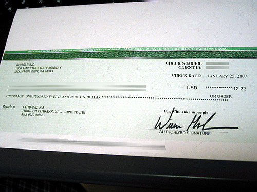

  

제 첫 번째 애드센스 수표입니다. 1년 훨씬 넘게 걸렸죠. 하하.  

<!-- truncate -->

하지만, 이렇게 오래 걸렸어도 저는 괜찮습니다. 우선 제가 블로깅을 하는 이유가 애드센스 때문만은 아니라는 건 확실하거든요. :)  
  
하지만 이후로 수입이 점점 증가하고 있다는 건 재밌는 사실입니다. 꾸준히 달아놔서 그런 걸까요? 애드센스에 신경을 많이 쓰며 어떻게 하면 좋을까 고민할 때는 정작 별 변화가 없다가 신경 끄고 블로깅을 하니 점차 수익이 쌓이더군요. 언젠가 [주성치님의 글](http://plan9.co.kr/tt2/tag/Google%20Analytics)을 보고 어떤 키워드에 클릭을 하는지를 알아보려고 한 적도 있었으나 저는 저 방법이 잘 안되더라고요. ㅜ.ㅡ 실패했습니다;  
  
각설하고 몇몇 이야기 시작합니다.  
  
**1**  
  
가끔 제가 세상과 소통하지 못하고 있다는 느낌을 받을 때가 있는데, 애드센스에 관해서도 그런 적이 있습니다. 어떤 분이 애드센스 관련 글에 "우리나라에서는 글을 잘 읽었다는 의미로 애드센스를 클릭하는데 그건…" 식으로 시작하는 댓글을 달아놨는데, 많은 분들이 그 댓글에 동의들을 하시더라고요.  
  
정말 그런 건가요? 제가 만약 구글에 애드워즈로 광고를 하는데, 제가 파는 상품에 전혀 관심 없는 사람이 단지 블로거의 글이 좋다고 제 광고를 클릭하면 기분이 그리 좋지는 않을 것 같습니다. 그건 본말이 전도된 거라고 생각해요. 마치 애드센스를 위한 블로그들 처럼 말이죠.  
  
**2**  
  
반대로 저는 가끔 제 블로그에 나오는 광고를 클릭하고 싶은 마음이 들 때가 있습니다. 제 수입 때문이 아니라 정말 궁금한 광고들이 나올 때가 있어요. 예를 들면 메뉴를 만들어주는 2kb 짜리 공짜 자바스크립트에 관한 광고라든지 명함관리 프로그램, 두통치료 한의원, 인터넷 중국어 학원 같은 광고 말이죠.  
  
물론 다른 블로그에 가서 글을 읽다가도 그런 광고가 눈에 띌 때가 있지요. 제 블로그에 나오는 광고는 혹시나 (부정클릭이 되지 않을까) 하는 생각에 클릭하지 못하지만, 다른 블로그에 가서는 궁금하면 바로 클릭해 봅니다. 클릭 후 꼭 상품을 구매하거나 어떤 계약을 체결하거나 하지는 않지만 해당 사이트의 내용을 읽어봅니다. 궁금해서 클릭한 거니까요.  
  
기술적으로 의도를 가진 부정클릭이냐 아니냐를 따지기 이전에 이런 게 바로 유효클릭이 아닐까요? 구글의 컨텍스트 광고 기술이 가진 장점도 사실 이런데 있는 거고요. 이런 유효한 광고 집행을 대행해주는 회사라면 저도 나중에 필요할 때 구글에 광고를 내야지-하는 생각을 합니다.  
  
하지만, 여러 꼼수로 인해 광고비가 새는 프로그램이라면 저부터 일단 사용하지 않을 겁니다. 그럼 그게 고스란히 애드센스를 달고 있는 블로거들에게 피해가 가겠죠. 광고주가 줄어들고 광고비가 줄어들테니까요.  
  
이 정도까지 이야기하니 우리나라의 P2P와 음반시장, DVD 시장에 관한 이야기들이 떠오르는군요. (만화책 시장도!)  
  
예. 반성합니다. 저도 위에서 이야기한 것처럼 한참 신경쓸 때는 친구들에게 광고 클릭해달라고 한 적 있어요. 부정클릭 강요죠. 지금은 자제하고 있습니다.  
  
**3**  
  
블로그에 광고를 실었다고 말이 많으니, 블로그의 공간에 대해서도 생각해 보게 되었습니다. 광고가 좋지 않다면 그럼 어떤 걸로 화면을 채우는 게 좋을까요?  
  
사실 광고는 나쁜 게 아니잖아요. 회사의 이윤추구 활동도 나쁜 게 아니고 개인의 이윤추구 활동 역시 나쁜 게 아니죠. 물론 이런 생각은 합니다. 블로그에 표시되는 내용은 블로거가 어느 정도 책임을 져야 하는 게 아닐까 하는 생각 말이죠. 그런 면에서 볼 때 블로그에 달린 광고는 자신이 책임질 수 없는 상품이나 물건 등에 대한 내용이 블로그에 올라와 있을 수 있다는 뜻이기도 합니다. 자신이 일일이 어떤 광고를 달지 선택할 수 있는 시스템이 아니니까요.  
  
하지만 광고를 보여주는 것 자체로 어떤 잘못을 유포하고 있는 건 분명히 아니라고 생각해요. 게다가 사람들은 이미 광고 영역을 광고로 인식하고 있고, 거기에 대한 준비를 할 것입니다. 악성 프로그램을 유포하거나 나쁜 일을 하는 걸로 알려진 회사 정도를 차단하는 것으로 충분하다고 생각해요.  
  
물론 광고가 들어갈 자리를 깨끗하게 비워두는 것도 의미가 있을 수 있습니다. 배너를 통해 자신이 몸 담은 조직이나 잘 되기 바라는 정책 등을 홍보할 수도 있죠. 그런 배너들은 비상업적이라고요? 방문자 입장에서는 똑같은 의미의 광고 아닐까요? 애드센스냐 링크프라이스냐가 중요한 게 아니라 의도를 가지고 주컨텐츠 이외의 다른 무언가를 보여주는 게 바로 광고잖아요.  
  
전 애드센스에 대한 클릭이 보다 투명해져서 많은 광고주들이 많은 광고비를 지출하게 되면 좋겠습니다. 그게 정도고 그게 시장이 커지는 길이고 그게 블로거들에게 돌아가는 수익이 커지는 길이겠지요.  
  
그런 이유로 컨텐츠와 광고를 의도적으로 비슷하게 만들어서 클릭을 유도하는 행위에 대해서는 회의적입니다. 혹은 지나친 방법으로 실수를 유도해 클릭을 하게 만드는 디자인 역시 회의적입니다. 이런 판단이야 주관적이겠지만 디자인을 보고 사람들의 의도를 어느 정도 파악할 수도 있잖아요.  
  
**3-1** 위의 광고 클릭과 관련해서 한 마디 덧붙이자면, 링크프라이스와 같은 프로그램의 경우 - 배너를 클릭해서 상품의 구매가 이루어져야 수익이 발생하는 경우에는 상황이 조금 달라지겠죠.  
  
어떤 홈페이지에 정기적인 독자들이 찾아온다고 가정해봅니다. 그리고, 그 독자들은 좋은 컨텐츠를 제공하는 홈페이지 주인에 대한 호감의 표시로 자신이 사야할 물건이 있을 때 해당 배너를 클릭해서 살 수 있겠죠.  
  
무작정 방문자의 클릭을 유도해서 그 중에 구매가 발생하는 일이 힘들다면 (실제로 이런 류의 프로그램은 실적이 매우 낮다고 하죠.) 이런 광고 역시 디자인을 해쳐가며 배치할 필요는 없을 것 같습니다. 결국 배너가 어디에 있든 충실한 방문객들은 호의의 표시로 혹은 주인에 대한 믿음으로 배너를 눌러 물건을 구매할 테니까요.  
  
결국 배치에 대한 결론은 비슷해지는 건가요? :)  
  
**4**  
  
이야기하다 보니 흐름이 '수입의 양'보다 '수입의 질'에 대한 이야기를 하게 된 듯 합니다. 엄밀히 말하면 이 두 가지는 서로 연결이 될 거예요. 나중이야 어떻게 되든 크게 한탕하고 끝내기 보다는 성장가능성이 있는 시장의 질을 높여서 많은 참여를 유도하면 시장은 점점 커질테고 우리는 꾸준히 알을 낳는 닭을 죽일 필요도 없을테니까요. 물을 흐리는 미꾸라지들은 적합한 절차에 따라 퇴출시키면 되고요.  
  
하지만, 우리는 너무도 빠른 변화 속에서 살고 있고, 올바른 상품 보다는 많이 팔리는 상품을 파는데 주력하는 회사들을 자주 만나고 있고, 개인에게 이익을 돌려주는 회사는 거의 만나본 적이 없죠. 이러한 불신의 벽은 여전히 높기 때문에 우리는 회사의 약정을 피해 클릭을 유도하고, 심지어 회사들도 찌질한 방법으로 사람들의 클릭을 유도하고, 우리는 이것들을 경계하며 인터넷을 서핑하는 거겠죠.
