좀 늦었지만 장면으로 보는 짧은 관람기. :)  

<!-- truncate -->

  
스티비 원더에게 흠뻑 반했던지 스티비 원더풀을 연신 외치던 토니 베넷. 스티비 원더는 언제 봐도 스티비 원더. :)  
  
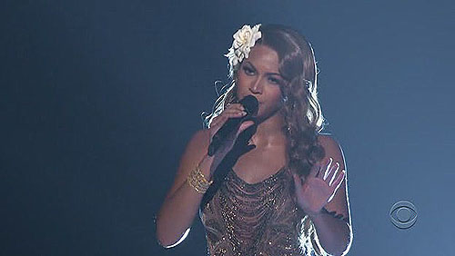  
별 주목도 받지 못하고 무대도 인상적이지 못했던 비욘세. 드림 걸스에서도 제니퍼 허드슨에게 밀렸다고 말이 많던데… 그러게 씨비 매스가 그랬잖아. 하나보단 둘, 둘보다는 셋.  
  
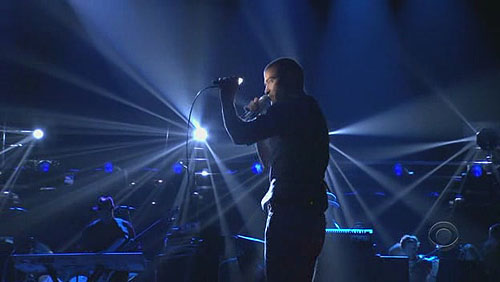  
세븐의 롤모델(?) 저스틴 팀버레이크. 하지만 혹은 당연히 세븐은 감히 상상도 못할 포스.  
  
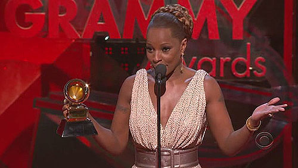  
베스트 알앤비 앨범 수상 때 엄청 길게 이야기 해놓고는 여성 알앤비 보컬 퍼포먼스 상을 받을 때 "짧게 이야기할게요" 라고 이야기하며 스스로도 웃던 메리 제이 블라이지 (사실 그러고는 짧게 이야기했죠 ^^)  
  
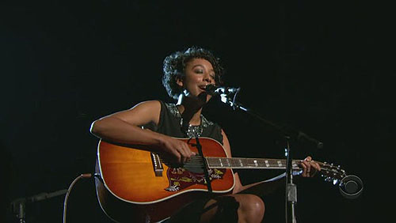  
올해의 발견 코린 베일리 레이. 그녀의 담백한 목소리는 사람들을 집중시키는 힘이 있습니다.  
  
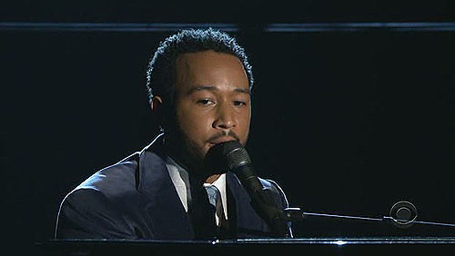  
존 레전드는 가만히 있어도 잘난 체 하는 것 같은, 모든 게 설정 같은, 신화의 전진 같아요.  
  
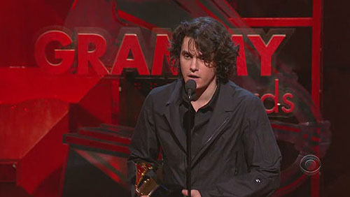  
살 빠지고 머리 긴 톰 행크스 같은 존 메이어의 이번 앨범을 들으며 확실히 느꼈습니다. 미국인이 좋아하는 음악의 특징 중 하나는 이런 보컬 톤이라는 거.  
  
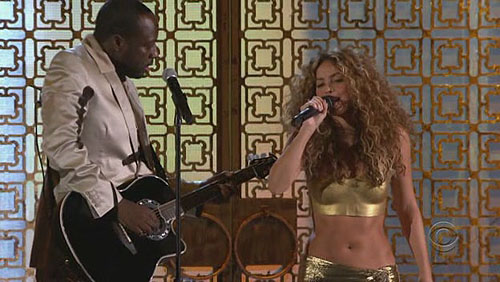  
솔직히 이번 퍼포먼스를 기대했는데 와이클리프 장은 립싱크로 거저 먹었어요. 반면 샤키라는 뻔하다고 생각되면서도 매번 눈을 떼지 못하게 하는 매력을 발산합니다.  
  
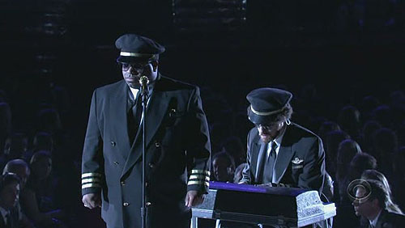  
날스 바클리는 앨범으로는 참을 수 없는 그루브를 던져주더니 이번 퍼포먼스에서는 어지러울 정도의 카리스마를 보여줍니다.  
  
  
메리 제이 블라이지 마냥 쪽지 준비해서 도움 준 사람들 줄줄 부르는 루다크리스. 거친 세상, 블랙 뮤직으로 성공하기 위해선 총싸움만 힘든 게 아니죠. 챙겨야 할 사람들이 이거야 좀 많아야죠.  
  
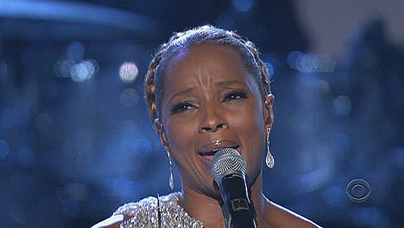  
미국의 쇼는 그게 거짓이든 사실이든 쇼가 진행되는 동안에는 진지하게 진행된다는 점입니다. 그건 산업적으로 그리고 가끔은 예술적으로도 분명한 장점이예요. 메리 제이 블라이지의 퍼포먼스는 그걸 보여줍니다.  
  
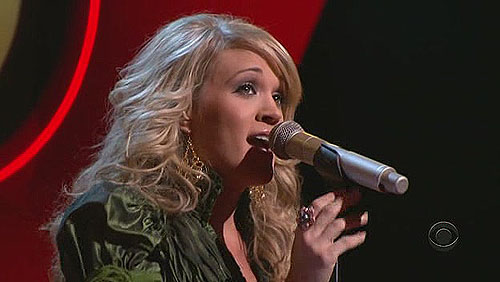  
하긴, 저도 캐리 언더우드가 나오는 아메리칸 아이돌을 볼 당시 초반부터 그녀가 우승할 줄 알았어요. 그리고 그녀는 이번 그래미에서 신인상을 받습니다.  
  
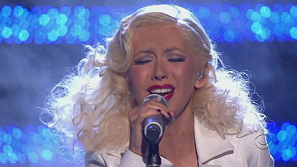  
크리스티나 아길레라의 지금의 질주는 브리트니의 부재 덕분일까 하는 생각을 종종 합니다. 개인적으로 그녀의 노래들을 더 좋아하는데도 말이죠.  
  
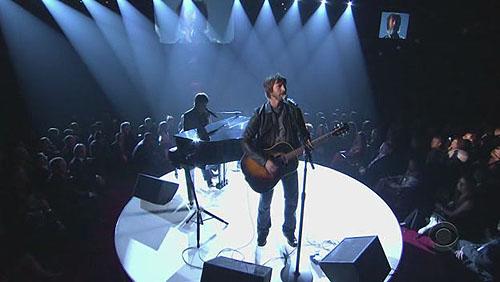  
제임스 블런트도 상은 받지 못했지만 결국 해냈습니다. 그의 끈기에 박수.  
  
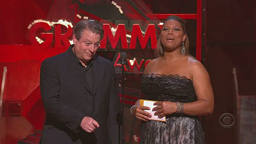  
전직 부통령이 음악 시상식에 나오는 나라, 우리나라도 그럴 수 있을까요? 맨슨 명박 전 서울시장이 집권하면 왠지 긴급조치 19호 내릴 것 같아요. 거짓 지원, 거짓 즐김, 즐기는 척 하며 내세우는 권위.  
  
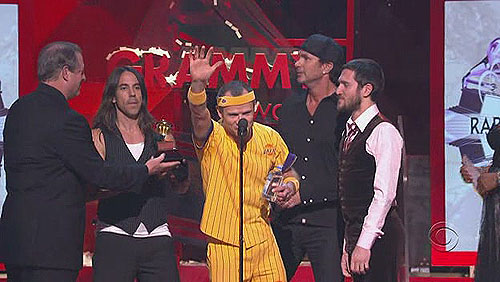  
레드 핫 칠리 페퍼스. 독보적인 사운드를 만들어내면서도 저토록 순수한 락밴드라니!  
  
  
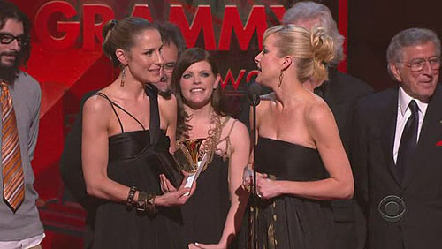  
이번 그래미를 정리하면 두 주인공으로 압축됩니다. **딕시 칙스**와 **메리 제이 블라이지**. 딕시 칙스는 중요 상을 싹쓸이했고, 메리 제이 블라이지는 그동안의 부진 아닌 부진을 모두 털어버렸으며 이번 그래미의 최고 중의 하나라고 할만한 무대를 보여줬어요. 그들을 통해 미국이 컨트리의 나라라는 걸, 요즘의 유행은 블랙 뮤직이라는 걸 보여준 그래미였습니다.  
  
  
그 밖의 수상 내역은 [**박하군의 전문성없는 음악이야기 - 딕시칙스를 선택한 그래미! <제49회 그래미 수상자 총정리>**](http://recreater.tistory.com/89)에서 확인하시고,  
  
더 자세히 알고 싶으면 [**GRAMMY.com - 49th Annual GRAMMY Awards Winners List**](http://www.grammy.com/Grammy_Awards/49th_Show/list.aspx)으로 가세요.  
  
공연 동영상은 역시 [**박하군의 전문성없는 음악이야기 - 제49회 그래미 시상식 주요공연 고화질로 보기 (수정)**](http://recreater.tistory.com/91)에 가시면 보실 수 있습니다. :)  
  
맛뵈기로 메리 제이 블라이지와 날스 바클리의 퍼포먼스를 옮겨 놓습니다.  
  
  
Mary J. Blige - Be Without You (live @ 49th Grammy Awards)  
  
  
Gnarls Barkley - Crazy (live @ 49th Grammy Awards)
