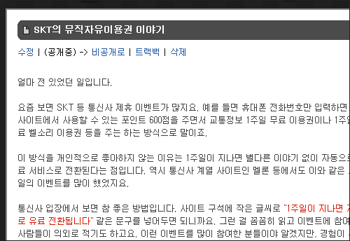
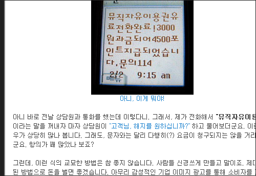
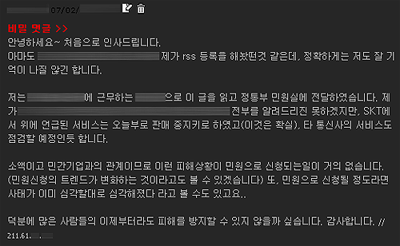
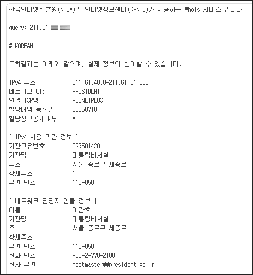

제가 얼마 전 올린 글 **SKT의 뮤직자유이용권 이야기** 기억하시나요? 그 뒷 이야기입니다.  

<!-- truncate -->

  
  
  
그 글에 댓글이 달렸습니다. 그 글을 올려도 되냐고 여쭤봤는데 아무래도 다시 확인하시지 않은 것 같아요. 하지만 몇몇 곳에 모자이크를 했으니 괜찮을 것 같습니다. ^^ (혹시라도 원치 않으신다거나 문제가 된다면 바로 말씀해주세요. 삭제하겠습니다.)  
  
  
아이피를 확인해 보니 그 쪽에서 근무하시는 분이 맞는 듯 합니다.  
  
  
정말 이런 경우는 윗 분 말씀처럼 소액이고 민간기업이고 하니 마땅히 어디다 이의를 제기하기가 쉽지 않잖아요. 해당 기업에 전화해 봤자 그냥 "고객님- 죄송합니다-" 하고 넘어가고. 고객들은 일상이 바쁘니까 그냥 욕 좀 하고 지나가고. 그러니 이런 게 더 기승을 부리는 것이겠죠. 고객 한 명당 한 번씩만 속여도 그 돈이 엄청날 테니까요.  
  
저도 이제껏 그래왔는데, 다른 분들도 이런 일들이 생길 때 몇 마디로 툴툴거리는 것 보다 비교적 정확하게 상황을 적어두는 게 좋을 것도 같아요. 모든 문제들이 글을 적는 것만으로는 해결이 되지 않겠지만, 어쨌든 상황을 정확히 알아야 해결도 할 수 있는 거니까요.  
  
어쨌든 이 일이 그럭저럭 잘 된 듯 하니 기분 좋군요. 처리해주신 분 정말 감사드립니다. 좋은 일 하셨어요~ ^^  
  
  
  
p.s. 댓글 적어주신 분들의 조언을 받아들여 조금 더 모자이크 했는데, 그래도 어차피 ip 조회 스샷까지 가리면 혼자서 소설 쓰는 것 같아서 ip 조회는 그냥 두었습니다. 다시 한번 말씀드리지만, 문제가 된다고 하면 다시 말씀해 주세요. 바로 삭제하겠습니다.
