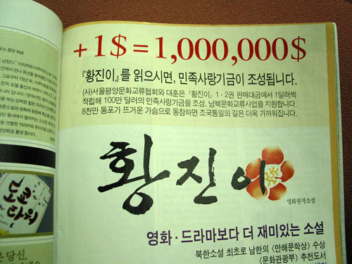

  
씨네21에 실린 소설 광고이다.  

<!-- truncate -->

애드센스를 사용하는 몇몇 사람들이 잘못 붙이는 걸 보면서도 신기했는데 이젠 잡지 광고에까지… 이거 정말 국내 표기법이 바뀐 걸까? -\_-;  
  
한두 명이 보고 결정한 시안이 아닐 것 같은데 저렇게 내보내다니, 씨네21 쪽에서라도 좀 잡아주지… (씨네21에만 나간 광고는 아닐지도 모르지만) 맞춤법 엉망인 기사들이 득세하더니 이제 광고도 그 대열에 합류하는가 보다.
