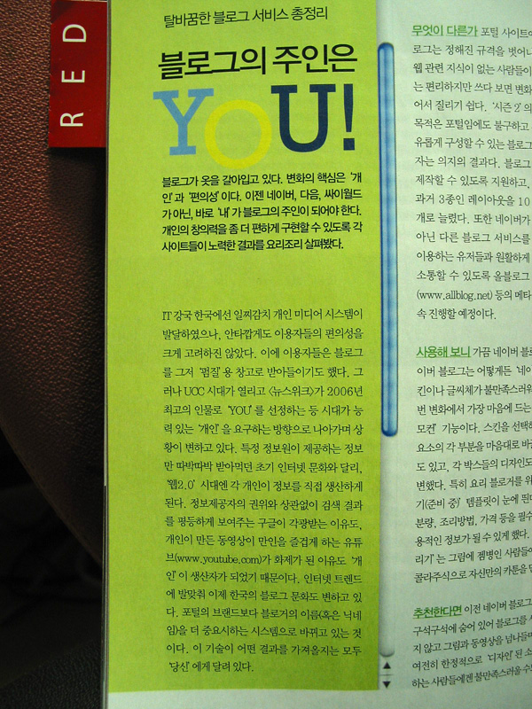
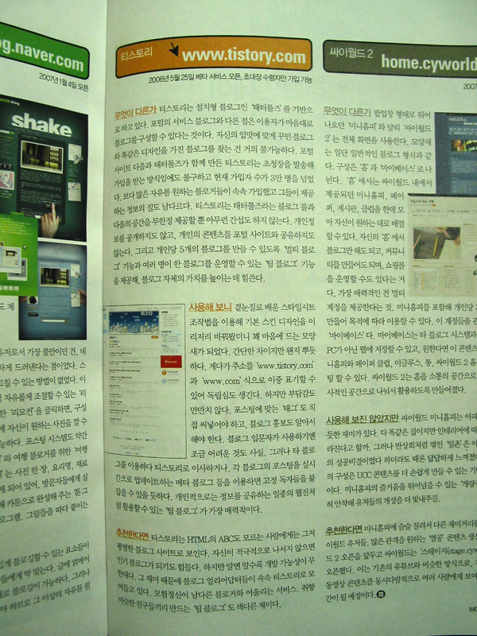
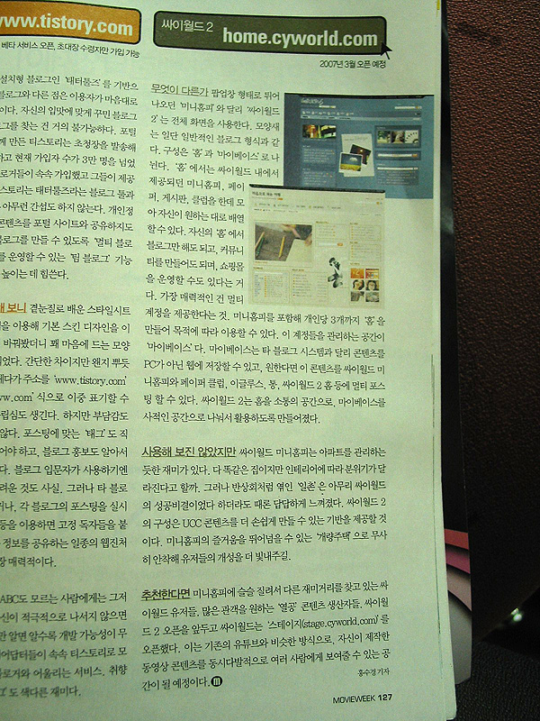

확실히 웹2.0 시대의 3대 (블로그) 서비스 - 이른바 빅3는 [티스토리](http://www.tistory.com), [네이버 블로그 시즌2](http://blog.naver.com), [싸이월드2](http://home.cyworld.com)로 확정된 모양이군요. 우리나라 사람들이 좋아하는 '3'이기도 하고, 각각 [다음](http://www.daum.net), [네이버](http://www.naver.com), [SK컴즈](http://corp.nate.com)라는 대기업 계열이기도 하고 하니, 그리 보는 게 모양새가 좋은가 봅니다.  

<!-- truncate -->

업계 속사정을 전혀 모르는 상태에서의 개인적인 의견입니다만 - 만약 [이글루스](http://www.egloos.com)가 SK컴즈에게 넘어가지 않았다면 여기에서 한 축을 차지할 수도 있지 않았을까 생각해 봅니다. SK컴즈에게 인수된 이후로는 조용하군요. 솔직히 예전에 이글루스가 가지고 있던 '물 좋은 블로그 서비스'란 타이틀이 요즘엔 티스토리에 슬쩍 넘어가지 않았나 생각도 해보고요.  
  
설날에 고향에 내려가다 읽은 잡지에 블로그 서비스에 관한 기사가 나와서 사진을 찍어봤습니다. 지난 번에 이어 이번엔 [무비위크](http://www.movieweek.co.kr/)로군요. 각각의 이미지를 클릭하면 읽을 수 있을 정도로 커집니다.  
  
  
아쿠아 스타일의 스크롤바는 예뻐보이지만 기사는 초반부터 삐그덕하는군요. 2006년 '올해'의 인물로 'you'를 선정한 건 뉴스위크가 아니라 타임지입니다.  
  
  
솔직히 네이버의 변신에 대한 표현은 거의 대부분 "레이아웃 (스킨)의 변경이 용이해졌다" 그 이상도 그 이하도 아닌 것 같아요. 만약 웹표준의 입장에서 이야기하면 고개 숙여야 하지 않을까요. 하긴, 그게 오늘날 우리나라의 인터넷 서비스를 선도하는 회사들의 수준이죠.  
  
  
티스토리가 두번째 주자입니다. 기사가 좀 아쉽군요. 솔직히 티스토리의 스킨은 CSS를 곁눈질로 배워 만족스럽게 수정할 수 있는 수준은 아니잖아요. 독립도메인에 대한 표현도 좀 아쉽고요. 하지만, 마지막 단락은 마음에 드는군요.예, 어떤 식으로든 나서야 합니다. :)  
  
  
싸이월드2 (일명 C2)도 나왔습니다. 솔직히 C2는 이 정도 분량으로 요약하기엔 너무 설명할 게 많죠. 복잡하기도 하고요. 게다가 중간에 "사용해 보진 않았지만" 이란 문구가 눈에 띕니다. 사용해 보지 않고 적는 기사라면 그냥 건너 뛰어도 될 듯 합니다.
