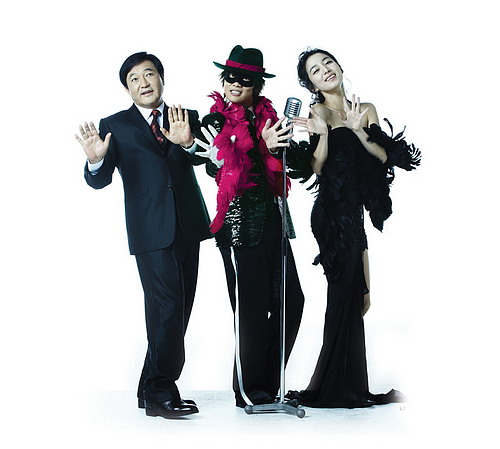

  
설날에 <복면달호>를 봤다.  

<!-- truncate -->

- 전형적인 설날 영화다. 이경규가 제작을 해서 캐스팅부터 난관에 부딪혔다고 하던데 이해가 될 뻔 하다가 오히려 갸우뚱했다. 그럼 황금 시즌인 설날엔 어떻게 개봉할 수 있었던 거지?   
  
- 영화는 복면을 쓴 주인공 달호 역을 맡은 차태현의 이미지처럼 그냥 쉽게 쉽게 흘러간다. 그렇다고 미끄럽게 이어지는 것도 아니고 덜컹거리면서. 그것도 아주 전형적인 신파와 주인공의 얕은 고민과 함께. 그래도 설날 영화인데, 뭘. 이런 영화도 있을 수 있지.  
  
- 숙적 트로트 가수 나태송의 캐스팅은 흥미로웠으나 뚜렷한 활약 없이 영화가 끝나 참 아쉬웠다. 태준아도 뭔가 할 것처럼 나오지만 그냥 맥없이 사라지고. 그런데, 마지막 엔딩 크레딧 올라갈 때의 영상은 뭘까. 그런 게 이슈가 되리라 생각한 걸까? 이경규를 이용한 홍보를 하지 않으려 한다고 하면서도 그런 영상을 끼워넣는 건 이중적인 태도라 생각했다.  
  
- 제작비를 적게 들였다는 건 한눈에 알겠는데, 그게 노골적으로 티나는 게 좀 그랬다. 예를 들면 달호와 서연이가 처음 등대가 있는 바닷가에 만나는 씬과 나중에 둘이 다툰 뒤 다시 재회하는 장면에서의 의상이 똑같더라. 한 눈에 봐도 장소도 같은 것 같고. 아마도 같은 날 찍은 거겠지. 이런 건 솔직히 좀 심했다.  
  
- 이 영화의 가장 큰 미덕은 차태현. 분위기도 잘 맞고, 노래도 잘 불렀다. 실제로 그가 가수활동을 할 때 무대에 오르면 약간 어색하다는 느낌을 받았는데 그 느낌까지 고스란히, 자연스럽게 표현된 듯 싶다.  
  
- 트로트를 소재로 한 이 영화의 음악은 주영훈이 작업했다고 한다. 주제가 "이차선 다리"이 역시 장르는 트로트인데 이 곡은 투가이즈라는 듀오가 작곡했다고 한다. 차태현에 의해 발라드처럼 불려지는 이 곡은 마지막에 락으로 편곡되기도 하는데, 이거야 말로 바로 우리나라 가요계의 현상을 제대로 반영하는 게 아닐까 싶다. 트로트 창법으로 락을 하는 버즈, 장르를 가리지 않는 소몰이 창법의 유행, 트로트 같은 노래로 활동하는 각종 여성 댄스 그룹. 정말 영화는 어떤 식으로든 현실을 반영하는 게 틀림없다.  
  
 / 
