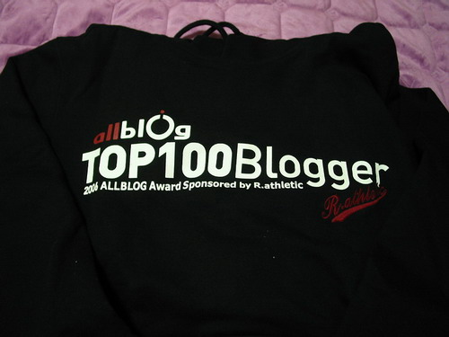
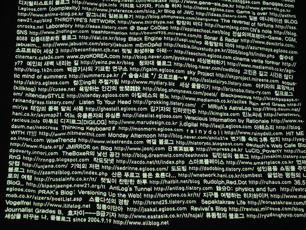

  

사진에 보이는 흰색 잡티는 먼지입니다. -\_-;  

<!-- truncate -->

  

뒷면에는 100개의 블로그 이름과 주소가 적혀있습니다.  
올블로그에서 후드티가 왔습니다. 잘 받았습니다. 평소에도 자랑하는 걸 잘 못하는지라 과연 밖에 입고 다닐 수 있을지 의문이 들기는 하지만, 디자인은 예쁘고 옷도 따뜻하게 보였습니다. (그런데, 어차피 라틀랜틱 로고가 있는데 굳이 sponsored by R.athletic 이라고 쓸 필요가 있나 싶긴 했어요. 하지만, 스폰서가 중요하긴 중요하죠.)  
  
후드티 뒷면에서 제 블로그 이름 찾는 게 너무 힘들었어요. 헉헉. 끝에 걸려서 더 찾기 힘들었던 것 같아요. 평소에도 블로그 이름을 한글로 표기할까 하는 생각을 하는데, 뒷면을 보니 그런 생각이 더 강하게 들더군요. 한글은 금방 찾겠더라고요. ^^  
  
요즘 올블로그에 이런 저런 주문도 많아지고, 질책도 많아져서 운영하시는 분들이 힘든 것도 같더군요. 하지만, 올블로그가 여러가지 면에서 가능성을 보여준 이상 여러 경쟁자들이 등장할텐데 이런 시기를 잘 견디면 올블로그에게 좋은 약이 될거라 생각합니다. 더욱이 올블로그에 무턱대고 악담을 하거나 비난을 늘어놓거나 하는 글은 거의 보지 못했는데 그 사실은 이미 큰 힘이 되지 않을까 해요. 앞으로도 계속해서 더 좋은 서비스 운영/유지/개발해주시길 바랍니다. :)  
  
사실 후드티는 그저께 도착했어요. 그런데, 왜 오늘에야 올리냐고요? 귀차니스트의 특권이죠. :p  
  
p.s. 아, 롤링페이퍼는 참 깜찍한 아이디어였어요. 멋졌습니다. ^^  
  
p.s.2 그런데, '빛자루' 1년 무료 이용권은 언제부터 이용할 수 있는 건가요? 다들 말씀이 없는 걸 보아 저만 소식을 못 들은 게 아닌가 싶기도 해요. -\_-a
