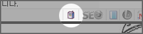
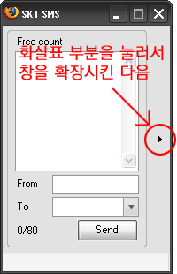
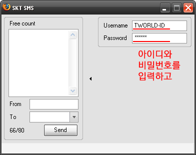
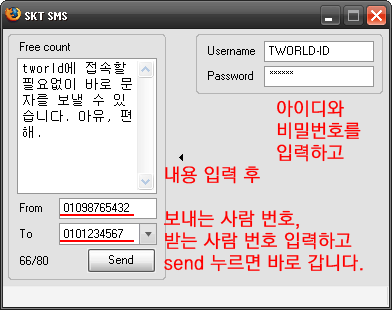

[**ToBWithU님**](http://blog.naver.com/tobwithu96)이 만드신 파이어폭스 확장기능 (extension) 입니다. tworld 로그인 아이디와 비밀번호를 입력해두면 별다른 설정없이 **파이어폭스에서 바로 문자메시지를 보낼 수 있습니다.** tworld 회원에게 매달 무료로 주어지는 문자메시지 말이죠.  

<!-- truncate -->

물론 주소록 기능이 아직 없다는 게 불편할 수도 있지만, 엄청나게 가볍다는 것이 그 불편을 상쇄하고도 남는군요.  
  

[**▶ 한국 모질라 업데이트 - SKT SMS 설치하러 가기**](http://update.mozilla.or.kr/addons/?p=1193&application=firefox&addonType=extension)

  
설치를 마치고 나면 파이어폭스의 상태표시줄에 다음과 같은 아이콘이 생깁니다.  
  
  

아이콘을 클릭하면 다음과 같은 창이 뜨는데 화살표를 눌러 창을 확장시킨 다음  
  
  

tworld 아이디와 비밀번호를 입력한 후  
  
  

내용을 작성하고, 보내는 사람 번호, 받을 사람 번호를 입력하고 보내면 문자가 바로 보내집니다.  
  
  

**※ 아이디, 비밀번호, 보내는 사람 번호는 처음 한 번만 입력하면 그 이후에는 다시 입력할 필요가 없습니다.**  
  
여러 사람이 사용하는 컴퓨터라면 사용하기 힘들겠지만, 자신만 사용하는 컴퓨터라면 아주 유용한 확장기능이 아닌가 합니다.  
  

**추가**  
  
버전업을 계속 하여 현재는 모질라의 공식 애드온 페이지에 **LightSMS**라는 플러그인으로 등록된 상태입니다. :)  
  
[**▶ Firefox 부가 기능 (Add-ons) - LightSMS 0.3 설치하러 가기**](https://addons.mozilla.org/ko/firefox/addon/5358)
