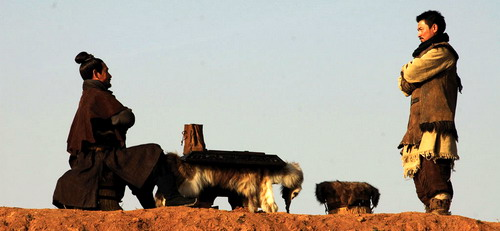

  
aka 墨攻, Battle of Wits  

<!-- truncate -->

- (묵공 홈페이지에 의하면) 묵가 사상은 기원전 5세기, 춘추 전국 시대 말 사상가 묵가에 의해 창시되었다고 한다. 침략 전쟁을 비난하는 '비공'이라는 사상을 내세워 약소국을 위협하는 강대국에 맞서 평화를 지켰다고 하고, 이 때 전투에 나섰던 묵가군을 묵수라고 불렸다고 한다. 묵공은 이들이 보다 공격적인 지략을 사용하여 적극적으로 수비를 하는 거을 의미한다고.  
  
- 고등학교 때 배운 것도 같지만 지금 묵가 사상에 대해 기억하고 있는 것은 거의 없다. 찾아 보니 상현(尙賢), 상동(尙同), 겸애(兼愛), 비공(非攻), 절용(節用), 절장(節葬), 천지(天志), 비락(非樂), 명귀(明鬼), 비명(非命) 등 10론(論)을 주장했다고 한다.  
  
- 조금 아쉬웠다. 영화를 보기 전에 원작인 만화책을 본 상태에서 이 영화를 본 어떤 이의 평을 봤는데, '꽤 재밌으면서도 아쉽다. 3부작 정도로 만들었으면 더 괜찮았을 것 같다.'고 한 게 기억났다. 원작 만화를 읽지 못한 나도 그런 느낌이 들었다. 원작을 읽고 싶어졌다. 할 이야기도 많았을 것 같고, 당시 상황에 대한 배경이라든지 묵가에 대한 설명 같은 게 조금 더 묘사되어도 좋을 듯 싶었는데 큰 덩어리에서 뚝 떼어 낸 일부분만을 보여주는 느낌이랄까?  
  
- 그럼에도 불구하고 영화는 묘한 재미를 주었는데 마치 실시간 전략 시뮬레이션이나 RPG 장르의 게임을 플레이 하는 것과 유사한 느낌이라고나 할까? 전통적인 서사구조에 맞춰 보자면 '기-전-전-전-전-전-결' 식인 이 영화가 좀 이상하게 보일 수도 있겠으나 나름의 세계관은 원작 만화에서 구축이 되어 있을 터, 원작을 아는 사람은 느낌이 많이 다를 것도 같았고. 앞으로 영화라는 매체가 이런 식으로도 발전한다면 어떤 형태가 될까 문득 궁금해졌다.  
  
- 모든 이를 사랑하는 것은 결국 아무도 사랑하지 않는다는 말과 같다는 흑인 노예의 말은 참 평범하면서도 이 영화에 적절한 표현이었다. 반면 물이 너무 깨끗하면 고기가 모이지 않고, 사람이 너무 청렴해도 주변에 사람이 모이지 않는다는 옛말이 요즘엔 더럽혀지는 양심과 소신에 대한 핑계로 너무 흔하게 사용되는 듯도 싶다.  
  
- 또한 도움을 요청하는 곳이라면 누구에게나 자신의 능력을 빌려주는 묵가군들을 다른 면으로 생각해보자면 현대판 '용병'이라 할 수도 있다. 돈을 위해 뛰는 용병이든, 사명감을 가지고 뛰는 용병이든 목적을 이루고 나면 쓸모가 없어진다. 쓸모가 없어진 용병은 폐기처분 된다. 정치적으로도, 상업적으로도 역사 속에서 대부분의 개인은 언제나 특정 진영 (기업)을 위해 뛰는 용병이라 할 수 있다. 개인이, 용병이 불행한 최후를 맞아들이지 않으려면 스스로 자신의 쓸모를 개발해야 한다. 세상은, 전장이다.  
  
 /  /   
  

**관련 링크**  
  
[묵공 국내 홈페이지](http://www.mukgong.co.kr)  
  
[고전과 걸작 사이 - [만화] 모리 히데키, 《묵공》(墨攻, 1992~1996) \*\*\*\*1/2](http://imjohnny.egloos.com/839897)  
[프레시안 - 신영복 고전강독 <111> 제10강 묵자(墨子)-1](http://www.pressian.com/scripts/section/article.asp?article_num=40020923152502&s_menu=%EB%AC%B8%ED%99%94)  
[월간 온오프 - 실천하는 반전론자 '혁리'가 바라본 전쟁과 민초](http://www.myonoff.com/bbs/board.php?bo_table=c1500&wr_id=3544)  
[愚公移山 - '墨家'의 유산, 영화 '묵공'](http://prouder.egloos.com/2944049)  
  
[씨네21 - [영화읽기] <묵공> 되살아난 묵자의 이상주의](http://www.cine21.com/Article/article_view.php?mm=005004001&article_id=44165)  
[씨네21 - [편집장이 독자에게] <묵공>의 가르침](http://www.cine21.com/Article/article_view.php?mm=005003005&article_id=43969)  
[씨네21 - 우직한 서사극 <묵공>](http://www.cine21.com/Article/article_view.php?mm=002001001&article_id=43971)
