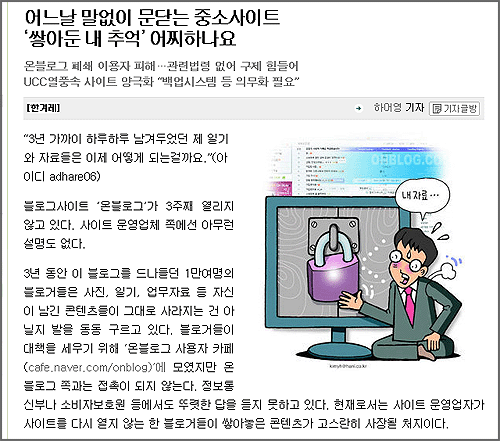
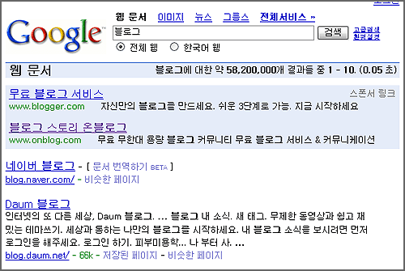

  
현재까지 [온블로그](http://www.onblog.com/)는 열리지 않고 있다.  

<!-- truncate -->

  
하지만, 아직 구글에 지불한 광고료는 남아서 집행이 끝나지 않았나 보다.  
솔직히 무섭다.  
  
간혹 이게 중소 블로그 서비스 업체에 대한 문제라고 여겨지기도 하는 모양인데, 호스팅 받아 설치용 블로그를 운영하는 사람들도 불안하긴 마찬가지이다. 예를 들면 - 턱없이 싼 가격에 혹 해서 계정을 만들었는데, 어느날 하루 아침에 그 호스팅 업체가 문을 닫으면 어쩌나 하는 걱정 같은 거.  
  
예전에 도메인 때문에 귀찮은 상황에 처한 적이 있었는데 그 땐 그나마 처리할 방법이라도 있어서 다행이었지, 만약 문 닫고 없어져 버렸다면 정말 난감할 뻔 했던 기억이 난다.  
  
블로그가 유용한 정보들의 저장소이든 개인사를 빼곡히 적어놓은 일기장이든 간에 저런 일을 겪는다면 정말 패닉상태에 빠질 것 같다. 그나마 설치형 유저들은 (귀찮아서 대부분 하지 않을 것 같긴 하지만) 백업이라도 할 수 있다지만, 백업도 지원하지 않는 무늬만 2.0인 블로그 서비스들을 사용하는 사용자에게는 정말 무서운 일임에 틀림없다.  
  
… 잠깐, 그런데 우리나라의 서비스형 블로그들 중에서 백업을 지원하는 업체는 몇 개나 될까?  
  

**사족**  
  
- 위에 사용된 '블로그'란 용어는 '인터넷 서비스'라고 바꿔도 무난할 듯.  
  
- 그러고 보면, 한번 가입하면 블로그 주소를 바꿀 수 없는 업체들이 대부분이다. 서비스 자체가 퍼머링크를 보장하지도 못하는데 (백업을 지원하지도 않는데) 주소 변경 같은 건 왜 제한할까?  
  
- '퍼머링크가 보장되지 않는다'라… 마치 사람이 살아가면서 모든 과거를 기억하고 있지 않듯 그리고 기억하고 있는 것들이 모두 사실이 아닌 듯, 인터넷도 그런 식으로 묵은 오래된 기억들을 날려버리는 걸까? 역시 인터넷은 살아있는 걸까?
