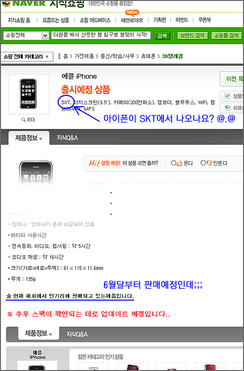

  

상품 정보 아래 **"현재 해외에서 인기리에 판매되고 있는 제품입니다"**라는 문구에서 결정적으로 신빙성을 상당히 잃었지만, 어쨌든 애플의 아이폰이 SKT를 타고 들어온다는 저 당당한 강태공 포스의 근원은 어디일까요?  

<!-- truncate -->

  
  
자고로 애플 가라사대, [**comming in June**](http://www.apple.com/iphone/hello/) 이랬는데 말이죠.  
  
  

Comming in June 이라고 했걸랑요.  
  
.  
.  
.  
  
  
앗. 혹시 저 June이 6월이 아니라 SKT의 June?  
  
  

요거? 프리미엄 멀티미디어 서비스?  
  
  
Rumor comes true 혹은 We've got rumor mixed up with the truth 로군요. :-p
