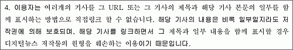

> 인터넷 사이트에 언론사 기사의 제목이나 사진 일부를 게재해 놓고 이를 클릭하면 해당 언론사 사이트의 해당 기사나 사진으로 이동하게 하는 이른바 '딥링크(Deep Link)'는 언론사 허락 없이 이뤄졌다 하더라도 저작권 침해가 아니라는 하급심 판단이 나왔다.  
>   
> (중략)  
>   
> 재판부는 **"피고들이 원고들의 기사를 딥링크를 한 것만으로 원고들의 저작물을 복제, 전송, 전시하였다거나 이와 동일하게 볼 수 있는 경우에 해당한다고 보기 어렵다"**고 밝혔다.  
>   
> 재판부는 **"피고가 뉴스기사 제목 또는 일부 내용을 게재했다 하더라도, 게재된 부분을 사상 또는 감정을 창작적으로 표현한 어문저작물이라고 인정하기에 부족하다"**고 설명했다.  
>   
> (후략)  
>   
> 출처 : [머니투데이 - "언론기사 '딥링크', 저작권침해 아니다"](http://emanager.moneytoday.co.kr/eman/view/mtview.htm?no=2006072609223376138&cp=money)

<!-- truncate -->

  
매번 궁금해 하면서도 매번 까먹었습니다. 그러니까 [온신협의 디지털뉴스 이용규칙 개정안](http://www.kona.or.kr/bbs_v.htm?board=notice&type=pds000&cols=&q=&page=1&idx=220)은 자신들이 그렇다고 주장하는 것이고, 법적으로는 위와 같이 판결이 났는데요, 이 판결 이후에 상소가 이루어졌는지 궁금하군요. 혹시 아시는 분 계시나요? (재밌는 건 이 기사 이외에는 어떤 신문사에서도 이와 관련된 기사를 찾을 수가 없었다는 겁니다.)  
  
  

온신협은 이렇게 주장하지만 판결은 제일 위의 인용문처럼 났다 이거지요.  
회원들에게만 컨텐츠를 제공하던지 하는 식의 적극적인 해결 방법은 사용하지 않으면서 단지 우리의 컨텐츠는 소중하다며 문을 꼭꼭 걸어 잠그는 신문사들의 폐쇄적인 정책을 보면 우리나라 음제협의 그것이 떠오릅니다.  
  
기술이 법의 제한을 뛰어넘는 시대에, 심지어 기술의 발전이 사람들의 인식 조차 변화시키는 시대에 도구의 사용법에 대한 인식의 흐름은 어설프게 막아서는 바꿀 수가 없다고 생각해요. 이를테면, **UCC = 동영상**은 아니지만 그렇다고 UCC는 동영상이 아니라고 무조건 반대만 하는 것 보다는 꾸준히 올바른 의미로 사용함으로써 진짜 UCC가 무엇인지 알리고 그걸 통해 새로운 가치를 창출하는 게 더 나은 것처럼 말이죠.  
  
물론 온신협에서도 의도하는 것들이 있겠지요. 하지만, 그 의도들이 제대로 실현되기 위해서는 단순히 '안돼!' 라고 하기 보다는 그들이 가지고 있는 앞으로의 계획을 대중들에게 제대로 알리고 홍보해 가며 다른 기업과 사용자들의 참여를 이끌어 내는 것이 낫지 않을까요? 어차피 컨텐츠라는 핵심 가치를 보유하고 있는 것은 온신협이니 그게 시장이든 마당이든 더 큰 장을 만들어 내는 첫 걸음을 뗄 수 있는 것도 그들일 테니까요.  
  
두드리면 열리고, 열려 있어야 살아 남을 수 있는 세상입니다. 치열하게 살아가기란 참 어려운 일입니다.
