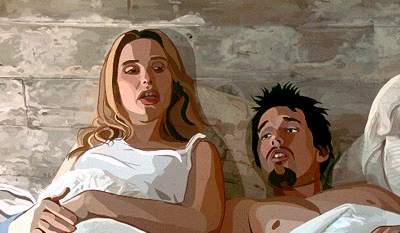

  
단지 생물학적으로, 현대 과학으로 숨이 멎는 것을 죽는다고 하지만, 그 외에 무언가 다른 게 있다고 생각하는 사람들이 많은 것 같아. 이러쿵 저러쿵 이야기해도 결국 죽어본 사람은 없으니까... 즉, 무언가 서로 다른 두가지의 개념에 대해 이야기를 하는데 한쪽은 경험해보지 못한 것이기 때문에 서로 명확한 비교나 대조를 할 수 없게 되버리는 거지. - 이를테면 안락사에 대한 문제의 한 축도 죽음에 대한 정의가 엇갈리기 시작했기 때문이라고 생각해.  

<!-- truncate -->

제시 (에단 호크 분)와 셀린 (줄리 델피 분)와의 대화 중에 이런 이야기가 나와. 자신이, 그리고 상대방이 어떤 사람의 꿈 속에서만 존재하는 사람인지도 모르겠다고. 내가 존재한다는 것이 과연 어떤 뜻인지 햇갈릴 때가 있다는 거지. 스스로 존재한다고 믿는 것이 존재하고 있다는 것을 증명해줄 수는 없으니까. 그리고, 존재에 대한 개념도 여러가지로 해석될 수도 있고.  
  
<공각기동대> (Ghost in the Shell, 1995) 에서 과연 생명체란 무엇인가에 대해서 이야기를 하잖아. 생명체에 대한 정의를 디지털적인 입장에서 해석하기도 하고. 꼭 공기를 호흡하고, 눈으로 보이는 외형을 가진 것만이 생명체가 아니라는 것들. 그렇다면 생명체란 무엇인가에 대한 이야기들. 이 영화와 다르면서도 닮아있는 생각들이 아닐까 싶어.  
  
주인공은 끊임없이 사람들에게 삶, 죽음 그리고 꿈에 대해서 물어봐. 사람들은 이 질문에 대해 자신의 이야기를 들려주고. 애니메이션의 내용은 사실 이게 전부야. 그런데, 이러한 애니메이션이 장편으로 기획되어 나왔다는 게 참 대단했어.  
  
사실 이 애니메이션이 주목받은 이유는 주제보다는 형식 때문이었다고 생각해. 실사를 바탕으로 하면서도 애니메이션의 특성을 잘 이용한 화면들, 그리고 여러 애니메이터들이 독립적으로 부분들을 맡아서 그렸기 때문에 생기는 자유 분방함들. 그렇지만 보면서 묘하게 주제와 형식이 어울린다는 생각이 들었어.  
  
자꾸 애니메이션의 마지막 즈음에 나눈 대화의 일부가 떠올라. '인생이 지루하니까 자꾸 꿈을 꾸게 되는 거야. 지루하니까 잠을 자지...'  
  
시간이 지날수록 내가 생각했던 것들에 관한 영화나 애니메이션들이 종종 나와서 신기해. 내가 인문철학에 지식이 있었다면 더 재밌게 봤을 것 같아. 그게 좀 아쉬워.  
  
평점을 주자면 별 다섯개에 세개. 탱고음악, 진짜 멋졌어.  
  
 /  / 
