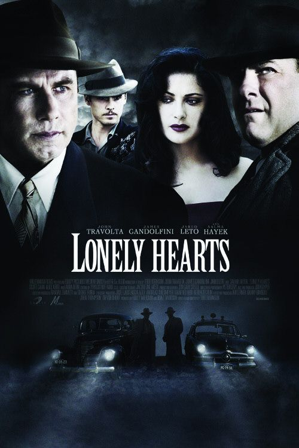

  

나이가 들어 1940년도에 디즈니가 만든 <피노키오>를 다시 볼 때 인상적이었던 건 바로 지미니 크리켓이었어. 피노키오를 따라다니던 그 조그만 귀뚜라미가 바로 '양심의 친구'로 나오잖아. 피노키오는 지미니의 말을 듣지 않고 자기 마음 끌리는 대로 행동하다가 결국은 위험에 빠지게 되고.  

<!-- truncate -->

어렸을 때부터 어른들에게 줄곧 듣는 이야기 중의 하나는 바로 "친구 잘 사귀어라"지. 실제로 한해 한해 지내면서 주변 사람들 때문에 사람이 달라지는 경우도 많이 보게 되고, 결혼 하고 나서 달라지는 경우도 많이 봤어. 물론 그게 꼭 친구 때문도 아니고, 양심만의 문제 역시 아니겠지만 말야.  
  
영화 속에는 마사와 레이라는 두 명의 살인범이 등장하는데, 이 둘은 연인이야. 이들은 여기저기 장소를 옮겨다니며 외로운 사람들을 속여 돈을 뜯어내고 심지어는 죽이기까지 해.  
  
아, 영화를 보면서 편집이 보통의 스릴러 영화와는 조금 다르게 - 조금 질질 끌길래 '이거 실제 있던 일을 영화화했나 보다' 싶었는데 정말 그랬더라고.  
  
실제로 1940년대 후반 미국에 마사 벡과 레이먼드 페르난데즈라는 악명 높은 살인자들이 있었대나봐. "Lonely Hearts Killers"라는 이름으로 불렸대. 레이가 잡지에 광고를 내서 전쟁에서 배우자를 잃은 여인들을 찾아 돈을 뜯어먹고는 죽였던 거지. 아이러니컬한 것은 마사와 레이먼드는 서로 그런 일을 통해 만나 사랑에 빠지고 연인이 되었다는 거야. 20건이 넘는 살인을 했다고 추정되었고, 그들은 열 두명을 죽였다고 자백했대.  
  
어쨌든 여기서 흥미로운 건 - 실제는 어땠는지 모르지만 마사는 레이에게 집착을 하고, 레이는 강한 성격의 마사에게 아니라며 고뇌하는 듯 하면서도 끌린다는 거야. 살인을 하게 되는 것도 마사가 레이에게 사랑을 확인하는 과정에서 벌어져. 외로운 사람들을 살인하는 살인범들이 사실은 외로운 사람들이었다는 거지. 물론 외롭다고 사람을 죽여서는 안되는 일이지만.  
  
그럼 레이는 <무간도>의 주인공들처럼 빠져나오고 싶은데 빠져나올 수 없는 상황에 빠진 살인범인걸까? 아니면 세상 일이란 게 원래 그런 것들 투성인걸까. 내 곁에는 어떤 친구들이 있을까. 나를 아껴주는 사람들은 어떤 사람들일까.  
  
평점을 주자면 별 다섯 개에 세 개. 이 이야기는 1996년에 유럽에서 <Profundo carmesí> (짙은 선홍색, Deep Crimson, 1996)으로 먼저 만들어졌대.  
  
 /  / 
