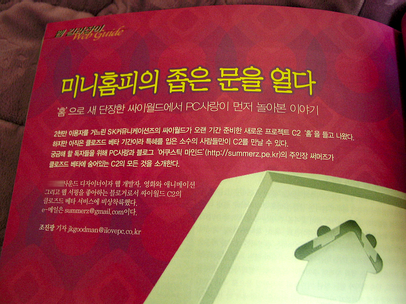
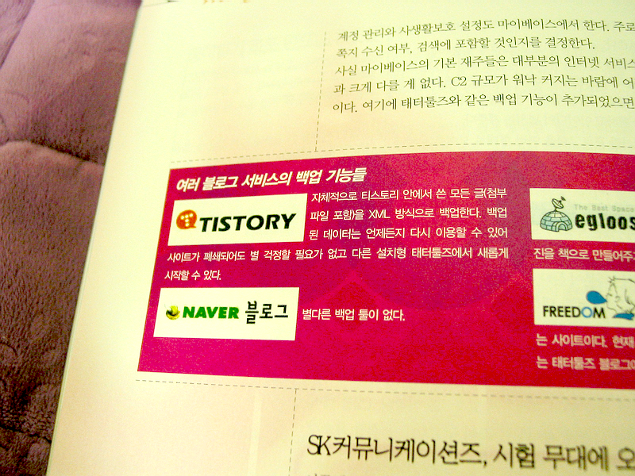

  
'홈'으로 새 단장한 싸이월드에서 PC사랑이 먼저 놀아본 이야기  

<!-- truncate -->

  
여러 블로그 서비스의 백업 기능들  
  
[PC사랑](http://www.ilovepc.co.kr/) 3월호에 실린 글입니다. 3월이 많이 지나긴 했지만, 현재 클로즈드 베타 서비스 중인 [싸이월드의 새로운 서비스](http://home.cyworld.nate.com/)에 대해 궁금하신 분들을 위한 글이니 서점가면 보실 수 있을 듯 합니다.   
  
바로 위의 페이지는 작은 박스 기사 부분이긴 하지만 네이버와 티스토리의 백업 기능의 차이 말이죠… 제가 적고도 좀 안스러운 생각이 들었습니다;;;  
  
(옆에 보이지는 않지만 이글루스에 대해서는 적절치 못하게 표현한 부분이 있어요. 유료였다가 무료가 된 이글루스 플러스 서비스와 PDF 백업, 중지된 나만의 책 만들기 서비스 등에 대해 조금의 착각과 표현상의 오류가 뒤섞여버린 채 적어버렸습니다.)  
  
p.s. 조만간 이 글의 요약본을 올릴 예정입니다.
