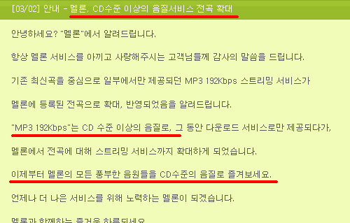
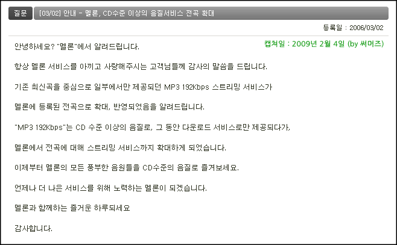

도통 최근 음악을 제대로 듣지 않고 지내다가 최근에 [벅스의 무제한 다운로드 서비스](http://mypage.bugs.co.kr/my_service/mypage_serviceMain.asp)를 이용해서 음악을 듣고 있습니다. 답답하긴 하지만 그래도 그럭저럭 들을만 합니다. 사실 출퇴근시 시끄러운 도로 위에서 듣기 때문에 뭐 아쉬운대로, 괜찮습니다.  

<!-- truncate -->

사실은 오히려 걱정이 가끔 됩니다. 이러면 도대체 음악 하는 사람은 돈을 어떻게 벌까. 이통사와 거대 기획사를 중심으로 한 몇몇 투자 자본들이 거둬들이는 수익을 제외하면 제대로된 수익을 얻지 못한 채 음악 외적으로 더 투자를 많이 해야 하는 뮤지션들 말이죠.  
  
각설하고, 이용하다 보니 벅스의 서비스가 그 질이 낮다는 걸 느끼고 있습니다. 여러가지 면에서 '박리다매 서비스' 인 것이지요. 하지만, 기왕 결제한 거 어느 정도는 이용하려고 생각하고 있습니다. 그런데, 안타깝게도 제 휴대용 기기에서 44.1kHz / 320Kbps로 인코딩된 mp3 파일을 다운 받아 재생시키면 음악이 튀더군요. 그래서 눈물을 머금고 192Kbps로 된 mp3를 듣고 있습니다.  
  
그래서, 다른 서비스들은 어떤가 하고 찾아보다가 [멜론](http://melon.com/)의 페이지를 뒤지다 다음과 같은 글을 찾았습니다.  
  

이해가 잘 되지 않더군요. 사용자들이 잘 보지 않는 곳에 적당히 숫자와 단위를 이용해 적어 놓으면 뻥쳐도 된다고 생각한 건지, 아니면 실수로 저리 적어놓은 것인지 궁금해요.  
  
합법적인 mp3 다운로드 시장이 형성되기 이전부터 유통되던 mp3들이 대부분 128Kbps여서 저렇게 적어놓은 걸 보면 확실히 왠지 상당한 음질 향상 - 정말 CD 수준의 음질을 기대하는 사람들이 있을 것도 같습니다.  
  
그래도 그렇지, 저런 글을 FAQ에 올려놓는 건 좀 심한 것 같아요.  
  
사족)  
  
음원 재생장치의 용량이 점점 커지면 무손실 압축이나 웨이브 파일의 다운로드 서비스도 생겨나지 않을까요? 분명히 수요가 있다고 생각하거든요.

2009-02-04 추가)

3년여가 지난 지금도 수정이 안되어 있군요. ㄷㄷㄷ

디자인만 바뀌었지 내용은 그대로예요.

