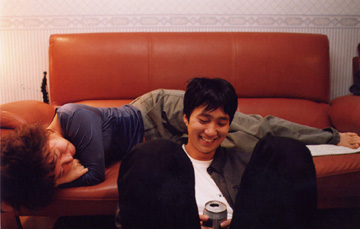

  
나 신기하게도, 이 영화를 보기 전부터 배종옥이라는 배우가 좋아졌어. 그전부터 TV 드라마를 보며 참 묘한 매력의 배우구나 싶긴 했지만. 정말 우스운 건 이 영화를 보기 전, 이 영화의 홍보 홈페이지에 들어가서 몇번 클릭하면서 "아, 내가 연기자 배종옥을 좋아하고 있구나" 하는 느낌이 들었어. 영화도 보기 전에 말이야.  

<!-- truncate -->

홍상수 감독의 영화들이 떠올랐어. 사람- 아니 나를 불편하게 만드는 것들 말야. 그런데 말야 나를 불편하게 만든다는 건 내가 가끔 느끼지만 피하고 싶은 것들이라는 거야. 홍상수 감독의 영화들보다는 훨씬 정서적이긴 했지만. 그리고 좀 더 내용이 친절한 것들도 있고. 참, 그리고 이 영화를 보면서 사람을 불편하게 만드는 것과 강요하는 것과는 다르다는 걸 다시 한번 느꼈어.  
  
모든 남자들은 아니겠지만, 남자들은 연상을 좋아하는 시기가 한번씩 있는 것 같아. 오이디푸스 컴플렉스도 어쩌면 비슷한 맥락이 아닐까 싶어. 정확하게 기억은 안나지만 자궁을 그리워하는 남성의 이미지를 표현한 영화들도 꽤 있었고 말야. 그렇지만 이를 겪는 거의 모든 남성들이 그 과정을 통과하는데 성공하지.  
  
한윤식 (문성근 분)은 정말 닳고 닳은 캐릭터였어. 그러면서도 나름의 설득력을 느낀 건 문성근의 힘이라고 생각해. 정떨어지게 능글능글 하고 자기 멋대로인 사람의 입에서 나오는 말이 나름의 설득력을 가진다는 게 신기했어. 하지만 그렇게 느끼면서도 씁쓸해졌던 건 그의 말과 행동과 생각이 일치하고 있지 않다는 느낌 때문이었지. 정작 자기 자신은 뒤에 숨는 궤변들.  
  
박성연 (배종옥 분)은 참 묘한 캐릭터야. 흔들리듯 하지만 사실은 흔들리지 않는 사람. 얼핏 보면 불안해 보이지만, 사실은 그 불안마저도 껴안아 잠재우는 사람. 세 명의 주요 인물들 중에서 유독 박성연이 드라마 거짓말 속의 인물들 같아 보였어. 그래서 매력있게 보였는지도 모르지. 드라마 거짓말을 정말 좋아했으니까.  
  
굉장히 정적으로 흘러가는 이 영화를 보면서 왜 그리 피식피식 웃었는지 모르겠어. 묘한 농담들, 마냥 행복하게 웃지도 못하는 묘한 설정들, 장면들이 많았어. 특히 이원상 (박해일 분)이 노래방에서 꽃잎을 부르는 장면에서는 뒤집어지는 줄 알았다니까. 누구 아이디어였을까?  
  
우습지만, 처음에 박찬욱 감독의 영화인 줄 알았어. 게다가 제목도 - 기형도의 시인 줄 알면서도 박찬욱 감독이기 때문에 스스로 자신의 영화, 복수는 나의 것을 패러디할 겸 해서 지은 줄 알았다니깐.  
  
평점을 주자면 별 다섯개에 네개. 쓸쓸함을 인정하지 않으려는 나의 의지 때문에 반개 덜 줬다.  
  

20030531 Mpark9 by myself

  
 /  / 
