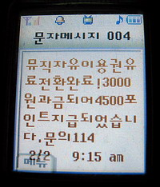
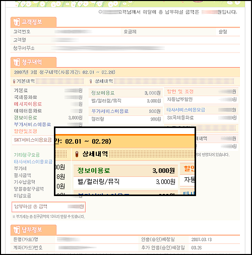

예전에 SKT의 뮤직자유이용권이 실제 유료로 적용되기 전에는 해지할 수 없다는 걸 알고 고객센터에 전화를 걸었던 적이 있습니다.  

<!-- truncate -->

  

이런 문자가 왔었죠.  
관련글 #1 - **SKT의 뮤직자유이용권 이야기**  
관련글 #2 - **SKT의 뮤직자유이용권 이야기 그 후**  
  
위의 글들을 읽으면 아시겠지만, 제가 뮤직자유이용권 이야기를 꺼내자 마자 상담원이 분명 "문자는 그렇게 찍혔지만 요금이 청구되지는 않는다"고 했던 것 같은데, 이렇게 청구가 되어서 나왔더라고요.  
  
  

제가 그 때 저 문자를 받고도 크게 기분 나쁘지 않았던 이유는 전화 통화를 한 후에 뭔가 내부적으로도 시정이 된 듯 한 느낌이 들었기 때문이었습니다. 하지만 사실은 그렇지 않았던 모양이군요. 아무래도 고객센터에 다시 전화를 해봐야겠습니다.
